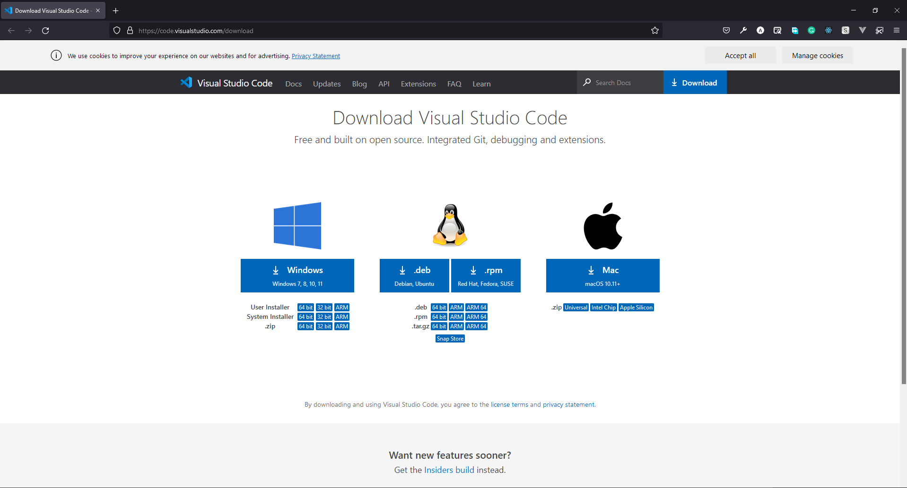
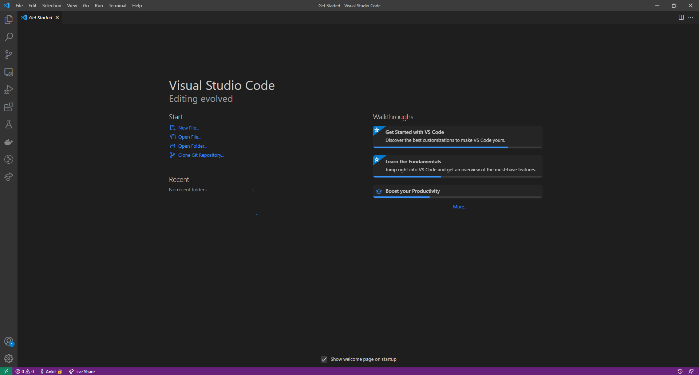
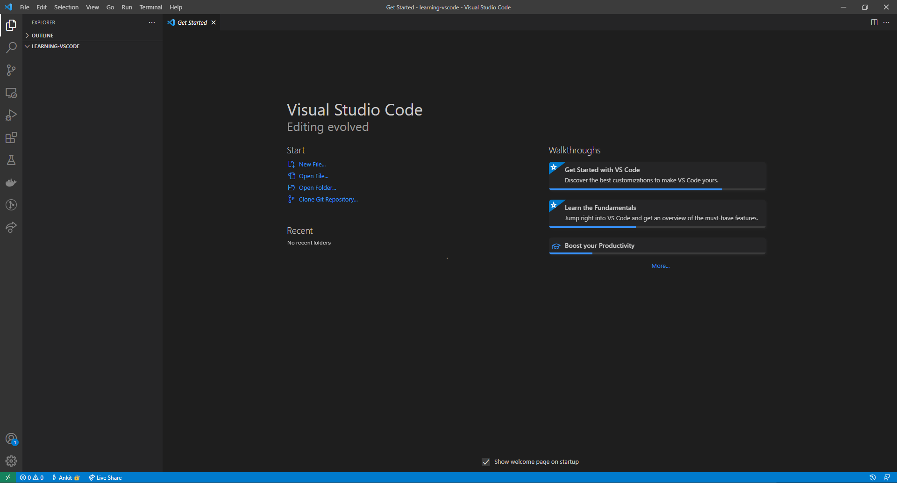
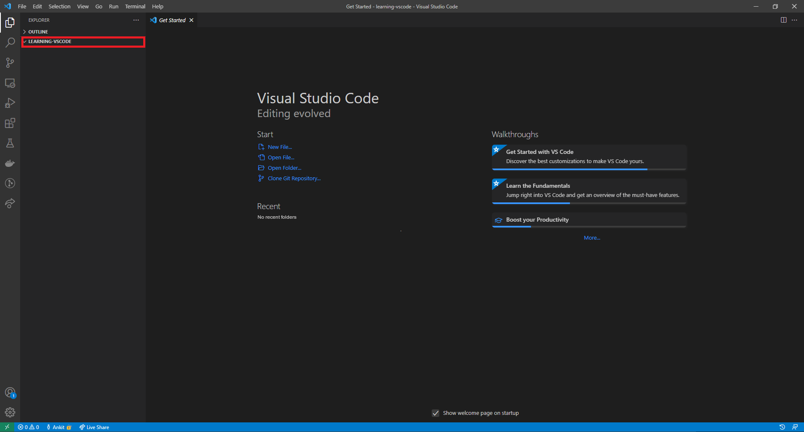
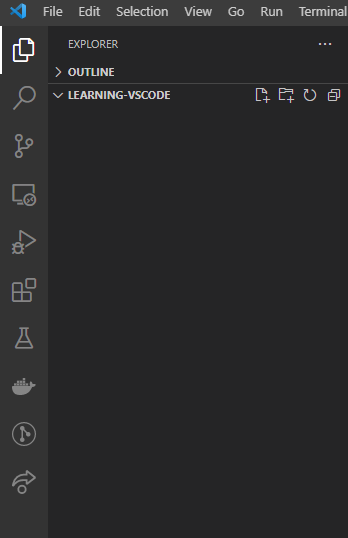
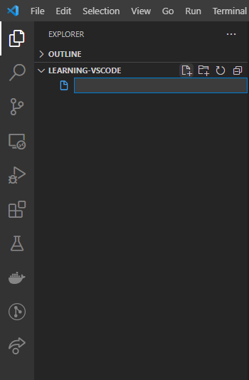
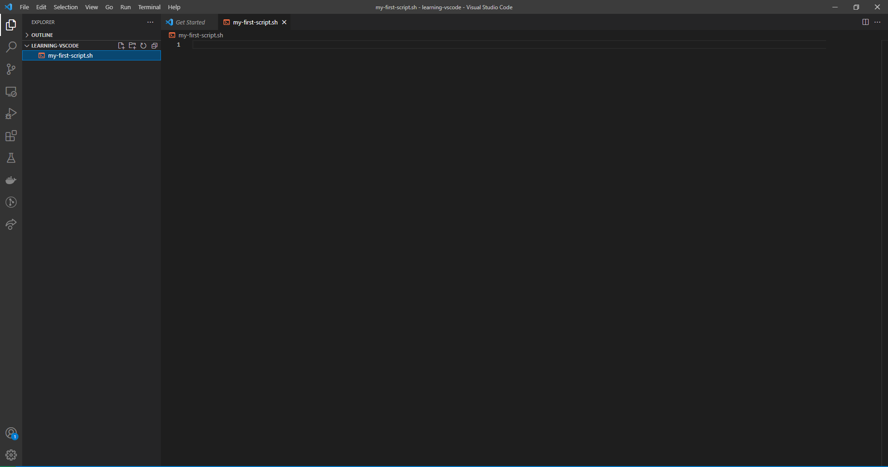
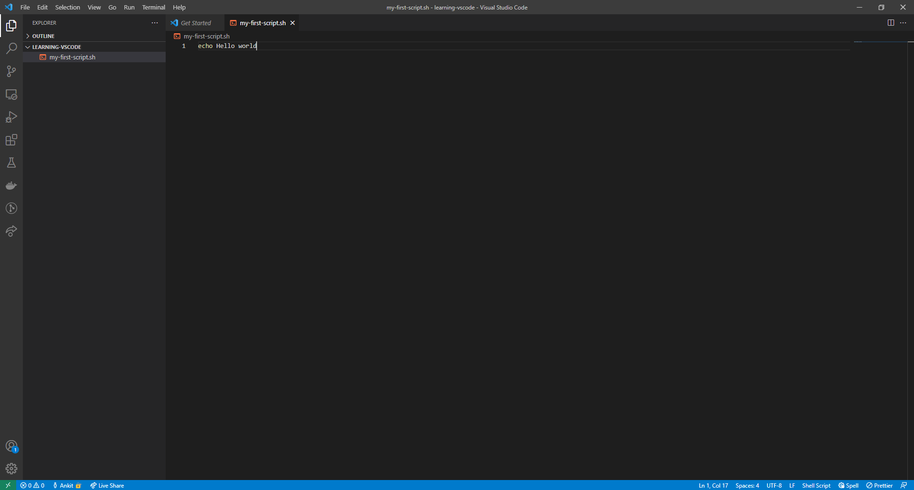
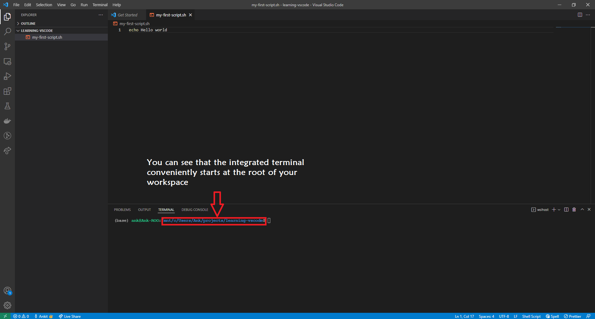
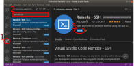

**Teaching: 20 min** || **Exercises: 0 min**

## Overview

:::::{.callout}

:::{.callout-important icon=false}
### Questions:
- How do we download and install `VS Code`?
- How do we communicate with our desktop in `VS Code`?
- Can I access a terminal and create a script in `VS Code`?
- How do we connect to and communicate with remote servers with `VS Code`?
:::

:::{.callout-important icon=false}
### Learning Objectives:
- How to download and install `VS Code`
- Opening a folder in `VS Code`
- Create a new script in `VS Code`
- Open a Terminal in `VS Code`
- Connect to and communicate with remote servers in `VS Code`
:::

:::{.callout-tip}
### Key Points:
- You can seamlessly create and edit scripts in `VS Code`.
- `VS Code` allows you to easily establish communication with remote servers and transfer files between your desktop and a remote server. 
:::
:::::


## 2.6.1 Introduction


Visual Studio Code (or `VS Code`) is a free, fully-featured programming open-source text/code editor available for all major platforms. It is available for Windows, Linux and macOS.

One of the strengths of this text editor is the wide range of extensions it offers.
One of those extensions is called _Remote SHH_ and allows us to connect to a remote computer (via _ssh_) and edit files as if they were on our own computer. 


## 2.6.2 Download
You can download VS Code from the URL: [https://code.visualstudio.com/download](https://code.visualstudio.com/download) by selecting the right platform.



To download VS code click on the respective icons, depending on your operating system.


## 2.6.3 Installation

We give brief instructions of how to install VS Code on each major operating system. 
For more detailed instructions, you may visit [the VS Code documentation page](https://code.visualstudio.com/docs/setup/setup-overview).

### Windows

- Open the folder where you have downloaded VS code.
- You will find a installer (`VSCodeUserSetup-{version}.exe`). Run the installer and follow the setup steps. It will take a few minutes.
- **Important:** After installation, open VS Code and go to “File > Preferences > Settings”. In the search box at the top of the settings, search for "EOL". The top hit should give you an option called “EOL” with the default value "auto". Change this to “\n” (this will ensure that the files you edit on Windows are compatible with the Linux operating system).

### macOS

- Open the folder where you have downloaded VS code. It will be a `.zip` file.
- Extract the zip contents.
- After extracting you will see an app `Visual Studio Code.app`. Drag `Visual Studio Code.app` to the `Applications` folder, so that you will open this using the macOS Launchpad.

### Linux

- For Debian and Ubuntu based distribution, download the `.deb` file and then follow below instructions for installation.
    - Open up the terminal
    - Move to the directory where you have downloaded the `.deb` file.
    - Run the following command to install

    ```bash
    sudo apt install ./<file-name>.deb
    ```
  
  - Replace <file-name> with the name of the vs-code file you have downloaded.
  - If you're on an older Linux distribution, you will need to run this instead:

    ```
    sudo dpkg -i <file-name>.deb
    sudo apt-get install -f # Install dependencies
    ```

- If you have downloaded the `.rpm` file, then follow below instructions for installation
    - Open up the terminal
    - Move to the directory where you have downloaded the `.rpm` file.
    - Run the following command to install

    ```bash
    sudo dnf install <file-name>.rpm
    ```

  - Replace <file-name> with the name of the vs-code file you have downloaded.


## 2.6.4 Open a folder in VS Code

If you open VS code for the first time it will look like the following:




You can open any folder/directory into VS Code in the following ways:

- On the VS Code menu bar, choose **File > Open Folder...**.
- Then browse to the location where you have the folder/directory. Select the folder/directory (don't double click) and then select **Select Folder** to open the folder into VS Code.

If a folder/directory is open then it will look like the following:




:::{.callout-note}
If only a file is open on VS Code, you will see that the colour of the bottom bar is purple. If a folder/directory is, then the colour will be blue.
:::

## 2.6.5 Create a new script in VS Code
Assuming you have opened a folder/directory in VS Code. On the left side of the VS Code window, you will see a pane called **Explorer**. Under Explorer, you will find the folder's name you have opened.



If you hover over the folder's name, you will see four icons appear. 



Starting from the left, they are for:

1. **Create New File** within the current folder.
1. **Create New Folder** within the current folder.
1. Refresh explorer.
1. Collapse explorer.

To create a new file click on the first icon (**New File**), and then type the name of the file with an extension of `.sh` and press `enter`.




In the centre, you will see that a new tab is open. You will see the title of this tab is the same as the name of your file.



Now you can begin your coding. Write the following code and save the file:

```bash
echo Hello World
```

After then, you need to save this file. You can save the file by pressing `ctrl` (on macOS `cmd`) + `S`.




## 2.6.6 Open a terminal in VS Code
VS Code comes with an integrated terminal that conveniently starts at the root of your workspace (this will be clear below). There are a few different ways to open the integrated terminal:

- Using Keyboard shortcut: Press `Ctrl`+ ` (ctrl + backtick character).
- Using VS Code menu bar: **View > Terminal**.

You will see that the integrated terminal opens at the bottom.




To learn more about the integrated terminal visit [https://code.visualstudio.com/docs/editor/integrated-terminal](https://code.visualstudio.com/docs/editor/integrated-terminal)


## 2.6.7 Connecting to an HPC

### Configuring Visual Studio Code for connecting to HPC 

We will use an extension called "Remote-SSH". 
To install the extension (see Figure):

1. Click the "Extensions" button on the side bar (or use <kbd>Ctrl + Shift + X</kbd>)
1. In the search box type "remote ssh" and choose the "Remote - SSH" extension
1. Click the "Install" button in the window that opens




### Connect `VS Code` to the HPC

Follow the instructions below to connect `VS Code` to the HPC.

1. Click the "Open Remote Window" green button on the bottom left corner.
2. Click "Connect to Host..." in the popup menu that opens.
3. Click "+ Add New SSH Host...".
4. Type your username and HPC hostname in the same way you do with `ssh`.
5. Select SSH configuration file to save this information for the future. Select the first file listed in the popup menu (a file in your user's home under `.ssh/config`).
6. A menu pops open on the bottom right informing the host was added to the configuration file. Click "Connect".
7. You may be asked what kind of platform you are connecting to. HPC environments always run on Linux. 
8. The first time you connect to a host you will also be asked if you trust this computer. You can answer "Continue". 
9. Finally, you will be asked for your password. Once you are connected the green button on the bottom-left corner should change to indicate you are ssh'd into the HPC
10. To open a folder on the HPC, use the left-hand "Explorer" and click "Open Folder"
11. Type the _path_ to the folder on the HPC from where you want to work from and press OK
    * You may be asked for your password again. The first time you connect to a folder you will also be asked "Do you trust the authors of the files in this folder?", to which you can answer "Yes, I trust the authors".


Once you are connected to the HPC in this way, you can edit files and even create new files and folders on the HPC filesystem.


## 2.6.8 Credit
Information on this page has been adapted and modified from the following source(s):

- https://github.com/cambiotraining/sars-cov-2-genomics

- https://github.com/cambiotraining/hpc-intro
