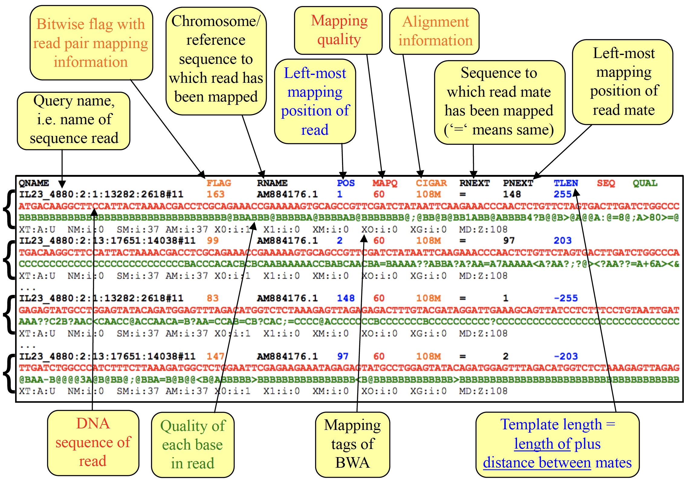

**Teaching: 20 min** || **Exercises: 10 min**

## Overview

:::::{.callout}

:::{.callout-important icon=false}
### Questions:
- What are the various file formats I may encounter while carrying out my bioinformatics analysis
- What information do I get from each file type
- Which file type should I look for specifically to address my needs
:::

:::{.callout-important icon=false}
### Learning Objectives:
- To know and identify the various file formats used in bioinformatics
- To know which file type to select to address appropriate needs
:::

:::{.callout-tip}
### Key Points:
- There are several file types generated along a bioinformatics pipeline. Each containing varying depth of information on the sequence.
- The common file types I may encounter in this course are:
    - CSV and TSV
    - FASTA
    - FAST5
    - FASTQ
    - SAM, BAM and CRAM
    - VCF
    - BED
    - GFF
    - NEWICK
- The various file formats are usually designed to allow for processing tools to easily parse the data 
:::
:::::


## 3.1.1 Background

:::{.callout-note}
### What is a file format?
A **file format** is a way for computers (and humans) to standardize how data is organized.
:::

In this chapter, our aim will be to go over the most common bioinformatics file formats you will come across. We will however not go into much details, but to simply help you become familiarized with the different file types that you may encounter in the course and are frequently used to store biological data. 

The heading of each file format links to a wiki page with more details about the format.

Generally, files can be classified into two categories: text files and binary files.

* **Text files** can be opened with standard text editors, and manipulated using command-line tools (such as `head`, `less`, `grep`, `cat`, etc.). However, many of the standard files listed in this page can be opened with specific software that displays their content in a more user-friendly way. For example, the NEWICK format is used to store phylogenetic trees and, although it can be opened in a text editor, it is better used with a software such as _FigTree_ to visualise the tree as a graph. 
Very often, text files may be **compressed** to save storage space. 
A common compression format used in bioinformatics is _gzip_ which has extension `.gz`. 
Many bioinformatic tools support compressed files. 
For example, FASTQ files (used to store NGS sequencing data) are often compressed with format `.fq.gz`.

* **Binary files** are often used to store data more efficiently. This helps improves efficiency for computers and are usually in a non-human readable binary format. You'll see some binary files have a corresponding "index" file which is useful for searching. 
Typically, specific tools need to be used with those files. For example, the BAM format is used to store sequences aligned to a reference genome and can be manipulated with dedicated software such as `samtools`.

More generally, the `extensions` *(last set of letters after the final `.` in a file name)* your find in file types are also used to indicate which algorithm/program can be used to open the file.


## 3.1.2 [CSV](https://en.wikipedia.org/wiki/Comma-separated_values#Example) and [TSV](https://en.wikipedia.org/wiki/Tab-separated_values#Example)

**CSV** stands for **C**omma-**S**eparated **V**alues

**TSV** on the other hand stands for **T**ab-**S**eparated **V**alues

**CSV** and **TSV** are text files. They store tabular data in a text file with the file extensions: `.csv` and `.tsv` respectively. It is also possible to store them with `.txt` extension and the data wll work normally. As the names suggest, for **CSV** files there is a *comma* `,` between each value, whereas for **TSV** files there is a *tab* between each value.


<!--FIXME: replace this with a more relevant one if necessary-->

Below is a sample `.csv` text. You will see this being used more frequently in other chapters.

:::{.callout}
```
sample,fastq_1,fastq_2
TBNmA041,/Genomes/TBNmA041_R1_001.fastq.gz,/Genomes/TBNmA041_R2_001.fastq.gz
TBNmA050,/Genomes/TBNmA050_R1_001.fastq.gz,/Genomes/TBNmA050_R2_001.fastq.gz
TBNmA064,/Genomes/TBNmA064_R1_001.fastq.gz,/Genomes/TBNmA064_R2_001.fastq.gz
TBNmA067,/Genomes/TBNmA067_R1_001.fastq.gz,/Genomes/TBNmA067_R2_001.fastq.gz
TBNmA074,/Genomes/TBNmA074_R1_001.fastq.gz,/Genomes/TBNmA074_R2_001.fastq.gz
TBNmA077,/Genomes/TBNmA077_R1_001.fastq.gz,/Genomes/TBNmA077_R2_001.fastq.gz
```
:::

The simplicity of these formats allows researchers to easily exchange data among computers, a term known as portability.

These files can be opened with spreadsheet programs (such as _Microsoft Excel_).
They can also be created from spreadsheet programs by going to <kbd>File > Save As...</kbd> and select "CSV (Comma delimited)" or "Text (Tab delimited)" as the file format.


## 3.1.3 [FASTA](https://en.wikipedia.org/wiki/FASTA)

FASTA (pronounced "fast-A") format is a simple type of format that bioinformaticians use to represent either DNA or protein sequences. 
**FASTA** files are therefore text files and stores nucleotide or amino acid sequences. It is written in text format, allowing for processing tools to easily parse the data. 
Within the basic FASTA file, there are two lines per sequence 

- 1) the identifier (comments, annotations)
- 2) the sequence itself

The top line holds information pertaining to the sequence below. It is preceded by with a `>`. Without this informative first line, we just have a raw format.
As a general rule, it is recommended that each line of sequence be shorter than 80 characters.
The file extensions for **FASTA** are `.fa` or `.fas` or `.fasta`

A FASTA file containing a single nucleotide sequence might look like this:

:::{.callout}
```
>G26832_filtered: example fasta sequence
ttgaccgatgaccccggttcaggcttcaccacagtgtggaacgcggtcgtctccgaactt
aacggcgaccctaaggttgacgacggacccagcagtgatgctaatctcagcgctccgctg
acccctcagcaaagggcttggctcaatctcgtccagccattgaccatcgtcgaggggttt
gctctgttatccgtgccgagcagctttgtccaaaacgaaatcgagcgccatctgcgggcc
ccgattaccgacgctctcagccgccgactcggacatcagatccaactcggggtccgcatc
```
:::


... and one containing a protein sequence may look like this:

:::{.callout}
```
>PROTEIN_SEQUENCE_1
MTEITAAMVKELRESTGAGMMDCKNALSETNGDFDKAVQLLREKGLGKAAKKADRLAAEG
LVSVKVSDDFTIAAMRPSYLSYEDLDMTFVENEYKALVAELEKENEERRRLKDPNKPEHK
IPQFASRKQLSDAILKEAEEKIKEELKAQGKPEKIWDNIIPGKMNSFIADNSQLDSKLTL
MGQFYVMDDKKTVEQVIAEKEKEFGGKIKIVEFICFEVGEGLEKKTEDFAAEVAAQL
```
:::


### Specific filename extensions
The generic form of FASTA file has the `.fas` extension. For more specific types, we can use the following:

|Extension|Meaning|Notes|
| :- | :-- |:------ |
| fna | FASTA nucleic acid | Used generically to specify nucleic acids
| ffn | FASTA nucleotide coding regions | Contains coding regions for a genome
| faa | FASTA amino acid | Contains amino acid sequences. A multiple protein fasta file can have the more specific extension mpfa
| frn | FASTA non-coding RNA | Contains non-coding RNA regions for a genome, in DNA alphabet e.g. tRNA, rRNA


## 3.1.4 [FAST5](https://github.com/mw55309/EG_MinION_2016/blob/master/02_Data_Extraction_QC.md)

**FAST5** is a binary file. More specifically, it is a Hierarchical Data Format (HDF5) file. used by Nanopore platforms to store the called sequences (in FASTQ format) as well as the raw electrical signal data from the pore. It's file extension is `.fast5`.


## 3.1.5 [FASTQ](https://en.wikipedia.org/wiki/FASTQ_format)

The FASTA format is extremely simple with just two lines per sequence --- the first is for the description, the other for the raw sequence. 
As this format is nicely simple, it does not tell us the **Q**uality of each nucleotide or protein. Your guess is as good as mine, yes! the **Q** in **FASTQ** (pronounced "fast-Q") stands for the **Q**uality of each nucleotide or amino acid in a sequence.
**FASTQ** is therefore a text file, but often compressed with _gzip_ and stores sequences and their quality scores. The quality score is encoded with a single ASCII character.
The file extensions for **FASTQ** are `.fq` or `.fastq` (compressed as `.fq.gz` or `.fastq.gz`) 
Just like the FASTA, the first line in a **FASTQ** file contains the sequence identifier with an optional description, however, the line begins with an `@` character rather than a `>` character. 


A FASTQ file containing a single sequence might look like any of these:

:::{.callout}
```
@VH00616:1:AAAM55THV:1:1101:65456:1000 2:N:0:CAGCAATCGT+ATACATCACA
GTATCGAGCTGGGATCGGCCGCGGATCTAGACGGTCTGCTGGCCCGGATGCGGGCGACCGACATTCACGT
+
CCCCCCCCCCCCCCCCCCCCCCCCCCCC;CCCCCCCCCCCCCCCCCCCCCCCCCCCCCCCCCCCCCCCCC
```
:::

:::{.callout}
```
@VH00616:1:AAAM55THV:1:1101:58564:1038 2:N:0:CAGCAATCGT+ATACATCACA
GTGTCAATGAACGCGCTTGGTGTGGCCCAACCGCATTCGGACGCCACGGACGTGACGTCGTGGCGCTCGG
+
!''*((((***+))%%%++)(%%%%).1***-+*''))**55CCF>>>>>>CCCCCCC65)**55CCF>>
```
:::

The second line contains the actual sequences of the read which is separated from the fourth (**Q**uality) line by a `+` on the third line.

The fourth line encodes the quality scores per each base call. This line must have the same length as the sequence in line 2

The byte representing quality runs from 0x21 (lowest quality; '!' in ASCII) to 0x7e (highest quality; '~' in ASCII). Here are the quality value characters in left-to-right increasing order of quality (ASCII):

:::{.callout}
```
!"#$%&'()*+,-./0123456789:;<=>?@ABCDEFGHIJKLMNOPQRSTUVWXYZ[\]
^_`abcdefghijklmnopqrstuvwxyz{|}~
```
:::


## 3.1.6 [SAM](https://en.wikipedia.org/wiki/SAM_(file_format)), [BAM](https://en.wikipedia.org/wiki/Binary_Alignment_Map) and [CRAM](https://en.wikipedia.org/wiki/CRAM_(file_format)) 
Before we talk about SAM, BAM and CRAM, we must discuss the software, SAMtools, from which these formats originate.

### SAMtools
SAMtools is a suite of utilities that allow for efficient post-processing of short DNA sequence read alignments. The program includes several command line programs such as view, sort, and index that allow for next-generation sequence data processing. You will come across this in later chapters.

### SAM format
The name **SAM** comes from **S**equence **A**lignment/**M**AP. It is a text file with the file extensions `.sam`. 
In addition to regular sequence reads, SAM includes alignment data that link short reads to a reference sequence. This makes SAM files the choice of format when visualizing short read sequences in genome browsers such as IGV (Integrated Genome Viewer).

### BAM and CRAM 
**BAM** refers to **B**inary **A**lignment **M**ap. As the name suggest, its a binary file. It is same as a SAM file but compressed in binary form with the file extension `.bam`.
The SAM format is simple to parse, generate and check for errors. However, its large file size (usually in GB on average) gets in the way of efficiency. Thus, researchers found a way to compress it into a binary format without losing the ability to manipulate it. BAM contains indexable representation of nucleotide sequence alignments, allowing for intensive data processing in production pipelines.

CRAM is a restructured version of its binary version, with column-orientation.

### What Information is in SAM & BAM
SAM files and BAM files contain the same information, but in a different format.
Both SAM & BAM files contain an optional header section (beginning with the `@` symbol) followed by the alignment section.

:::{.callout}
### Illustration of the composition of a `SAM` file
```
@SQ     SN:MTB_anc      LN:4411532
@PG     ID:bwa  PN:bwa  VN:0.7.17-r1188 CL:bwa mem -t 4 MTB_ANC_unwrapped.fasta G26832_R1.fastq.gz G26832_R2.fastq.gz
D00535:103:CD2W4ANXX:8:2209:4278:1980   73      MTB_anc 4112828 60      101M    =       4112828 0       CCCGATCGGGTGAGATCACGAAGCCGGTGCCCTCCAACACTTTCTGGCATCTGGGTGCCAGGCTGCGGATTTTGACGACACTTGGCTCGGTGGCCGCCACC     B@BB=EBB/EG/01?DB:E/9/9EGG/EB9@FG09:110=CDGGCC11:CFFE@BCG=CE1F0BF9EG//B0@@/9/C>//;F000E09CDDDDD/.CDDG     NM:i:0  MD:Z:101        AS:i:101        XS:i:0
```
:::


The header section may contain information about the entire file and additional information for alignments. The alignments then associate themselves with specific header information.

The alignment section contains the information for each sequence about where/how it aligns to the reference genome.

Alignment sections have 11 mandatory fields, as well as a variable number of optional fields

| Col | Field | Type | Brief description |
| :- | :- | :- | :--- |
| 1	| QNAME	| String | Query template NAME |
| 2	| FLAG	| Int | bitwise FLAG |
| 3	| RNAME	| String | References sequence NAME |
| 4	| POS | Int	| 1- based leftmost mapping POSition |
| 5	| MAPQ	| Int | MAPping Quality |
| 6	| CIGAR	| String | CIGAR string |
| 7	| RNEXT	| String | Ref. name of the mate/next read |
| 8	| PNEXT	| Int | Position of the mate/next read |
| 9	| TLEN	| Int | observed Template LENgth |
| 10 | SEQ | String | segment SEQuence |
| 11 | QUAL	| String | ASCII of Phred-scaled base QUALity+33 |


The bitwise FLAG, provides the following information:
* are there multiple fragments?
* are all fragments properly aligned?
* is this fragment unmapped?
* is the next fragment unmapped?
* is this query the reverse strand?
* is the next fragment the reverse strand?
* is this the 1st fragment?
* is this the last fragment?
* is this a secondary alignment?
* did this read fail quality controls?
* is this read a PCR or optical duplicate?




## 3.7 [VCF](https://en.wikipedia.org/wiki/Variant_Call_Format) 
**VCF** stands for **V**ariant **C**alling **F**ormat.
As you may already guess from the name, yes!, it is a text file but often compressed with _gzip_ that stores gene sequence variations (SNP/Indel variants). It's file extension is `.vcf`.
It contains a header with metadata preceded by a `##` string. Best practices with VCF files recommend describing INFO, FILTER, and FORMAT entries used in the body within the header. 

Following the header is the body, made up of 8 mandatory tab separated columns, one for each identifier and an unlimited number of optional columns that may be used to record other information about the sample(s). When additional columns are used, the first optional column is used to describe the format of the data in the columns that follow.

### The columns of a VCF
|	| Name |	Brief description |
| :- | :- | :-------- |
| 1	| CHROM |	The name of the sequence (typically a chromosome) on which the variation is being called. This sequence is usually known as 'the reference sequence', i.e. the sequence against which the given sample varies. |
| 2	| POS |	The 1-based position of the variation on the given sequence. |
| 3	| ID	| The identifier of the variation, e.g. a dbSNP rs identifier, or if unknown a ".". Multiple identifiers should be separated by semi-colons without white-space. |
| 4	| REF |	The reference base (or bases in the case of an indel) at the given position on the given reference sequence. |
| 5	| ALT	| The list of alternative alleles at this position. |
| 6	| QUAL	| A quality score associated with the inference of the given alleles. |
| 7	| FILTER |	A flag indicating which of a given set of filters the variation has failed or PASS if all the filters were passed successfully. |
| 8 |	INFO | An extensible list of key-value pairs (fields) describing the variation. See below for some common fields. Multiple fields are separated by semicolons with optional values in the format: <key>=<data>[,data]. |
| 9 |	FORMAT	| An (optional) extensible list of fields for describing the samples. See below for some common fields. |
| + |	SAMPLEs	| For each (optional) sample described in the file, values are given for the fields listed in FORMAT. |


:::{.callout}
### A typical content of a `VCF` file
```
##fileformat=VCFv4.2
##FILTER=<ID=PASS,Description="All filters passed">
##bcftoolsVersion=1.14+htslib-1.14
##bcftoolsCommand=mpileup --fasta-ref MTB_ANC_unwrapped.fasta --min-BQ 20 --annotate FORMAT/AD,FORMAT/ADF,FORMAT/ADR,FORMAT/DP,FORMAT/SP,INFO/AD,INFO/ADF,INFO/ADR G26832_sorted.bam
##reference=file://MTB_ANC_unwrapped.fasta
##contig=<ID=MTB_anc,length=4411532>
##ALT=<ID=*,Description="Represents allele(s) other than observed.">
##INFO=<ID=INDEL,Number=0,Type=Flag,Description="Indicates that the variant is an INDEL.">
##INFO=<ID=IDV,Number=1,Type=Integer,Description="Maximum number of raw reads supporting an indel">
##INFO=<ID=IMF,Number=1,Type=Float,Description="Maximum fraction of raw reads supporting an indel">
##INFO=<ID=DP,Number=1,Type=Integer,Description="Raw read depth">
##INFO=<ID=VDB,Number=1,Type=Float,Description="Variant Distance Bias for filtering splice-site artefacts in RNA-seq data (bigger is better)",Version="3">
##INFO=<ID=RPBZ,Number=1,Type=Float,Description="Mann-Whitney U-z test of Read Position Bias (closer to 0 is better)">
##INFO=<ID=MQBZ,Number=1,Type=Float,Description="Mann-Whitney U-z test of Mapping Quality Bias (closer to 0 is better)">
##INFO=<ID=BQBZ,Number=1,Type=Float,Description="Mann-Whitney U-z test of Base Quality Bias (closer to 0 is better)">
##INFO=<ID=MQSBZ,Number=1,Type=Float,Description="Mann-Whitney U-z test of Mapping Quality vs Strand Bias (closer to 0 is better)">
##INFO=<ID=SCBZ,Number=1,Type=Float,Description="Mann-Whitney U-z test of Soft-Clip Length Bias (closer to 0 is better)">
##INFO=<ID=FS,Number=1,Type=Float,Description="Phred-scaled p-value using Fisher's exact test to detect strand bias">
##INFO=<ID=SGB,Number=1,Type=Float,Description="Segregation based metric.">
##INFO=<ID=MQ0F,Number=1,Type=Float,Description="Fraction of MQ0 reads (smaller is better)">
##FORMAT=<ID=PL,Number=G,Type=Integer,Description="List of Phred-scaled genotype likelihoods">
##FORMAT=<ID=DP,Number=1,Type=Integer,Description="Number of high-quality bases">
##FORMAT=<ID=SP,Number=1,Type=Integer,Description="Phred-scaled strand bias P-value">
##FORMAT=<ID=AD,Number=R,Type=Integer,Description="Allelic depths (high-quality bases)">
##FORMAT=<ID=ADF,Number=R,Type=Integer,Description="Allelic depths on the forward strand (high-quality bases)">
##FORMAT=<ID=ADR,Number=R,Type=Integer,Description="Allelic depths on the reverse strand (high-quality bases)">
##INFO=<ID=AD,Number=R,Type=Integer,Description="Total allelic depths (high-quality bases)">
##INFO=<ID=ADF,Number=R,Type=Integer,Description="Total allelic depths on the forward strand (high-quality bases)">
##INFO=<ID=ADR,Number=R,Type=Integer,Description="Total allelic depths on the reverse strand (high-quality bases)">
##FORMAT=<ID=GT,Number=1,Type=String,Description="Genotype">
##INFO=<ID=AC,Number=A,Type=Integer,Description="Allele count in genotypes for each ALT allele, in the same order as listed">
##INFO=<ID=AN,Number=1,Type=Integer,Description="Total number of alleles in called genotypes">
##INFO=<ID=DP4,Number=4,Type=Integer,Description="Number of high-quality ref-forward , ref-reverse, alt-forward and alt-reverse bases">
##INFO=<ID=MQ,Number=1,Type=Integer,Description="Average mapping quality">
##bcftools_callVersion=1.14+htslib-1.14
##bcftools_callCommand=call --output-type v --ploidy 1 --multiallelic-caller; Date=Fri Nov  4 10:38:43 2022
##bcftools_viewVersion=1.14+htslib-1.14
##bcftools_viewCommand=view --output-file G26832.vcf.gz --output-type z; Date=Fri Nov  4 10:38:43 2022
#CHROM  POS     ID      REF     ALT     QUAL    FILTER  INFO    FORMAT  G26832_sorted.bam
MTB_anc 1       .       T       .       284.59  .       DP=64;ADF=49;ADR=11;AD=60;MQSBZ=0;FS=0;MQ0F=0;AN=1;DP4=49,11,0,0;MQ=59  GT:DP:SP:ADF:ADR:AD       0:60:0:49:11:60
MTB_anc 2       .       T       .       284.59  .       DP=68;ADF=50;ADR=11;AD=61;MQSBZ=0;FS=0;MQ0F=0;AN=1;DP4=50,11,0,0;MQ=59  GT:DP:SP:ADF:ADR:AD       0:61:0:50:11:61
MTB_anc 3       .       G       .       284.59  .       DP=68;ADF=49;ADR=11;AD=60;MQSBZ=0;FS=0;MQ0F=0;AN=1;DP4=49,11,0,0;MQ=59  GT:DP:SP:ADF:ADR:AD       0:60:0:49:11:60
...
```
:::


**NB.** You may have come across a `BCF` file. **B**inary **C**all **F**ormat (BCF) is a binary representation of VCF, containing the same information in binary format for improved performance.


## 3.1.8 [BED](https://en.wikipedia.org/wiki/BED_(file_format)) 
**BED** stands for **B**rowser **E**xtensible **D**ata. It's a text file that stores coordinates of genomic regions and has the file extension `.bed`. ìt has a tabs-delimited file format that allows users to define how data lines of an annotation track are displayed.
One of the advantages of this format is the manipulation of coordinates instead of nucleotide sequences, which optimizes the power and computation time when comparing all or part of genomes.

BED files can have up to 12 columns, but only three are required for the UCSC browser, Galaxy browser and bedtools:
**chrom**
 - Name of chromosome - chr5, chrX, chr2_random. or scaffold - scaffold10671
**chromStart**
 - Starting position of chrom.
 - First base starts at 0.
**chromEnd**
 - Ending position.
 - This value does not get displayed. For example, the first 20 bases would have chromStart value of 0 to and chromEnd value of 20.

:::{.callout}
### A typical content of a `BED3` file
```
NC_002945.4	2751	2755
NC_002945.4	10447	10467
NC_002945.4	13457	13470
NC_002945.4	31969	31970
NC_002945.4	86804	86805
NC_002945.4	86808	86809
NC_002945.4	86818	86819
NC_002945.4	89105	89107
NC_002945.4	94892	94896
```
:::


## 3.1.9 [GFF](https://en.wikipedia.org/wiki/General_feature_format) 
**GFF** stands for **G**eneral **F**eature **F**ormat (also called gene-finding format, generic feature format). 
It's a text file that stores gene coordinates and other features and has the file extension `.gff`. It is used to describe genes and other features of DNA, RNA and protein sequences. 

GFF is an extension of a basic file with the name, start and end parameters (NSE). For example, an NSE (Chromosome2,2000,4000) specifies two kilobases found on chromosome 2. GFF allows the annotation of these segments and it consists of one line per feature, each containing 9 columns of data. Each column is separated by a tab, making it a tabs-delimited file.
It uses a header region with a `##` string to include metadata.

### General GFF3 structure

| Position index |	Position name	| Description |
| :- | :- | :---------- |
| 1 |	seqid	| The name of the sequence where the feature is located. |
| 2	| source	| Keyword identifying the source of the feature, like a program (e.g. Augustus or RepeatMasker) or an organization (like TAIR). |
| 3 |	type	| The feature type name, like "gene" or "exon". In a well structured GFF file, all the children features always follow their parents in a single block (so all exons of a transcript are put after their parent "transcript" feature line and before any other parent transcript line). In GFF3, all features and their relationships should be compatible with the standards released by the Sequence Ontology Project. |
| 4 |	start |	Genomic start of the feature, with a 1-base offset. This is in contrast with other 0-offset half-open sequence formats, like BED. |
| 5 |	end	| Genomic end of the feature, with a 1-base offset. This is the same end coordinate as it is in 0-offset half-open sequence formats, like BED.[citation needed] |
| 6 |	score |	Numeric value that generally indicates the confidence of the source in the annotated feature. A value of "." (a dot) is used to define a null value. |
| 7 |	strand	| Single character that indicates the strand of the feature; it can assume the values of "+" (positive, or 5'->3'), "-", (negative, or 3'->5'), "." (undetermined). |
| 8 |	phase	| phase of CDS features; it can be either one of 0, 1, 2 (for CDS features) or "." (for everything else). See the section below for a detailed explanation. |
| 9 |	attributes |	All the other information pertaining to this feature. The format, structure and content of this field is the one which varies the most between the three competing file formats. |


:::{.callout}
### A typical content of a `GFF3` file
```
##gff-version 3
##feature-ontology https://github.com/The-Sequence-Ontology/SO-Ontologies/blob/v3.1/so.obo
# Annotated with Bakta
# Software: v1.5.0
# Database: v4.0
# DOI: 10.1099/mgen.0.000685
# URL: github.com/oschwengers/bakta
##sequence-region contig_1 1 321788
contig_1	Bakta	region	1	321788	.	+	.	ID=contig_1;Name=contig_1
contig_1	Prodigal	CDS	15	272	.	+	0	ID=BDKKDL_00005;Name=hypothetical protein;locus_tag=BDKKDL_00005;product=hypothetical protein
contig_1	Prodigal	CDS	224	613	.	+	0	ID=BDKKDL_00010;Name=PE-PGRS family protein;locus_tag=BDKKDL_00010;product=PE-PGRS family protein;Dbxref=RefSeq:WP_003914742.1,SO:0001217,UniParc:UPI00019015A7,UniRef:UniRef100_A0A7U9K5X7,UniRef:UniRef50_A0A7U9K5X7,UniRef:UniRef90_A0A7U9K5X7
contig_1	Prodigal	CDS	1164	1568	.	+	0	ID=BDKKDL_00015;Name=Uncharacterized protein Rv2742A;locus_tag=BDKKDL_00015;product=Uncharacterized protein Rv2742A;Dbxref=GO:0005886,GO:0016021,RefSeq:WP_003912838.1,SO:0001217,UniParc:UPI00005EE738,UniRef:UniRef100_P0DMQ8,UniRef:UniRef50_P0DMQ8,UniRef:UniRef90_P0DMQ8
contig_1	Prodigal	CDS	1565	2377	.	-	0	ID=BDKKDL_00020;Name=Putative envelope-preserving system protein Rv2743c;locus_tag=BDKKDL_00020;product=Putative envelope-preserving system protein Rv2743c;Dbxref=GO:0016021,RefSeq:WP_003414026.1,SO:0001217,UniParc:UPI00000D0F36,UniRef:UniRef100_I6YA50,UniRef:UniRef50_I6YA50,UniRef:UniRef90_I6YA50
...
```
:::
You may have come across a `GTF` file. The **GTF** (**G**ene **T**ransfer **F**ormat) file type shares the same format as **GFF** files, though it is used to define gene and transcript-related features exclusively.


## 3.1.10 [NEWICK](https://en.wikipedia.org/wiki/Newick_format)
The **NEWICK** format is a text file usually with the file extensions: `.tree` or `.treefile`. It is a way of representing graph-theoretical trees with edge lengths using parentheses and commas. It stores phylogenetic trees including nodes names and edge lengths.

The following tree:


could be represented in Newick format in several ways

```
(,,(,));                               no nodes are named
(A,B,(C,D));                           leaf nodes are named
(A,B,(C,D)E)F;                         all nodes are named
(:0.1,:0.2,(:0.3,:0.4):0.5);           all but root node have a distance to parent
(:0.1,:0.2,(:0.3,:0.4):0.5):0.0;       all have a distance to parent
(A:0.1,B:0.2,(C:0.3,D:0.4):0.5);       distances and leaf names (popular)
(A:0.1,B:0.2,(C:0.3,D:0.4)E:0.5)F;     distances and all names
((B:0.2,(C:0.3,D:0.4)E:0.5)F:0.1)A;    a tree rooted on a leaf node (rare)
```

Below is the newick tree data of the first tree you will ever build in this course

**Myfirsttree.tree**
<!--FIXME: Replace this tree with the actual tree for the course-->
```
(TBNmA399:0.008270245,TBNmA464:0.007078265,((TBNmA217:0.009068723,((TBNmA361:0.008676792,TBNmA250:0.007952614)0.882:0.000644627,((ERX467883:0.019205883,(((TBNmA286:0.008210194,(TBNmA162:0.000672847,(TBNmA432:0.000681896,TBNmA437:0.000906203)0.520:0.000000005)1.000:0.007987255)0.963:0.009745124,ERX4639416:0.031087096)0.760:0.002127560,(ERX4639417:0.014406021,TBNmA120:0.017392319)0.983:0.003844014)0.561:0.000000005)0.733:0.000446004,(((((ERX2675537:0.037328220,(ERX2822389:0.035236770,((NC_002945.4:0.085788912,(TBNmA403:0.003585076,TBNmA265:0.005594965)1.000:0.077815900)1.000:0.045871008,(ERX4639418:0.021865797,(((TBNmA389:0.011858464,(TBNmA343:0.010603912,TBNmA187:0.010539288)0.887:0.001097047)1.000:0.025977064,((TBNmA041:0.023722379,((TBNmA271:0.001127595,((TBNmA452:0.008680633,TBNmA077:0.009375017)1.000:0.005680396,(TBNmA123:0.010406082,(TBNmA085:0.011381506,TBNmA064:0.009800991)0.946:0.001327826)0.996:0.003589739)0.988:0.009195987)0.881:0.002561916,((((TBNmA327:0.000000005,TBNmA345:0.000224666)1.000:0.012329485,(TBNmA321:0.000975869,TBNmA322:0.001858213)1.000:0.009131999)1.000:0.008206124,((TBNmA382:0.007331542,(TBNmA365:0.005435424,(TBNmA306:0.006093690,TBNmA117:0.007030120)0.543:0.000000005)0.771:0.000000005)0.998:0.002534799,(ERX1275306:0.007758780,(TBNmA050:0.004680429,(TBNmA191:0.006984201,(TBNmA412:0.007273051,TBNmA258:0.009516111)0.823:0.000000005)0.909:0.000672574)0.880:0.000492079)0.976:0.001602252)1.000:0.005254102)1.000:0.008769376,(TBNmA121:0.013273022,(TBNmA280:0.005420607,(TBNmA190:0.005355244,TBNmA428:0.005210953)0.870:0.000000005)0.972:0.002255197)1.000:0.017861767)0.707:0.000136299)0.884:0.000659873)1.000:0.004134566,(TBNmA257:0.002984847,(TBNmA377:0.000000005,(TBNmA362:0.000000005,TBNmA357:0.000000005)0.881:0.000000005)0.944:0.001325432)1.000:0.025946471)0.976:0.000000005)1.000:0.017127738,(ERX512130:0.009550754,(TBNmA394:0.001180640,TBNmA331:0.001151751)1.000:0.006179602)1.000:0.034250718)0.163:0.000000005)0.189:0.000110233)0.987:0.002076210)0.823:0.000755449)1.000:0.009140266,ERX467856:0.036035736)0.667:0.000000005,((TBNmA110:0.017454586,((ERX1749324:0.012028354,TBNmA262:0.011318248)0.985:0.004246403,(TBNmA348:0.012534351,TBNmA067:0.011426344)1.000:0.005264503)0.816:0.000000005)1.000:0.016810353,(TBNmA393:0.032119007,(TBNmA074:0.012340989,(ERX467886:0.000000005,ERX467895:0.000000005)1.000:0.012723309)1.000:0.018036487)0.707:0.001395736)0.999:0.004644168)0.872:0.000000005,(TBNmA395:0.025760081,((TBNmA351:0.011266183,TBNmA266:0.008431616)1.000:0.011565390,(TBNmA383:0.014217025,(TBNmA447:0.003756605,(TBNmA305:0.003438150,TBNmA435:0.004132593)0.993:0.002834680)1.000:0.006652517)1.000:0.009294668)0.858:0.000767446)1.000:0.008991216)0.708:0.000000005,TBNmA384:0.029259232)1.000:0.014945411)1.000:0.014745950)0.681:0.000000005)0.009:0.000000005,((TBNmA124:0.004508430,(TBNmA460:0.008309784,(TBNmA125:0.003377088,TBNmA195:0.005663590)0.953:0.001124832)0.751:0.000219064)0.897:0.000448976,TBNmA290:0.006384894)0.388:0.000000005)0.624:0.000000005);
```


## 3.1.11 Credit
Information on this page has been adapted and modified from the following source(s):

- Credit: https://github.com/cambiotraining/sars-cov-2-genomics

- https://snipcademy.com/sequence-file-formats

- https://en.wikipedia.org/wiki

- Wellcome Genome Campus Advanced Courses and Scientific Conferences 2017 - WORKING WITH PATHOGEN GENOMES Course Manual http://www.wellcome.ac.uk/advancedcourses
