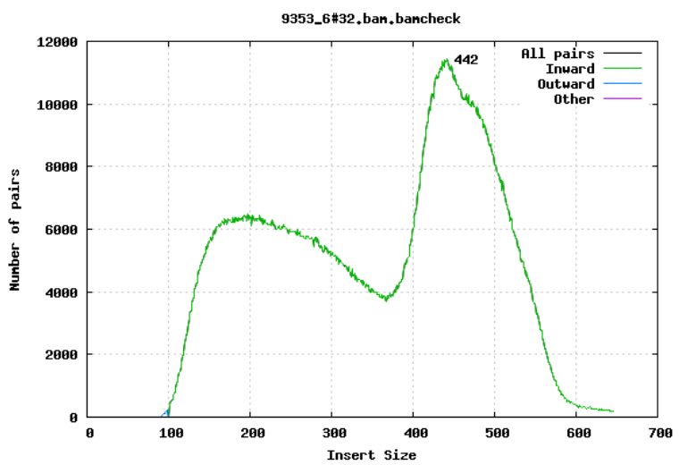
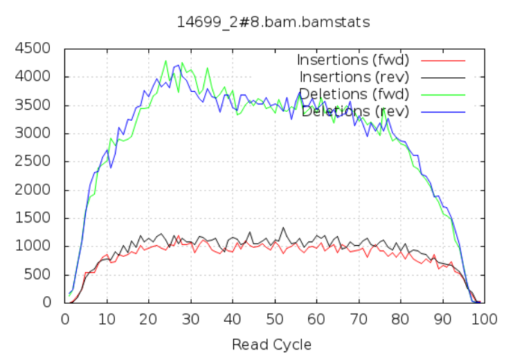

**Teaching: 90 min** || **Exercises: 20 min**

## Overview

:::::{.callout}

:::{.callout-important icon=false}
### Questions:
- How do you perform basic statistics to check the quality of next generation sequence reads?
- How do you identify contaminants in your sequences?
- What are the various tools used for carrying out quality control?
:::

:::{.callout-important icon=false}
### Learning Objectives:
- To perform a QC assessment of high throughput next generation sequence data
- Interpret and critically evaluate data quality reports
- To identify possible contamination in high throughput sequence data
- Run simple scripts to achieve quality control of your genomic data
:::

:::{.callout-tip}
### Key Points:
- Before analysing your next generation sequencing data, it is key to quality control the data and only carry on with genomes that pass quality control checks
- Best practice quality control assessments include:
    - Base quality check
    - Identifying mismatches
    - GC content and bias checks
    - False insertions and deletions
    - Identifying contamination

- Best practice quality control tools for performing the quality checks include
    - [fastq-scan](https://github.com/rpetit3/fastq-scan)
    - [FastQC](https://www.bioinformatics.babraham.ac.uk/projects/fastqc/)
    - [fastp](https://github.com/OpenGene/fastp)
    - [Kraken 2](https://github.com/DerrickWood/kraken2)
    - [Bracken](https://github.com/jenniferlu717/Bracken)
    - [MultiQC](https://github.com/ewels/MultiQC)

- It is a good practice to clean up your directory as you proceed from analysis to analysis to avoid getting the error message that tells you `you are running out of space/memory`.
:::
:::::


## 4.1.1 Background

Before we delve into having a look at our own genomic data. Lets take some minutes to explore what to look out for when performing **Q**uality **C**ontrol **(QC)** checks on our sequences. 
For this course, we will largely focus on next generation sequences obtained from Illumina sequencers. 
As you may already know from the previous lesson, the main output files expected from our Illumina sequencer are `.fastq` files.


### QC assessment of NGS data
As you may already know, **QC** is an important part of any analysis. In this section we are going to look at some of the metrics and graphs that can be used to assess the QC of NGS data. 

#### Base quality
[Illumina sequencing](https://en.wikipedia.org/wiki/Illumina_dye_sequencing) technology relies on sequencing by synthesis. One of the most common problems with this is __dephasing__. For each sequencing cycle, there is a possibility that the replication machinery slips and either incorporates more than one nucleotide or perhaps misses to incorporate one at all. The more cycles that are run (i.e. the longer the read length gets), the greater the accumulation of these types of errors gets. This leads to a heterogeneous population in the cluster, and a decreased signal purity, which in turn reduces the precision of the base calling. The figure below shows an example of this.


Because of dephasing, it is possible to have high-quality data at the beginning of the read but really low-quality data towards the end of the read. In those cases you can decide to trim off the low-quality reads, for example using a tool called [Trimmomatic](http://www.usadellab.org/cms/?page=trimmomatic). In this workshop, we will do this using the tool [`fastp`](https://www.ncbi.nlm.nih.gov/pubmed/30423086/). In addition to trimming low quality reads, `fastp`will also be used to trim off Illumina adapter/primer sequences.

The figures below shows an example of a high-quality read data (left) and a poor quality read data (right).

::: {layout-ncol=2}


Base Quality Comparison
:::


In addition to __Phasing noise__ and __signal decay__ resulting from dephasing issues described above, there are several different reasons for a base to be called incorrectly. You can lookup these later by clicking [here](10.1093/bib/bbq077).


#### Mismatches per cycle
Aligning reads to a high-quality reference genome can provide insight to the quality of a sequencing run by showing you the mismatches to the reference sequence. This can help you detect cycle-specific errors. Mismatches can occur due to two main causes, sequencing errors and differences between your sample and the reference genome, which is important to bear in mind when interpreting mismatch graphs. The figures below show an example of a good run (top) and a bad one (bottom). In the first figure, the distribution of the number of mismatches is even between the cycles, which is what we would expect from a good run. However, in the second figure, two cycles stand out with a lot of mismatches compared to the other cycles.


#### GC bias
It is a good idea to compare the GC content of the reads against the expected distribution in a reference sequence. The GC content varies between species, so a shift in GC content like the one seen below (right image) could be an indication of sample contamination. In the left image below, we can see that the GC content of the sample is about the same as for the theoretical reference, at ~65%. However, in the right figure, the GC content of the sample shows two distribution, one is closer to 40% and the other closer to 65%, indicating that there is an issue with this sample --- a possible missed sample. Note that, suspecting contamination is perfectly fine for the species we are dealing with (MTBC). For other bacteria where there may be possibility of gene transfer, one can imagine that, such a situation may be from inheriting some plasmids that have a totally different GC content to the bacteria chromosome (*This is arguable though*).


::: {layout-ncol=2}


Figure: Base Quality Comparison
:::

#### GC content by cycle
Looking at the GC content per cycle can help detect if the adapter sequence was trimmed. For a random library, it is expected to be little to no difference between the different bases of a sequence run, so the lines in this plot should be parallel with each other like in the first of the two figures below. In the second of the figures, the initial spikes are likely due to adapter sequences that have not been removed. 


#### Insert size
For paired-end sequencing the size of DNA fragments also matters. In the first of the examples below, the insert size peaks around 440 bp. In the second however, there is also a peak at around 200 bp. This indicates that there was an issue with the fragment size selection during library prep.





#### Insertions/Deletions per cycle
Sometimes, air bubbles occur in the flow cell, which can manifest as false indels. The spike in the second image provides an example of how this can look.




In addition to the QC plots you've encountered so far, there are other metrics that are generated with very powerful tools. For this workshop, we will explore these quality metrics with the help of `fastq-scan` and `FastQC` tools.
It is often not a good practice to carry on analysis on samples that are contaminated with sequences from other species. We will identify contamination using either one of two ways.
As earlier mentioned, the GC content varies between species, so a shift in GC content could be an indication of sample contamination. 
One other way of identifying sample contamination is by using specialized tools to determine/predict the species composition of your sample. For this course, we will determine species composition using the `Kraken 2` database.


## 4.1.2 Change to the `sequence_qc` directory and activate the `qc` environment
Before we start, change into the `sequence_qc/` directory and activate the `qc` environment:

```bash
cd ~/Desktop/bact_gen_workshop2022/sequence_qc/
```

```bash
mamba activate qc
```


## 4.1.3 Generating QC stats and metrics

We are now ready to explore some quality metrics on our sequence data.


:::{.callout-important}
### Tools used and how to get help
This tutorial uses [fastq-scan](https://github.com/rpetit3/fastq-scan), [FastQC](https://www.bioinformatics.babraham.ac.uk/projects/fastqc/), [fastp](https://github.com/OpenGene/fastp), [Kraken 2](https://github.com/DerrickWood/kraken2), [Bracken](https://github.com/jenniferlu717/Bracken) and [MultiQC](https://github.com/ewels/MultiQC), which have been preinstalled for you in a virtual environment called `qc`. This is to help speed up the pace of the workshop.
You can lookup the setup page for how to install these tools later. In a latter chapter of the course, you will also be introduced to how to set up these virtual environments and explore its usefulness.
For each tool, to get help messages that describe how they are used, you can simply type the name of the tool and hit enter. This only works if you activate the environment in which the tools have already been installed. Alternatively, you can use the **help** flag `-help` or `-h` as appropriate.
:::


### Disk Usage I --- Before analysis
Before we start investigating our genomic sequences, let's pause and check the space of our current working directory.

You can do this with the **d**isk **u**sage `du` command
```bash
du -h
```

<details><summary>Current Disk Space In QC Directory</summary>~1.3G</details>

Now, keep this value in mind, we will come back to it at the end of the chapter.


### [fastq-scan](https://github.com/rpetit3/fastq-scan)
`fastq-scan` reads a FASTQ from STDIN and outputs summary statistics (read lengths, per-read qualities, per-base qualities) in JSON format.

:::{.callout}
## Help
Do this to get the help information for fastq-scan
```bash
fastq-scan -h
```
```
Usage: cat FASTQ | fastq-scan [options]
Version: 1.0.0

Optional arguments:
 -g INT   Genome size for calculating estimated sequencing coverage. (Default 1)
 -p INT   ASCII offset for input quality scores, can be 33 or 64. (Default 33)  
 -q       Print only the QC stats, do not print read lengths or per-base quality scores
 -v       Print version information and exit
 -h       Show this message and exit
```
:::


:::{.callout}
## Usage
`fastq-scan` reads from STDIN, so pretty much any FASTQ output can be piped into `fastq-scan`. There are a few things to be aware of. It assumes that all FASTQ entries are the four line variant. Also, it has a PHRED offset (33 vs 64) guesser function. By default it is set to PHRED33, it could produce errors if there are not any PHRED33 or PHRED64 specific characters in the quality scores.
:::

You can now go ahead and perform the `fastq-scan` with the below command.

:::{.callout-note}
*Try this command out first. You may have to add `<` after the `zcat` command depending on your OS. `zcat` works differently with different OS.*

Do this to run the forward reads:
```bash
zcat G26832_R1_001.fastq.gz | fastq-scan -g 4300000 > G26832_R1_fastq-scan.json
```

And for the reverse reads:
```bash
zcat G26832_R2_001.fastq.gz | fastq-scan -g 4300000 > G26832_R2_fastq-scan.json
```
:::


You should now see two new files generated in your current directory.


To see if the files have been created, use this command:

:::{.callout}
```bash
ls | grep "fastq-scan.json"
```
```
G26832_R1_fastq-scan.json
G26832_R2_fastq-scan.json
```
:::

To view the statistics for the forward reads use this command:
```bash
cat G26832_R1_fastq-scan.json
```

:::{.callout-note}
The file created is rather small, so you can afford to use `cat` to view the entire content. You may want to use `head` or `less` for huge files.
:::

As you may have realized, the content of the output file doesn't look friendly.

Let's convert the `.json` files into a more friendly format, say `tsv`. You should know what `tsv` files are by now. If not, you can go back to the previous chapter on file-formats to equip yourself.


#### Parse json files into tsv format

We will run a simple python script to achieve this purpose. In your working directory, you will find a file named `fastq-scan_parser.py`. This is a simple python script that will do the job for us.

We can go ahead and execute that python script by running the command below:
```bash
python fastq-scan_parser.py
```

You should now see another file generated in your directory called `fastq-scan_summary.tsv`. 
What the python script did was to extract the relevant information from all `.json` files in the working directory and convert them to a `tsv` file.

Now let's go ahead and have a look at the `tsv` file with the command

```bash
cat fastq-scan_summary.tsv
```
```
sample	total_bp	coverage	read_total	read_min	read_mean	read_std	read_median	read_max	read_25th	read_75th	qual_min	qual_mean	qual_std	qual_max	qual_median	qual_25th	qual_75th
G26832_R1	305515607	71.0501	3024907	101	101.0	0.0	101	101	101	101	14	35.2243	3.49844	37	37	35	37
```

Alternatively, you can open the `tsv` file with any appropriate GUI software (excel or libreoffice)


### [FastQC](https://www.bioinformatics.babraham.ac.uk/projects/fastqc/)

`FastQC` is a program designed to spot potential problems in high throughput sequencing datasets. It runs a set of analyses on one or more raw sequence files in fastq or bam format and produces a report which summarises the results.
It provides a modular set of analyses which you can use to give a quick impression of whether your data has any problems of which you should be aware before doing any further analysis.

FastQC will highlight any areas where the library looks unusual and where you should take a closer look. The program is not tied to any specific type of sequencing technique and can be used to look at libraries coming from a large number of different experiment types (Genomic Sequencing, ChIP-Seq, RNA-Seq, BS-Seq etc etc).

The main functions of FastQC are:

- Import of data from BAM, SAM or FastQ files (any variant)
- Providing a quick overview to tell you in which areas there may be problems
- Summary graphs and tables to quickly assess your data
- Export of results to an HTML based permanent report
- Offline operation to allow automated generation of reports without running the interactive application

:::{.callout}
## Help
Do this to get the help information for FastQC

```bash
fastqc -h
```
```

            FastQC - A high throughput sequence QC analysis tool

SYNOPSIS

        fastqc seqfile1 seqfile2 .. seqfileN

    fastqc [-o output dir] [--(no)extract] [-f fastq|bam|sam] 
           [-c contaminant file] seqfile1 .. seqfileN

DESCRIPTION

    FastQC reads a set of sequence files and produces from each one a quality
    control report consisting of a number of different modules, each one of 
    which will help to identify a different potential type of problem in your
    data.
    
    If no files to process are specified on the command line then the program
    will start as an interactive graphical application.  If files are provided
    on the command line then the program will run with no user interaction
    required.  In this mode it is suitable for inclusion into a standardised
    analysis pipeline.
    
    The options for the program as as follows:
    
    -h --help       Print this help file and exit
    
    -v --version    Print the version of the program and exit
    
    -o --outdir     Create all output files in the specified output directory.
                    Please note that this directory must exist as the program
                    will not create it.  If this option is not set then the 
                    output file for each sequence file is created in the same
                    directory as the sequence file which was processed.
                    
    --casava        Files come from raw casava output. Files in the same sample
                    group (differing only by the group number) will be analysed
                    as a set rather than individually. Sequences with the filter
                    flag set in the header will be excluded from the analysis.
                    Files must have the same names given to them by casava
                    (including being gzipped and ending with .gz) otherwise they
                    won't be grouped together correctly.
...
```
:::


:::{.callout}
## Usage
`FastQC` reads a set of sequence files and produces from each one a quality control report consisting of a number of different modules, each one of which will help to identify a different potential type of problem in your data.
If no files to process are specified on the command line then the program will start as an interactive graphical application.  If files are provided on the command line then the program will run with no user interaction required.  In this mode it is suitable for inclusion into a standardised analysis pipeline.

The general format of the command is:

```
fastqc [-o output dir] [--(no)extract] [-f fastq|bam|sam] [-c contaminant file] seqfile1 seqfile2 .. seqfileN
``` 
:::

You can now go ahead and perform the `fastQC` with the below command.

:::{.callout-note}
Do this to run the forward reads:
```bash
fastqc --threads 4 G26832_R1_001.fastq.gz
```
```
Started analysis of G26832_R1_001.fastq.gz
Approx 5% complete for G26832_R1_001.fastq.gz
Approx 10% complete for G26832_R1_001.fastq.gz
Approx 15% complete for G26832_R1_001.fastq.gz
Approx 20% complete for G26832_R1_001.fastq.gz
Approx 25% complete for G26832_R1_001.fastq.gz
...
```

And for the reverse reads:
```bash
fastqc --threads 4 G26832_R2_001.fastq.gz
```
:::


:::{.callout-note}
### Output

If you specified an output `-o` directory then you should look out for that file being created in that directory.  For our situation, we didn't specify any output directory so the result will just be in the current directory. You should now see two new files generated in your current directory. 
:::


How do you tell which file has been recently produced?
<details><summary>Hint</summary>
Perform a simple `ls` command with the arguments `-lhrt` and the last file in the output should be the most recent.

```bash
ls -lhrt
```
</details>

We are interested in the one that ends with `.html`. Go ahead and open it. Being an `.html` file, it will prefer to open in a browser, and that's just how we want to make sense out of it.

We have already seen some of the content of the output file from the background to this chapter. However, this time, let's look at a few more and also with some more details.


#### [Basic Statistics](https://www.bioinformatics.babraham.ac.uk/projects/fastqc/Help/3%20Analysis%20Modules/1%20Basic%20Statistics.html)
The first information you encounter is the basic statistics. 
The Basic Statistics module generates some simple composition statistics for the file analysed.

- Filename: The original filename of the file which was analysed
- File type: Says whether the file appeared to contain actual base calls or colorspace data which had to be converted to base calls
- Encoding: Says which ASCII encoding of quality values was found in this file. 
- Total Sequences: A count of the total number of sequences processed. There are two values reported, actual and estimated. At the moment these will always be the same. 
- Filtered Sequences: If running in Casava mode sequences flagged to be filtered will be removed from all analyses. The number of such sequences removed will be reported here. The total sequences count above will not include these filtered sequences and will the number of sequences actually used for the rest of the analysis.
- Sequence Length: Provides the length of the shortest and longest sequence in the set. If all sequences are the same length only one value is reported.
- %GC: The overall %GC of all bases in all sequences


#### [Per Base Sequence Quality](https://www.bioinformatics.babraham.ac.uk/projects/fastqc/Help/3%20Analysis%20Modules/2%20Per%20Base%20Sequence%20Quality.html)
The plot shows an overview of the range of quality values across all bases at each position in the FastQ file.


For each position a BoxWhisker type plot is drawn. The elements of the plot are as follows:
- The central red line is the median value
- The yellow box represents the inter-quartile range (25-75%)
- The upper and lower whiskers represent the 10% and 90% points
- The blue line represents the mean quality

The y-axis on the graph shows the quality scores. The higher the score the better the base call. The background of the graph divides the y-axis into very good quality calls (green), calls of reasonable quality (orange), and calls of poor quality (red). The quality of calls on most platforms will degrade as the run progresses, so it is common to see base calls falling into the orange area towards the end of a read.

It should be mentioned that there are number of different ways to encode a quality score in a FastQ file. FastQC attempts to automatically determine which encoding method was used, but in some very limited datasets it is possible that it will guess this incorrectly (ironically only when your data is universally very good!). The title of the graph will describe the encoding FastQC thinks your file used.

***NB.*** Results from this module will not be displayed if your input is a BAM/SAM file in which quality scores have not been recorded.

***Warning***
A warning will be issued if the lower quartile for any base is less than 10, or if the median for any base is less than 25.

***Failure***
This module will raise a failure if the lower quartile for any base is less than 5 or if the median for any base is less than 20.

<details><summary>Common reasons for warnings</summary>

The most common reason for warnings and failures in this module is a general degradation of quality over the duration of long runs. In general sequencing chemistry degrades with increasing read length and for long runs you may find that the general quality of the run falls to a level where a warning or error is triggered.

If the quality of the library falls to a low level then the most common remedy is to perform quality trimming where reads are truncated based on their average quality. For most libraries where this type of degradation has occurred you will often be simultaneously running into the issue of adapter read-through so a combined adapter and quality trimming step is often employed.

Another possibility is that a warn / error is triggered because of a short loss of quality earlier in the run, which then recovers to produce later good quality sequence. This can happen if there is a transient problem with the run (bubbles passing through a flow cell for example). You can normally see this type of error by looking at the per-tile quality plot (if available for your platform). In these cases trimming is not advisable as it will remove later good sequence, but you might want to consider masking bases during subsequent mapping or assembly.

If your library has reads of varying length then you can find a warning or error is triggered from this module because of very low coverage for a given base range. Before committing to any action, check how many sequences were responsible for triggering an error by looking at the sequence length distribution module results.

</details>


#### [Per Sequence Quality Scores](https://www.bioinformatics.babraham.ac.uk/projects/fastqc/Help/3%20Analysis%20Modules/3%20Per%20Sequence%20Quality%20Scores.html)
The per sequence quality score report allows you to see if a subset of your sequences have universally low quality values. It is often the case that a subset of sequences will have universally poor quality, often because they are poorly imaged (on the edge of the field of view etc), however these should represent only a small percentage of the total sequences.


If a significant proportion of the sequences in a run have overall low quality then this could indicate some kind of systematic problem - possibly with just part of the run (for example one end of a flow cell).

***NB.*** Results from this module will not be displayed if your input is a BAM/SAM file in which quality scores have not been recorded.

***Warning***
A warning is raised if the most frequently observed mean quality is below 27 - this equates to a 0.2% error rate.

***Failure***
An error is raised if the most frequently observed mean quality is below 20 - this equates to a 1% error rate.

<details><summary>Common reasons for warnings</summary>
This module is generally fairly robust and errors here usually indicate a general loss of quality within a run. For long runs this may be alleviated through quality trimming. If a bi-modal, or complex distribution is seen then the results should be evaluated in concert with the per-tile qualities (if available) since this might indicate the reason for the loss in quality of a subset of sequences.
</details>


#### [Per Base Sequence Content](https://www.bioinformatics.babraham.ac.uk/projects/fastqc/Help/3%20Analysis%20Modules/4%20Per%20Base%20Sequence%20Content.html)
Per Base Sequence Content plots out the proportion of each base position in a file for which each of the four normal DNA bases has been called.


In a random library you would expect that there would be little to no difference between the different bases of a sequence run, so the lines in this plot should run parallel with each other. The relative amount of each base should reflect the overall amount of these bases in your genome, but in any case they should not be hugely imbalanced from each other.

It's worth noting that some types of library will always produce biased sequence composition, normally at the start of the read. Libraries produced by priming using random hexamers (including nearly all RNA-Seq libraries) and those which were fragmented using transposases inherit an intrinsic bias in the positions at which reads start. This bias does not concern an absolute sequence, but instead provides enrichment of a number of different K-mers at the 5' end of the reads. Whilst this is a true technical bias, it isn't something which can be corrected by trimming and in most cases doesn't seem to adversely affect the downstream analysis. It will however produce a warning or error in this module.

***Warning***
This module issues a warning if the difference between A and T, or G and C is greater than 10% in any position.

***Failure***
This module will fail if the difference between A and T, or G and C is greater than 20% in any position.

<details><summary>Common reasons for warnings</summary>
There are a number of common scenarios which would elicit a warning or error from this module.

Overrepresented sequences: If there is any evidence of overrepresented sequences such as adapter dimers or rRNA in a sample then these sequences may bias the overall composition and their sequence will emerge from this plot.
Biased fragmentation: Any library which is generated based on the ligation of random hexamers or through tagmentation should theoretically have good diversity through the sequence, but experience has shown that these libraries always have a selection bias in around the first 12bp of each run. This is due to a biased selection of random primers, but doesn't represent any individually biased sequences. Nearly all RNA-Seq libraries will fail this module because of this bias, but this is not a problem which can be fixed by processing, and it doesn't seem to adversely affect the ability to measure expression.
Biased composition libraries: Some libraries are inherently biased in their sequence composition. The most obvious example would be a library which has been treated with sodium bisulphite which will then have converted most of the cytosines to thymines, meaning that the base composition will be almost devoid of cytosines and will thus trigger an error, despite this being entirely normal for that type of library
If you are analysing a library which has been aggressively adapter trimmed then you will naturally introduce a composition bias at the end of the reads as sequences which happen to match short stretches of adapter are removed, leaving only sequences which do not match. Sudden deviations in composition at the end of libraries which have undergone aggressive trimming are therefore likely to be spurious.
</details>


#### [Per Base N Content](https://www.bioinformatics.babraham.ac.uk/projects/fastqc/Help/3%20Analysis%20Modules/6%20Per%20Base%20N%20Content.html)
If a sequencer is unable to make a base call with sufficient confidence then it will normally substitute an N rather than a conventional base] call

This module plots out the percentage of base calls at each position for which an N was called.


It's not unusual to see a very low proportion of Ns appearing in a sequence, especially nearer the end of a sequence. However, if this proportion rises above a few percent it suggests that the analysis pipeline was unable to interpret the data well enough to make valid base calls.

***Warning***
This module raises a warning if any position shows an N content of >5%.

***Failure***
This module will raise an error if any position shows an N content of >20%.

<details><summary>Common reasons for warnings</summary>
The most common reason for the inclusion of significant proportions of Ns is a general loss of quality, so the results of this module should be evaluated in concert with those of the various quality modules. You should check the coverage of a specific bin, since it's possible that the last bin in this analysis could contain very few sequences, and an error could be prematurely triggered in this case.

Another common scenario is the incidence of a high proportions of N at a small number of positions early in the library, against a background of generally good quality. Such deviations can occur when you have very biased sequence composition in the library to the point that base callers can become confused and make poor calls. This type of problem will be apparent when looking at the per-base sequence content results.
</details>


### [fastp](https://github.com/OpenGene/fastp)
click [here](https://www.ncbi.nlm.nih.gov/pubmed/30423086/) to view the publication on [fastp](https://www.ncbi.nlm.nih.gov/pubmed/30423086/)
`fastp` is a tool designed to provide fast all-in-one pre-processing for FastQ files.

:::{.callout}
## Help
Do this to get the help information for fastp
```bash
fastp --help
```
```
fastp: an ultra-fast all-in-one FASTQ pre-processor
version 0.23.2
usage: fastp [options] ... 
options:
  -i, --in1                            read1 input file name (string [=])
  -o, --out1                           read1 output file name (string [=])
  -I, --in2                            read2 input file name (string [=])
  -O, --out2                           read2 output file name (string [=])
      --unpaired1                      for PE input, if read1 passed QC but read2 not, it will be written to unpaired1. Default is to discard it. (string [=])
      --unpaired2                      for PE input, if read2 passed QC but read1 not, it will be written to unpaired2. If --unpaired2 is same as --unpaired1 (default mode), both unpaired reads will be written to this same file. (string [=])
...
```
:::

#### Features
- comprehensive quality profiling for both before and after filtering data (quality - curves, base contents, KMER, Q20/Q30, GC Ratio, duplication, adapter contents...)
- filter out bad reads (too low quality, too short, or too many N...)
- cut low quality bases for per read in its 5' and 3' by evaluating the mean quality - from a sliding window (like Trimmomatic but faster).
- trim all reads in front and tail
- cut adapters. Adapter sequences can be automatically detected, which means you don't have to input the adapter sequences to trim them.
- correct mismatched base pairs in overlapped regions of paired end reads, if one base is with high quality while the other is with ultra low quality
- trim polyG in 3' ends, which is commonly seen in NovaSeq/NextSeq data. Trim polyX in 3' ends to remove unwanted polyX tailing (i.e. polyA tailing for mRNA-Seq data)
- preprocess unique molecular identifier (UMI) enabled data, shift UMI to sequence name.
- report JSON format result for further interpreting.
- visualize quality control and filtering results on a single HTML page (like FASTQC - but faster and more informative).
- split the output to multiple files (0001.R1.gz, 0002.R1.gz...) to support parallel - processing. Two modes can be used, limiting the total split file number, or limiting the lines of each split file.
- support long reads (data from PacBio / Nanopore devices).
- support reading from STDIN and writing to STDOUT
- support interleaved input
- support ultra-fast FASTQ-level deduplication


:::{.callout}
## Usage
for single end data (not compressed)
```bash
fastp -i in.fq -o out.fq
```

for paired end data (gzip compressed)
```bash
fastp -i in_R1.fq.gz -I in_R2.fq.gz -o out_R1.fq.gz -O out_R2.fq.gz
```

By default, the HTML report is saved to fastp.html (can be specified with -h option), and the JSON report is saved to fastp.json (can be specified with -j option).
:::

You can now go ahead and perform the `fastp` with the below command. We will perform the run on both reads.

:::{.callout-note}
```bash
fastp --cut_front --cut_tail --trim_poly_x --cut_mean_quality 30 --qualified_quality_phred 30 --unqualified_percent_limit 10 --length_required 50 --in1 G26832_R1_001.fastq.gz --in2 G26832_R2_001.fastq.gz --out1 G26832_R1.trim.fastq.gz --out2 G26832_R2.trim.fastq.gz --json G26832_fastp.json --html G26832_fastp.html --thread 4 --detect_adapter_for_pe
```
```
Detecting adapter sequence for read1...
>Illumina TruSeq Adapter Read 1
AGATCGGAAGAGCACACGTCTGAACTCCAGTCA

Detecting adapter sequence for read2...
>Illumina TruSeq Adapter Read 2
AGATCGGAAGAGCGTCGTGTAGGGAAAGAGTGT

Read1 before filtering:
total reads: 3024907
total bases: 305515607
Q20 bases: 291946114(95.5585%)
Q30 bases: 278924986(91.2965%)

Read2 before filtering:
total reads: 3024907
total bases: 305515607
Q20 bases: 283844973(92.9069%)
Q30 bases: 265510454(86.9057%)

Read1 after filtering:
total reads: 2042550
total bases: 204034659
Q20 bases: 203578565(99.7765%)
Q30 bases: 202244612(99.1227%)
...
```

You can also read out what is printed out on the terminal as a log file by passing the output to a textfile named `fastp.log`. This way, you don't see all the long print out on the terminal.

```bash
fastp --cut_front --cut_tail --trim_poly_x --cut_mean_quality 30 --qualified_quality_phred 30 --unqualified_percent_limit 10 --length_required 50 --in1 G26832_R1_001.fastq.gz --in2 G26832_R2_001.fastq.gz --out1 G26832_R1.trim.fastq.gz --out2 G26832_R2.trim.fastq.gz --json G26832_fastp.json --html G26832_fastp.html --thread 4 --detect_adapter_for_pe > fastp.log
```
:::


You should now see four new files generated in your current directory.

```
G26832_R2.trim.fastq.gz
G26832_R1.trim.fastq.gz
G26832_fastp.json
G26832_fastp.html
```

Now let's go ahead and see what our output looks like by opening the `G26832_fastp.html` file.
You should be able to interpret the output by now.


Let's have a look at the quality of both reads before and after trimming. What obvious differences do you notice.


::: {layout-ncol=2}


Read Quality before and after `fastp` processing
:::


::: {layout-ncol=2}


Base Content Quality before and after `fastp` processing
:::

<!--FIXME: The difference in the base quality content is not that obvious. You may want to change it later-->


## 4.1.4 Identifying contamination

It is always a good idea to check that your data is from the species you expect it to be. A very useful tool for this is Kraken. In this workshop we will go through how you can use Kraken to check your samples for contamination.


### [Kraken 2](https://github.com/DerrickWood/kraken2)
click [here](https://www.ncbi.nlm.nih.gov/pmc/articles/PMC6883579/#CR41) to view the publication on [Kraken 2](https://www.ncbi.nlm.nih.gov/pmc/articles/PMC6883579/#CR41)
`kraken` is a taxonomic sequence classifier that assigns taxonomic labels to DNA sequences. Kraken examines the `k-mers` within a query sequence and uses the information within those `k-mers` to query a database. That database maps `k-mers` to the lowest common ancestor (LCA) of all genomes known to contain a given `k-mer`.

The first version of Kraken used a large indexed and sorted list of -mer/LCA pairs as its database. While fast, the large memory requirements posed some problems for users, and so Kraken 2 was created to provide a solution to those problems.


:::{.callout}
## Help
Do this to get the help information for Kraken 2
```bash
Kraken2 --help
```
```
Usage: kraken2 [options] <filename(s)>

Options:
  --db NAME               Name for Kraken 2 DB
                          (default: none)
  --threads NUM           Number of threads (default: 1)
  --quick                 Quick operation (use first hit or hits)
  --unclassified-out FILENAME
                          Print unclassified sequences to filename
  --classified-out FILENAME
                          Print classified sequences to filename
  --output FILENAME       Print output to filename (default: stdout); "-" will
                          suppress normal output
  --confidence FLOAT      Confidence score threshold (default: 0.0); must be
                          in [0, 1].
...
```
:::


:::{.callout}
## Usage
`Kraken 2` is run on a database. You don't have to worry about the database for now. All has been setup for you. To set up the database yourself, visit the [setup page](../../setup.md)

The general synthax for running `Kraken 2` is:

```bash
kraken2 --db $DBNAME [other_options] <filename(s)>
```
:::

To run `Kraken 2`, you need to provide the path to the database. By default, the input files are assumed to be in FASTA format, so in this case we also need to tell Kraken that our input files are in FASTQ format, gzipped, and that they are paired end reads.

You can now go ahead and run `Kraken 2` with the below command.

:::{.callout-note}

Take note of these:
1. You have to specify the directory to the database
2. Our input files will be the trimmed fastq sequences from the fastp analysis.

Do this to run Kraken 2:
<!--FIXME: specify the correct output directory per the course environment-->
```bash
kraken2 --db minikraken2_v1_8GB --threads 4 --unclassified-out G26832.unclassified#.fastq --classified-out G26832.classified#.fastq --report G26832.kraken2.report.txt --output G26832.kraken2.out --gzip-compressed --report-zero-counts --paired G26832_R1.trim.fastq.gz G26832_R2.trim.fastq.gz
```
```
Loading database information... done.
2042550 sequences (407.73 Mbp) processed in 18.212s (6729.3 Kseq/m, 1343.29 Mbp/m).
  2038335 sequences classified (99.79%)
  4215 sequences unclassified (0.21%)
```
:::


You should now see some new files generated in your current directory. How many new files have been generated? Do you see that the `fastq` files are unzipped?

:::{.callout}
### Let's save some disk space by zipping the four new `fastq` files created
```bash
gzip *.fastq
```
:::

You can try to read the two kraken report output text files created, but I'm sure that won't make real sense to you.

<details><summary>Quick look at Kraken 2 report</summary>
Run the command to have a quick look at the Kraken 2 report.

```bash
head -n 20 G26832.kraken2.report.txt
```

The six columns in this file are:
- Percentage of reads covered by the clade rooted at this taxon
- Number of reads covered by the clade rooted at this taxon
- Number of reads assigned directly to this taxon
- A rank code, indicating (U)nclassified, (D)omain, (K)ingdom, (P)hylum, (C)lass, (O)rder, (F)amily, (G)enus, or (S)pecies. All other ranks are simply '-'.
- NCBI taxonomy ID
- Scientific name
</details>

Just like we did for the fastq-scan output, we will have to convert the Kraken 2 output to a more readable format. Before we do this, we will have to perform one more analysis on our sample. The Kraken 2 often does not provide exhaustive results. To re-estimate taxonomic abundance of the samples we have to do this with another tool called `Bracken` using the output of Kraken 2.


### [Bracken](https://github.com/jenniferlu717/Bracken)
click [here](https://peerj.com/articles/cs-104/) to view the publication on [Bracken](https://peerj.com/articles/cs-104/)
Bracken is a companion program to Kraken 1, KrakenUniq, or Kraken 2 While Kraken classifies reads to multiple levels in the taxonomic tree, Bracken allows estimation of abundance at a single level using those classifications (e.g. Bracken can estimate abundance of species within a sample)


:::{.callout}
## Help
Do this to get the help information for fastq-scan
<!--FIXME: look for the correct help option for Bracken-->
```bash
bracken -h
```
```
Usage: bracken -d MY_DB -i INPUT -o OUTPUT -w OUTREPORT -r READ_LEN -l LEVEL -t THRESHOLD
  MY_DB          location of Kraken database
  INPUT          Kraken REPORT file to use for abundance estimation
  OUTPUT         file name for Bracken default output
  OUTREPORT      New Kraken REPORT output file with Bracken read estimates
  READ_LEN       read length to get all classifications for (default: 100)
  LEVEL          level to estimate abundance at [options: D,P,C,O,F,G,S,S1,etc] (default: S)
  THRESHOLD      number of reads required PRIOR to abundance estimation to perform reestimation (default: 0)
```
:::


:::{.callout}
## Usage
The general synthax is:
```bash
bracken -d ${KRAKEN_DB} -t ${THREADS} -k ${KMER_LEN} -l ${READ_LEN} -i {INPUT} -o {OUTPUT}
```
***NB.*** `Bracken` relies on the Kraken 2 database, so we will specify the same directory as before and also use the output report of Kraken 2 as our input.
:::

You can now go ahead and perform `Bracken` with the below command.

:::{.callout-note}

Run Bracken with the following command:

```bash
bracken -l S -t 10 -d minikraken2_v1_8GB -i G26832.kraken2.report.txt -o G26832_bracken_S.tsv
```
```
 >> Checking for Valid Options...
 >> Running Bracken 
      >> python src/est_abundance.py -i G26832.kraken2.report.txt -o G26832_bracken_S.tsv -k ../../Analysis/database/minikraken2_v1_8GB/database100mers.kmer_distrib -l S -t 10
PROGRAM START TIME: 11-09-2022 18:28:06
>> Checking report file: G26832.kraken2.report.txt
BRACKEN SUMMARY (Kraken report: G26832.kraken2.report.txt)
    >>> Threshold: 10 
    >>> Number of species in sample: 11780 
          >> Number of species with reads > threshold: 17 
          >> Number of species with reads < threshold: 11763 
    >>> Total reads in sample: 2042550
          >> Total reads kept at species level (reads > threshold): 75467
          >> Total reads discarded (species reads < threshold): 60
          >> Reads distributed: 1962804
          >> Reads not distributed (eg. no species above threshold): 4
          >> Unclassified reads: 4215
BRACKEN OUTPUT PRODUCED: G26832_bracken_S.tsv
PROGRAM END TIME: 11-09-2022 18:28:06
  Bracken complete.
```
:::


You should now see two new files generated in your current directory. You can take a look at them as they are small files. You can already guess what specie we are working with from the `G26832_bracken_S.tsv` file.


### Producing a more friendly species composition file
Imagine you have over 100 samples and have produced Bracken output files for each file using a simple bash script.
Ho do you check each individual file to see what species abundance there is?
This will be tedious right?
How can we make things easier for us? For instance have them all in one `.tsv` file to examine at a go.
Your guess is as good as mine. ...Let's write a script for that.

To do this, we can simply parse all the Kraken 2 and Bracken results into a more friendly `.tsv` file that summarises all the output into one file. We will achieve this with a simple python script.


#### Parse Kraken 2 and Bracken results files into tsv format

We will run a simple python script to achieve this purpose. In your working directory, you will find a file named `kraken_parser.py`. This is a simple python script that will do the job for us.

We can go ahead and execute that python script by running the command below:
```bash
python kraken_parser.py
```

You should now see another file generated in your directory called `Bracken_species_composition.tsv`. 

Now let's go ahead and have a look at the `tsv` file with the command below. Remember, we have run analysis on only one sample and so will expect only one line of results.

:::{.callout}
```bash
cat Bracken_species_composition.tsv
```
```
name	Mycobacterium tuberculosis	other
G26832_bracken	99.58682581959188	0.41317418040812015
```
:::


Alternatively, you can open the `tsv` file with any appropriate GUI software (excel or libreoffice)

Now, what if we want to also see all the QC statistics in one go provided we performed the analysis for multiple samples (or in our case even for just one sample).

Thankfully, bioinformaticians are not sleeping, there is one final tool (*MultiQC*) we will discuss here which puts all that analysis we have performed into a single report that is viewable on a web browser, yes an `.html` file.


### [MultiQC](https://github.com/ewels/MultiQC)
click [here](https://pubmed.ncbi.nlm.nih.gov/27312411/) to view the publication on [MultiQC](https://pubmed.ncbi.nlm.nih.gov/27312411/) or check out their [website](https://multiqc.info/)

MultiQC is a tool to create a single report with interactive plots for multiple bioinformatics analyses across many samples.

Reports are generated by scanning given directories for recognised log files. These are parsed and a single HTML report is generated summarising the statistics for all logs found. MultiQC reports can describe multiple analysis steps and large numbers of samples within a single plot, and multiple analysis tools making it ideal for routine fast quality control.

:::{.callout}
## Help
Do this to get the help information for fastq-scan
```bash
multiqc -h
```


:::


:::{.callout}
## Usage
Once installed, you can use MultiQC by navigating to your analysis directory (or a parent directory) and running the tool.

The general synthax is:

```bash
mutliqc .
```

Yes, that's it! MultiQC will scan the specified directory (`.` is the current dir) and produce a report detailing whatever it finds.
:::

You can now go ahead and perform the `MultiQC` with the below command.
We will only add the `-f` flag which overwrites any existing MultiQC reports.

:::{.callout-note}
Perform the analysis with this command:
```bash
multiqc -f .
```


:::

The report is created in `multiqc_report.html` by default. Tab-delimited data files are also created in a directory called `multiqc_data/`, containing extra information. These can be easily inspected using Excel. 

You should now see two new files generated in your current directory.

Let's have a quick look the report by simply opening it in a web browser. 


We should now know what each plot represent. If you don't at this point, then you may want to start from the beginning of this document.


## 4.1.5 QC bash script: Putting it all together

Now let's try this out! We will generate QC stats for three pairs of reads from Illumina paired-end sequencing. We will perform all the analysis above in one run while generating all the various files at each stage within the pipeline in tandem. 

### Running multiple samples with a simple bash script

All the `fastq` files needed for this analysis are located in the current working QC directory.
You can have a look by simply running the below command to check out all the forward reads present in the current directory.

:::{.callout}
```  bash
ls *R1.fastq.gz 
```
```
G26832_R1.fastq.gz  G33041_R1.fastq.gz ERX1027829_ERR948844_R1.fastq.gz
```
:::


Let's have a look at the QC bash script we are going to run:


```bash
cat qcloop.sh
```

The script contains several commands, some are combined together using pipes. (UNIX pipes is a very powerful and elegant concept which allows us to feed the output of one command into the next command and avoid writing intermediate files. If you are not comfortable with UNIX or how scripts look like and how they work, consider having a go at the [UNIX](../02-unix_intro/) tutorial or more specifically [bonus shell script](../02-unix_intro/2.9-bonus_shell_scripts.md).

Now run the script to create the QC stats (this may take a while):

:::{.callout}
```bash
bash qcloop.sh
```
```
###########################################
#### loop bash script for running QC ######
###########################################
#               #
#  ___   ____   #
# / _ \ / ___|  #
# | | | | |     #
# | |_| | |___  #
# \__\_\ \____| #
#               #
#               #
############################################
fastq-scan_parser.py exists and will run in a second.
 <<<<<<<running fastq-scan_parser>>>>>>>
Traceback (most recent call last):
...
```
:::


The script will produce all the intermediate and final files we have encountered in this session.

Perform a simple `ls` command with the arguments `-lhrt` and view the most recent files created.
```bash
ls -lhrt
```
Which files do you consider most useful?

Now, let's have a look at the two most important files here --- The `multiqc_report.html` and the `Bracken_species_composition.tsv`.


:::::{.callout-important icon=false}
## ***Exercise 4.1.5.1:*** MultiQC and Species Composition Report Interpretation
Have a quick look at both MultiQC report and Bracken species composition files and attempt these questions

1. How many genomes were analysed?
2. What is the average read length of each read?
3. What is the average GC content of each genome?
4. Will you pass all the reads as being good reads? *Given a phred quality score threshold of 30.*
5. Identify the reads that failed QC and report what could be wrong with the sequences.
6. What are the most abundant species identified in each of the genomes?
7. Are there any suspected contaminants in any of the genomes? 

:::{.callout collapse="true"}
## ***Solution:***
Sorry, no solution.

If you are having any challenges just hold on, we will solve this together in class. 
:::
:::::


If you have successfully gone through the exercise above, congratulations!!! You are a bioinformatics QC expert now.

Now, let's copy the `trimmed` genome that we are most confident in to another directory called `short_read_mapping`. We will carry out our mapping and pseudogenome assembly of short reads from this genome in our next lesson.

:::::{.callout-important icon=false}
## ***Exercise 4.1.5.2:*** Copy to and view content from the *short_read_mapping* directory
The next lesson's directory is called **short_read_mapping**. 
Go ahead and copy the two reads, `G26832_R1.trim.fastq.gz` and `G26832_R2.trim.fastq.gz` into the **short_read_mapping** directory. This directory is one level above your current directory.
After copying the files to the **short_read_mapping** directory, verify if they were successfully copied.

**NB.** Don't leave your current working **QC** directory

:::{.callout collapse="true"}
## ***Solution:***
Do this to copy the files to the **short_read_mapping** directory
```bash
cp G26832_R?.trim.fastq.gz ../short_read_mapping
```


Do this to view the files from the **short_read_mapping** directory
```bash
ls ../short_read_mapping/G26832*
```
:::
:::::


### Disk Usage II --- Cleaning up after analysis
Now that we are done investigating our genomic sequences, let's pause again and check the space of our current working directory.

You can do this with the **d**isk **u**sage `du` command
```bash
du -h
```

How much disk space have you used since the start of the analysis?
I'm sure it's more than 4G. That's fine. Let's do some cleaning up.
We will remove `rm` all files that we may not need for further analysis. 
Most of these files are intermediate files and can always be reproduced if we need to.

You will find this cleaning process very useful in the next chapter where we will generate tonnes and tonnes of data.

#### remove all `trimmed` fastq files if not needed
```bash
rm *trim*
```

#### remove all `classified` and `unclassified` fastq files if not needed
```bash
rm *classified*
```

#### remove all `Kraken 2` output if not needed
```bash
rm *kraken2.out
```

----

:::::{.callout-important icon=false}
## ***Exercise 4.1.5.3:*** Advance Exercise
If you have gone through this material in good time and still want to try your hands on some more advanced stuff, you are free to do this exercise.

Try modifying the `qcloop` script to be able to carry out analysis on a specific pair of fastq reads given that you have more than one pair of fastq in your working directory (*assuming you want to perform QC again on only the one that passed our quality checks*).

You can call the new script `qcloop_modified``

You should be able to call out the script to carry out the analysis on the specified fastq files with the below command

```bash
bash qcloop_modified G26832_R1.fastq.gz G26832_R2.fastq.gz
```

:::{.callout collapse="true"}
## ***Solution:***
<!--FIXME: Provide a solution to the advance exercise here-->
:::
:::::


----

## 4.1.6 deactivate `qc` environment
Now that we are done with all our analysis, let's deactivate the `qc` environment:

```bash
mamba deactivate
```


## 4.1.7 Credit
Information on this page has been adapted and modified from the following source(s):

- https://github.com/sanger-pathogens/QC-training

- https://github.com/rpetit3/fastq-scan

- https://www.bioinformatics.babraham.ac.uk/projects/fastqc/

- https://github.com/OpenGene/fastp

- https://github.com/DerrickWood/kraken2

- https://github.com/jenniferlu717/Bracken

- https://github.com/ewels/MultiQC