**Teaching: 90 min** || **Exercises: 20 min**

## Overview

:::::{.callout}

:::{.callout-important icon=false}
### Questions:
- What is mapping?
- Can I visualize how my paired end reads map to a reference?
- How do I generate a `vcf` file and what information is contained within such a file?
- What are the steps involved in assembling *Mycobacterium tuberculosis* genome from next generation sequencing data?
- How can I do reference-based assembly of *Mycobacterium tuberculosis* genomes?
:::

:::{.callout-important icon=false}
### Learning Objectives:
- Understand what mapping is and why the need to map to a reference genome.
- To introduce mapping and variant calling software, BWA, SAMtools, bcftools.
- To show how sequence variation data such as SNPs and INDELs can be viewed in
single and multiple BAM files, and VCF variant filtering using simple genome browsers.
- To recognise what the main steps are in processing raw sequencing short read data to generate consensus genome sequences.
- To show how short-read mapping can be executed with a simple script.
- To understand the relevance of file organization and cleaning up after analysis.
:::

:::{.callout-tip}
### Key Points:
- Mapping your sequences to a reference assembled genome helps you compare your genome to the reference and be able to tease out genetic variants that may have phenotypic consequences.
- The main steps to generate MTB consensus sequences from a *clean* sequence date are: 
    - map and sort reads to reference genome with tools like `bwa` and `samtools`
    - call variant/mutation with tools like `bcftools`
    - produce a consensus sequence
- Artemis and IGV are very useful tools to visualize SNPs and INDELs in mapped sequence reads and VCF files.
:::
:::::


## 5.1.1 Background

One of the main reasons why we will sequence the DNA of a particular organism is to be able to obtain a consensus genome from which further downstream analysis can be performed. Can you think of any analysis that you can use a consensus genome for?
Okay, wait a minute, if you don't know what a **consensus genome** is, we will explain it pretty soon. Basically, we will need to combine all the short reads we have generated from the Illumina sequencer into an assembled genome which we refer to as a **consensus genome**. 

Although different software/tools are used depending on which kind of sequencing platform was used to generate the sequences, the main goal is the same: to align the sequencing reads to a reference genome, and identify any DNA changes (SNPs or Indels) relative to the reference genome from which we can build a consensus genome based on the reference genomic position. This is called **consensus assembly**, since we are assembling the genome of our sample from the reads and generating a consensus sequence based on changes present in several reads covering a particular position of the genome.


To achieve a consensus genome, the general data processing steps are:

- Map the reads to a reference genome.
- Perform variant calling (SNPs and indels) to identify changes relative to the reference sequence.
- Generate a consensus sequence for the sample based on those variants.


## 5.1.2 Activate the `mapping` environment
Now navigate into the `short_read_mapping_MTB/` directory and activate the `mapping` environment:

```bash
cd ~/Desktop/workshop_files_Bact_Genomics_2023/05_mapping/short_read_mapping_MTB/
```

```bash
mamba activate mapping
```

Have a quick look at the directory

```bash
ls -al
```

We are now ready to perform some mapping and consensus assembly.


## 5.1.3 Mapping to a reference

A common task in processing sequencing reads is to align them to a reference genome, which is typically referred to as **read mapping** or **read alignment**. 
We will continue exemplifying how this works for Illumina data, however the principle is similar for Nanopore data (although the software used is often different, due to the higher error rates and longer reads typical of the platform). 

Generally, these are the steps involved in read mapping:

- **Genome Indexing |** Because reference genomes can be quite long, most mapping algorithms require that the genome is pre-processed, which is called genome indexing. You can think of a genome index in a similar way to an index at the end of a textbook, which tells you in which pages of the book you can find certain keywords. Similarly, a genome index is used by mapping algorithms to quickly search through its sequence and find a good match with the reads it is trying to align against it. Each mapping software requires its own index, but we **only have to generate the genome index once**. 

- **Read mapping |** This is the actual step of aligning the reads to a reference genome. There are different popular read mapping programs such as `bowtie2` or `bwa` (for this workshop, we will use the `bwa`). The input to these programs includes the genome index (from the previous step) and the FASTQ file(s) with reads. The output is an alignment in a file format called **SAM** (text-based format - takes a lot of space) or **BAM** (compressed binary format - much smaller file size). You have already encountered these file formats in our [file format](../03-file_formats/3.1-file_formats.md) session.

- **BAM Sorting |** The mapping programs output the sequencing reads in a random order (the order in which they were processed). But, for downstream analysis, it is good to _sort_ the reads by their position in the genome, which makes it faster to process the file. 

- **BAM Indexing |** This is similar to the genome indexing we mentioned above, but this time creating an index for the alignment file. This index is often required for downstream analysis and for visualising the alignment with programs such as the integrated genome viewer (IGV). 


### Disk Usage I --- Before analysis

Before we start performing any mapping analysis, let's pause and check the space of our current working directory as we did for our previous lesson.

You can do this with the **d**isk **u**sage `du` command
```bash
du -h
```

<details><summary>Current Disk Space In QC Directory</summary>~895MB</details>

Now, keep this value in mind, and this time, don't forget it. We will come back to it at the end of this chapter.


### Genome Indexing with [`bwa`](https://bio-bwa.sourceforge.net/)
**Burrows-Wheeler Aligner (BWA)** is a software package for mapping low-divergent sequences against a large reference genome, such as the human genome. It consists of three algorithms: BWA-backtrack, BWA-SW and BWA-MEM. The first algorithm is designed for Illumina sequence reads up to 100bp, while the rest two for longer sequences ranged from 70bp to 1Mbp. BWA-MEM and BWA-SW share similar features such as long-read support and split alignment, but BWA-MEM, which is the latest, is generally recommended for high-quality queries as it is faster and more accurate. BWA-MEM also has better performance than BWA-backtrack for 70-100bp Illumina reads.

<details><summary>There are three algorithms, which one should I choose?</summary>
For 70bp or longer Illumina, 454, Ion Torrent and Sanger reads, assembly contigs and BAC sequences, BWA-MEM is usually the preferred algorithm. For short sequences, BWA-backtrack may be better. BWA-SW may have better sensitivity when alignment gaps are frequent.
</details>


:::{.callout}
## Help
Do this to get the help information for `bwa`
```bash
bwa
```
```
Program: bwa (alignment via Burrows-Wheeler transformation)
Version: 0.7.17-r1188
Contact: Heng Li <lh3@sanger.ac.uk>

Usage:   bwa <command> [options]

Command: index         index sequences in the FASTA format
         mem           BWA-MEM algorithm
         fastmap       identify super-maximal exact matches
         pemerge       merge overlapping paired ends (EXPERIMENTAL)
         aln           gapped/ungapped alignment
         samse         generate alignment (single ended)
         sampe         generate alignment (paired ended)
         bwasw         BWA-SW for long queries

         shm           manage indices in shared memory
         fa2pac        convert FASTA to PAC format
         pac2bwt       generate BWT from PAC
         pac2bwtgen    alternative algorithm for generating BWT
         bwtupdate     update .bwt to the new format
         bwt2sa        generate SA from BWT and Occ

Note: To use BWA, you need to first index the genome with `bwa index'.
      There are three alignment algorithms in BWA: `mem', `bwasw', and
      `aln/samse/sampe'. If you are not sure which to use, try `bwa mem'
      first. Please `man ./bwa.1' for the manual.
```
:::

As we stated in our previous lesson, the starting material we will be using for our
mapping is the fastq sequence that passed our QC checks. You may recall that this was identified as a *Mycobacterium tuberculosis* species. This species belongs to the *Mycobacterium tuberculosis* complex (MTBC). Consequently,  we would have to align it to an appropriate reference within the same species.
Fortunately for the world of TB, as with many other pathogens, there is a reference genome ([**MTB H37Rv**](https://www.ncbi.nlm.nih.gov/nuccore/NC_000962.3)) which was sequenced as far back in 1998 by [Cole et. al 1998](https://www.nature.com/articles/31159).


:::{.callout}
## Usage
The general format of the command is:

```bash
bwa <command> [options]
```  
:::

You can now go ahead and perform reference indexing of the H37Rv using `bwa` with the below command.

:::{.callout}
Do this to make the index file:
```bash
bwa index MTB_H37Rv.fasta
```
```
[bwa_index] Pack FASTA... 0.13 sec
[bwa_index] Construct BWT for the packed sequence...
[bwa_index] 1.14 seconds elapse.
[bwa_index] Update BWT... 0.03 sec
[bwa_index] Pack forward-only FASTA... 0.02 sec
[bwa_index] Construct SA from BWT and Occ... 0.40 sec
[main] Version: 0.7.17-r1188
[main] CMD: bwa index MTB_H37Rv.fasta
[main] Real time: 1.843 sec; CPU: 1.742 sec
```
:::


You should now see five new files generated in your current directory.

To see if the files have been created, run this command:

:::{.callout}
```bash
ls -l MTB_H37Rv.fasta.*
```
```
...
--- 1.1M Jan 24 14:48 MTB_H37Rv.fasta.pac
--- 4.3M Jan 24 14:48 MTB_H37Rv.fasta.bwt
---   89 Jan 24 14:48 MTB_H37Rv.fasta.ann
---   12 Jan 24 14:48 MTB_H37Rv.fasta.amb
--- 2.2M Jan 24 14:48 MTB_H37Rv.fasta.sa
```
:::


That's it -- our reference index is now created


### Read mapping [`bwa`](https://bio-bwa.sourceforge.net/)

#### Usage
You have already encountered the general format of the command from above. Here, we will use the `mem` algorithm.

The general command should look like this

```bash
bwa mem [options]] index_file_name read_1.fastq.gz read_2.fastq.gz > aln.sam
```


Let's now go ahead and perform the mapping/alignment with `bwa` with the below command.

:::{.callout}

### Do this to perform the mapping/alignment:

```bash
bwa mem -t 4 MTB_H37Rv.fasta G26832_R1.trim.fastq.gz G26832_R2.trim.fastq.gz > G26832.aln.sam
```
```
M::bwa_idx_load_from_disk] read 0 ALT contigs
[M::process] read 400806 sequences (40000169 bp)...
[M::process] read 400548 sequences (40000024 bp)...
[M::mem_pestat] # candidate unique pairs for (FF, FR, RF, RR): (146, 184906, 36, 147)
[M::mem_pestat] analyzing insert size distribution for orientation FF...
[M::mem_pestat] (25, 50, 75) percentile: (111, 222, 474)
[M::mem_pestat] low and high boundaries for computing mean and std.dev: (1, 1200)
[M::mem_pestat] mean and std.dev: (276.34, 242.38)
[M::mem_pestat] low and high boundaries for proper pairs: (1, 1563)
[M::mem_pestat] analyzing insert size distribution for orientation FR...
[M::mem_pestat] (25, 50, 75) percentile: (179, 239, 304)
```
:::


You should now see one new file generated in your current directory.

```
G26832.aln.sam
```

This is a huge file and you don't want to open it completely.

If you are eager to see what's in it perform the command below:

:::{.callout}
### peep into `.sam` file
```bash
head -n 4 G26832.aln.sam
```
```
@SQ     SN:NC_000962.3  LN:4411532
@PG     ID:bwa  PN:bwa  VN:0.7.17-r1188 CL:bwa mem -t 4 MTB_H37Rv.fasta G26832_R1.trim.fastq.gz G26832_R2.trim.fastq.gz
D00535:103:CD2W4ANXX:8:2209:1263:2022   99      NC_000962.3     1225671 60      101M    =       1225828 258     CGGGTTCTGGTCGTCGGAGAACGCCGACCACCCGGGTGCCGCGCTGGTCGGGAACGACAGCTTACCCGCACTGATCGAATCGCCGATGGGCTGCACACCGC       BCABBGGGGGGGGGGGGGGFGGGGGGDGGGEGDGFGGGGGGGGGGDGGGGGDGGGGDGGGGEGGGGGGGGGGE=EGGGGGGGGGGGGGGGGGGGGGGECC@       NM:i:0  MD:Z:101        MC:Z:101M       AS:i:101    XS:i:0
D00535:103:CD2W4ANXX:8:2209:1263:2022   147     NC_000962.3     1225828 60      101M    =       1225671 -258    GGAGCACTCGTCGCCGGAGAGGTTGCCGTGGTCGACTTGTTGTCGCCGCGGAGGCCGATCACCAGGATCACCACCAGTAGGATGACACCCAGCACCGCGAG       EGGGD6GCGDDADGGGGGGGGGDGDGGGGGGGGGGEEGGGGDGGDGGGGGG<G>/=GF@FFGG@CGG@BFBGGGGGGEGCGGGGGGGGGGGFGGGGB@BBB       NM:i:0  MD:Z:101        MC:Z:101M       AS:i:101    XS:i:0
```
:::


### BAM Sorting with [`samtools sort`](http://www.htslib.org/doc/samtools.html)
Samtools is a set of utilities that manipulate alignments in the SAM (Sequence Alignment/Map), BAM, and CRAM formats. It converts between the formats, does sorting, merging and indexing, and can retrieve reads in any regions swiftly.

Each command has its own man page which can be viewed using e.g. `man samtools-view` or with a recent GNU man using `man samtools view`. You can also just use `samtools view --help` to call out the specific help function for a `samtools` command. For the `view` command, options exist to change the output format from SAM to BAM or CRAM, so this command also acts as a file format conversion utility.


:::{.callout}
## Help

Do this to get the help information for samtools

```bash
samtools --help
```
```
Program: samtools (Tools for alignments in the SAM format)
Version: 1.15 (using htslib 1.14)

Usage:   samtools <command> [options]

Commands:
  -- Indexing
     dict           create a sequence dictionary file
     faidx          index/extract FASTA
     fqidx          index/extract FASTQ
     index          index alignment

  -- Editing
     calmd          recalculate MD/NM tags and '=' bases
     fixmate        fix mate information
     reheader       replace BAM header
     targetcut      cut fosmid regions (for fosmid pool only)
     addreplacerg   adds or replaces RG tags
     markdup        mark duplicates
     ampliconclip   clip oligos from the end of reads
...
```
:::


:::{.callout}
## Usage
The general format of the command is:

```
samtools <command> [options]
```  
:::


Before we proceed to sorting our `.sam` file, let's convert it to a `.bam` file using the command `view`. This creates a much more smaller binary file which is easier to read by downstream analysis tools.


:::{.callout}
### We do this by running the following command:

```bash
samtools view -F 4 --threads 4 -bhS G26832.aln.sam > G26832.aln.bam
```
Don't expect a print out -- the `.bam` file just get created in the background
Perform a simple `ls` to confirm the new `.bam` file created.

The optional arguments we have used in the above command have the following meaning:

| option | interpretation |
|--|----------|
| `-F` | Used for filtering out (excluding) flagged reads in the alignment. Here. We are excluding unmapped reads |
| `--threads` | Specifies the number of additional threads to use. 4 used in this case |
| `-b` | Specifies the output format in `.bam` |
| `-h` | Include header in SAM output |
| `-S` | Specifies that the input file is in `.sam` format |
| `>` | Direct the standard output to a relevant file name. You may also use `-o` in place of `>` to specify the output file name |

:::


:::{.callout-note}
### Combining the last two commands
The `.sam` file we created with `bwa` is often not really needed and most pipelines instantly convert it to a `.bam` file. This helps save a lot of disk space.

We can combine the two commands by simply using the pipe `|`. Do you remember its use from our previous lesson? We will see a lot of this in our scripts later.

You don't need to run the below command, but if you wanted to perform both analysis at a go you would run this command:

```bash
bwa mem -t 4 MTB_H37Rv.fasta G26832_R1.trim.fastq.gz G26832_R2.trim.fastq.gz | samtools view -F 4 --threads 4 -bhS -o G26832.aln.bam
```
:::


The general synthax for the `samtools sort` command is:
```bash
samtools sort [-l level] [-u] [-m maxMem] [-o out.bam] [-O format] [-M] [-K kmerLen]
 [-n] [-t tag] [-T tmpprefix] [-@ threads] [in.sam|in.bam|in.cram]
```


You can now go ahead and perform the BAM sorting with `samtools` using the below command.

:::{.callout}
# 

Do this to run the `sort` option on the `.bam` file:
```bash
samtools sort -@ 4 -o G26832.sorted.aln.bam -T G26832 G26832.aln.bam
```
```
[bam_sort_core] merging from 0 files and 4 in-memory blocks...
```
:::

Our sorted aligned file is now ready.


### BAM Indexing with [`samtools index`](http://www.htslib.org/doc/samtools.html)
We will use another command from `samtools` called the `samtools index` to index our `.sorted.aln.bam` file.

This index coordinate-sorted BAM files for fast random access.

:::{.callout}
## Usage

The general format of the command follows the same as listed in previous commands

:::

You can now go ahead and perform the indexing of the `.sorted.aln.bam` file with the below command.

:::{.callout}
**NB.** 

* -b create a BAI index. This is currently the default when no format options are used.

* The BAI index format can handle individual chromosomes up to 512 Mbp (2^29 bases) in length. If your input file might contain reads mapped to positions greater than that, you will need to use a CSI index

* When no output filename is specified, for a BAM file `sorted.aln.bam`, either `sorted.aln.bam.bai` or `sorted.aln.bam.csi` will be created, depending on the index format selected.

Do this to perform the indexing:
```bash
samtools index -@ 4 G26832.sorted.aln.bam
```
Don't expect a print out in the terminal. Our indexed file should be created in the current directory
```
G26832.sorted.aln.bam.bai
```
:::


:::::{.callout-important icon=false}
## ***Exercise 5.1.3.1:*** Obtain some mapping statistics with samtools
So far, we have explored three commands from the `samtools` -- `samtools view`, `samtools sort` and `samtools index`.
Check out the various commands of `samtools` using `help` or `man` and identify any command that can allow you to generate some mapping statistics.

Go ahead and perform the analysis and output your results to `G26832.mapstats.txt`.

This file can also be used to produce a quality control report.

Have a look at the first 47 lines. This initial section contains a summary of the alignment and includes some general statistics. In particular, you can see how many bases mapped, and how much of the genome that was covered.

Now look at the output and try to answer the questions below.

1. What is the total number of reads?
2. What proportion of the reads were mapped?
3. How many pairs were mapped to a different chromosome?
4. What is the insert size mean and standard deviation?
5. How many reads were paired properly?

Finally, look out for the samtools command to create some QC plots from the output of the stats command.

**NB.** for all the statistics commands, the BAM index file needs to be present in the same directory.


:::{.callout collapse="true"}
## ***Solution:***

Run the below command to perform the analysis:
```bash
samtools stats --threads 4 G26832.sorted.aln.bam > G26832.mapstats.txt
```

View the first 47 lines:
```bash
head -n 47 G26832.mapstats.txt
```

This file contains a number of useful stats that we can use to get a better picture of our data, and it can even be plotted with __`plot-bamstats`__.

First let's have a closer look at some of the different stats. Each part of the file starts with a `#` followed by a description of the section and how to extract it from the file. Let's have a look at all the sections in the file:

```bash
grep ^'#' G26832.mapstats.txt | grep 'Use'
```

Plot the bamstats:
```bash
plot-bamstats -p data/lane1-plots/ data/lane1.sorted.bam.bchk
```
:::
:::::


### Other `samtools` commands to explore
In addition to the `stats` command, you may want to explore the `flagstat` and ìdxstats` commands below at you free time.

#### samtools flagstat
`samtools flagstat` – counts the number of alignments in a BAN file for each FLAG type.
The commands does a full pass through the input file to calculate and print statistics to stdout.
It provides counts for each of 13 categories based primarily on bit flags in the FLAG field. Information on the meaning of the flags is given in the [SAM specification document](https://samtools.github.io/hts-specs/SAMv1.pdf).

Each category in the output is broken down into QC pass and QC fail. In the default output format, these are presented as "#PASS + #FAIL" followed by a description of the category.

The first row of output gives the total number of reads that are QC pass and fail (according to flag bit 0x200). For example:

```
4131522 + 2 in total (QC-passed reads + QC-failed reads)
```

Which would indicate that there are a total of 4131524 reads in the input file, 4131522 of which are marked as QC pass and 2 of which are marked as "not passing quality controls"

[Click here](http://www.htslib.org/doc/samtools-flagstat.html) for more description on understanding the output of the command.

You can go ahead and try out the command and have a look at its output.

:::{.callout}
#

```bash
samtools flagstat --threads 4 G26832.sorted.aln.bam > G26832.flagstat.txt
```
:::


#### samtools idxstats
`samtools idxstats` – reports alignment summary statistics
The command retrieves and print stats in the index file corresponding to the input file. 

The output is TAB-delimited with each line consisting of reference sequence name, sequence length, # mapped read-segments and # unmapped read-segments. It is written to stdout. Note this may count reads multiple times if they are mapped more than once or in multiple fragments.


:::{.callout}

```bash
samtools idxstats G26832.sorted.aln.bam > G26832.idxstats.tsv
```
:::


## 5.1.4 Genome Visualization 

You can think of some benefits derived from manually visualizing genomes -- Compared to cost of writing, debugging and running computational scripts, visual inspections may be low cost and may also have high performance. For instance what you physically see really makes sense (seeing patterns for instance) and you have the chance of also identifying issues and outliers even though laborious (debugging). 

There are over 40 genome browsers -- some works only online, but there are others you can get a local copy. Which one you choose depends on a number of factors:
- task at hand
- kind of data
- size of data
- confidentiality of data (data privacy)

We will not go deep into the tools used for [browsing genomes](https://www.youtube.com/watch?v=woKXw1R8LMA&t=3s), however, we will attempt to give in-depth introduction into a couple of these tools.


### [Integrative Genomics Viewer (IGV)](https://igv.org)

The [Integrative Genomics Viewer (IGV)](https://igv.org) is a high-performance, easy-to-use, interactive tool for the visual exploration of genomic data. It supports flexible integration of all the common types of genomic data and metadata, investigator-generated or publicly available, loaded from local or cloud sources.

Datasets that can be analysed with IGV range from epigenomics, microarrays, NGS alignments, RNA-Seq to mRNA-, CNV- Seq.

You can click [here](https://software.broadinstitute.org/software/igv/) to [Download the IGV software](https://software.broadinstitute.org/software/igv/) and also check out their [Publication](https://www.ncbi.nlm.nih.gov/pmc/articles/PMC3346182/).

Aligned reads from sequencing can be loaded into IGV in the BAM format, SAM format, or CRAM format.
IGV requires that BAM and CRAM files have an associated index file.

The main data file must include the .bam or .cram extension.
The index file should have the same filename but with the .bai or .crai extension. For example, the index file for G26832.sorted.aln.bam would be named G26832.sorted.aln.bam.bai.
When loading by URL, the URL to both the data file and the index file should be specified.
When loading by file, IGV automatically searches for the index file within the same directory as the data file.

:::{.callout}
### Using IGV: The basics
After installation of the software, the basic things to do to get you going are:
- Launch the software
- Select a reference genome
- Load your data
- Load any extra annotation data relative to your reference genome that you may need
- Navigate through the data

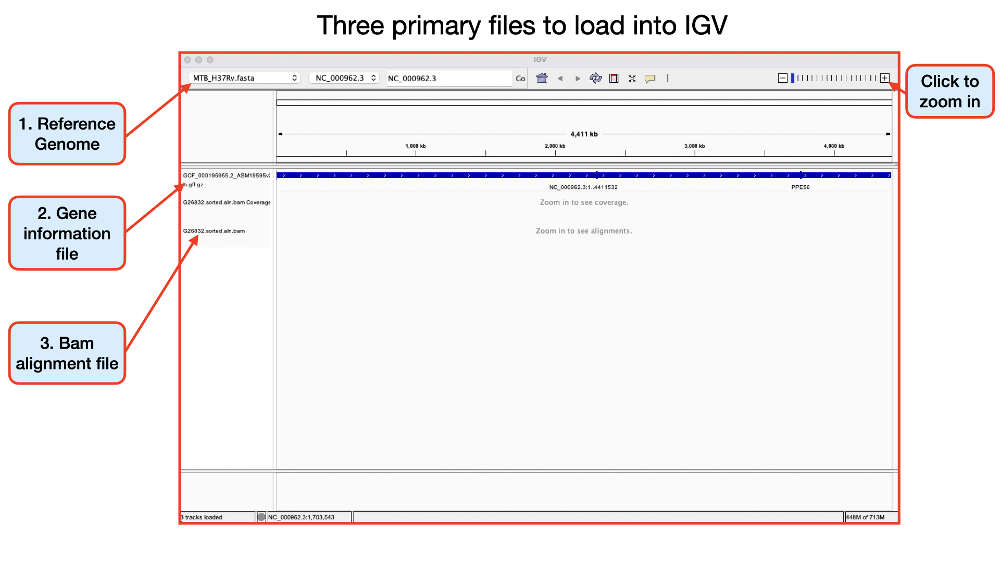

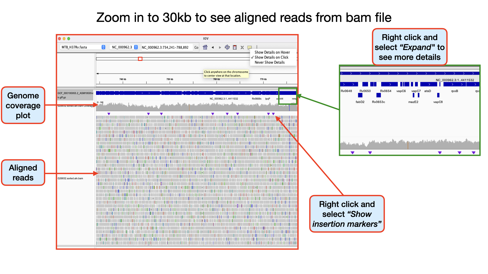

**NB.** For this workshop, we will focus on analysing our genomic data to look out for variants - SNPs and INDELs.
:::


:::::{.callout-important icon=false}
## ***Exercise 5.1.4.1:*** Open IGV and load data
Follow the steps outlined above and load your data into IGV.
The data to load can be found in the genome_browser directory **/Desktop/workshop_files_Bact_Genomics_2023/05_mapping/genome_browser/**.

*You should have IGV already installed on your machines.*

:::{.callout collapse="true"}
## ***Solution:***
The solution to this exercise is your success in loading your data into IGV.

- Open _IGV_ and go to <kbd>Genome → Load Genome from File...</kbd>. 
- In the file browser that opens go to the folder `/Desktop/workshop_files_Bact_Genomics_2023/05_mapping/genome_browser/` and select the file `MTB_H37Rv.fasta` to open it. This is the reference file with no annotation.
- Next, go to <kbd>File → Load from File...</kbd>. 
- In the file browser that opens go to the folder `/Desktop/workshop_files_Bact_Genomics_2023/05_mapping/genome_browser/` and select the file `G26832.sorted.aln.bam` to open it.
- Go back to <kbd>File → Load from file...</kbd> and this time load the gff file `MTB_H37Rv_annotation.gb` containing the annotations.

:::
:::::


There are a huge variety of features you can explore in IGV.
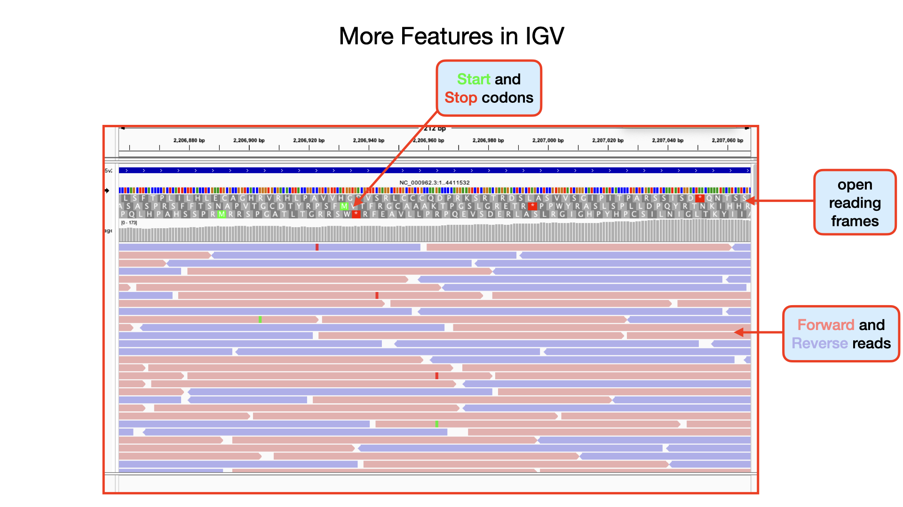


Click to watch the YouTube video below for a brief introduction to IGV -- Sequencing Data Basics.

<p align="center"><iframe width="560" height="315" src="https://www.youtube.com/embed/E_G8z_2gTYM" title="YouTube video player" frameborder="0" allow="accelerometer; autoplay; clipboard-write; encrypted-media; gyroscope; picture-in-picture" allowfullscreen></iframe></p>


Click to watch the YouTube video below for a brief introduction on SNP analysis in IGV.
<p align="center"><iframe width="560" height="315" src="https://www.youtube.com/embed/eZUI6lcIX3I" title="YouTube video player" frameborder="0" allow="accelerometer; autoplay; clipboard-write; encrypted-media; gyroscope; picture-in-picture" allowfullscreen></iframe></p>


#### Identifying SNPs | Homozygous, Heterozygous, Strand Bias

Important metrics for evaluating the validity of SNPs are:
- Coverage
- Amount of support
- Strand bias / PCR artifacts
- Mapping quality scores
- Base quality scores


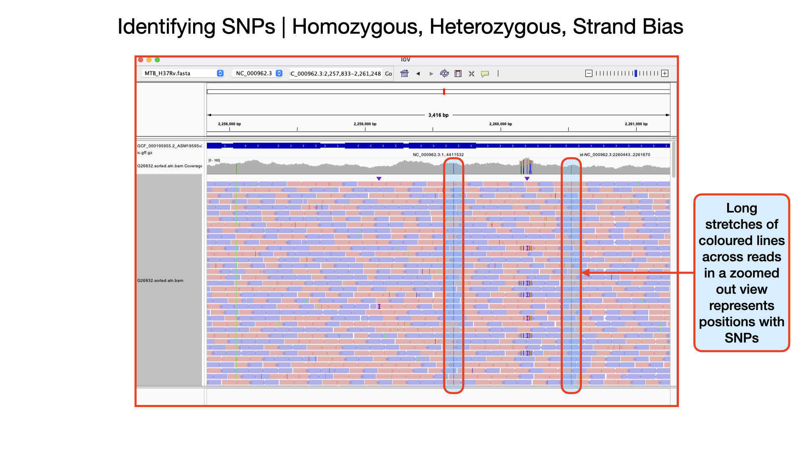

**Identifying Homozygous SNPs**
At position 2,259,657 the nucleotide `A` from the reference sequence has mutated to a `C` within our sample genome. This represents a single nucleotide polymorphism (SNP). If you scroll through, you see that all the 109 reads covering that position called the nucleotide `C` implying this is a true positive SNP and also called an homozygous SNP.

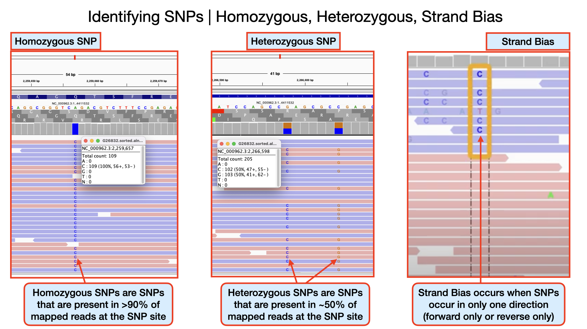

**Identifying Heterozygous SNPs**
In other SNP situations, you will find that only about half the number of reads covering that SNP site called a different nucleotide. Such SNPs are called heterozygous SNPs. This arise because there may be more than one population (*sub-population*) of bacteria within the sample. You can see a lot of this within the region 2,266,478 to 2,266,628. At position 2,266,598 you that out of the 205 reads, exactly half mapped to the nucleotide `C` and the remaining half mapped to the nucleotide `G`.

**Detecting Strand Bias**
In some situations, due to sequencing errors, a false heterozygous SNP can be called. One way to detect false heterozygous SNPs is by looking at the number of forward and reverse reads that called that SNP. If you find that all the SNPs are found on only the forward reads and not reverse reads (or vice versa), then it probably was due to sequencing error. This type of error is called strand bias.


#### Identifying Insertions and Deletions (InDels)

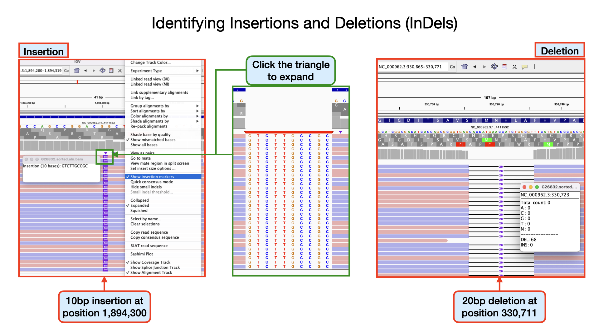

**Identifying insertions**
At position 1894300 the nucleotide `GG` from the reference sequence has mutated to `GGTCTTGCCGCG` within our sample genome. This represents an insertion of 10 nucleotides. If you scroll through your genomic data, you see that more than 80% of the aligned reads have this mutation. Can you identify other insertions?

**Identifying deletions**
At position 330711 the nucleotide `GCACCATGAACCATCTGGCGT` from the reference sequence has mutated to `G` within our sample genome. This represents a deletion of 20 nucleotides at that site. If you scroll through, you see that all the 68 aligned reads at that position have this mutation. Can you identify other deletions?

Note that, these INDELS we have detected, may or may not have phenotypic consequences depending on the location.

:::{.callout-note}
### VCF files can also be loaded into IGV.

We have not yet examined a VCF file. But you should already know how the file format looks like and what it likely contains. We will look into it more detailed in a matter of minutes.
For now, click to watch the YouTube video below for a brief introduction on what VCF files are and how to browse VCF files in IGV.
<p align="center"><iframe width="560" height="315" src="https://www.youtube.com/embed/EpD2ZHM7Q8Q" title="YouTube video player" frameborder="0" allow="accelerometer; autoplay; clipboard-write; encrypted-media; gyroscope; picture-in-picture" allowfullscreen></iframe></p>
::: 


:::::{.callout-important icon=false}
## ***Exercise 5.1.4.2:*** Informative INDELS

Now you know what INDELS look like.
Follow the steps above and load your sample `.vcf` and perform the following task.
1. Identify 2 informative insertions
2. Identify 2 informative deletions 

<details><summary>Hint</summary>Look for INDELS located within annotated genes</details>

:::{.callout collapse="true"}
## ***Solution:***
<!--FIXME: Add the answer-->
:::
:::::

If you have the time, watch the YouTube video below for some more detailed explanation into the use of IGV. 

<p align="center"><iframe width="560" height="315" src="https://www.youtube.com/embed/woKXw1R8LMA" title="YouTube video player" frameborder="0" allow="accelerometer; autoplay; clipboard-write; encrypted-media; gyroscope; picture-in-picture" allowfullscreen></iframe></p>


Follow this [link](https://github.com/sanger-pathogens/pathogen-informatics-training/blob/19186e1ffc7094a0903d18de380184f42494c116/Notebooks/IGV/IGV.pdf) to explore more on IGV.

### [Artemis](https://github.com/sanger-pathogens/Artemis)

The Artemis Software is a set of software tools for genome browsing and annotation.
Several types/sets of information can be viewed simultaneously within different contexts. For example, Artemis gives you the two views of the same genome region, so you can zoom in to inspect detailed DNA sequence motifs, and also zoom out to view local gene architecture (e.g. operons), or even an entire chromosome or genome, all within one screen. It is also possible to perform analyses within Artemis and save the output for future reference.

The Artemis Software includes:
- Artemis
- ACT
- BamView
- DNAPlotter

**Artemis** is a free genome browser and annotation tool that allows visualisation of sequence features, next generation data and the results of analyses within the context of the sequence, and also its six-frame translation. Artemis is written in Java, and is available for UNIX, Macintosh and Windows systems. It can read EMBL and GENBANK database entries or sequence in FASTA, indexed FASTA or raw format. Other sequence features can be in EMBL, GENBANK or GFF format.

**ACT** is a free tool for displaying pairwise comparisons between two or more DNA sequences. It can be used to identify and analyse regions of similarity and difference between genomes and to explore conservation of synteny, in the context of the entire sequences and their annotation.

**DNAPlotter** generates images of circular and linear DNA maps.

**BamView** is a standalone BAM/CRAM file viewer.


#### Starting up the Artemis software
Double click the Artemis icon on the desktop. Alternatively, you can type `art` in the terminal and hit <kbd>Enter</kbd> to open artemis.
A small start-up window will appear (see below). The directory `/Desktop/workshop_files_Bact_Genomics_2023/05_mapping/genome_browser/` all files you will need for this module.
Now follow the sequence of numbers to load up the `MTB_H37Rv.fasta` reference sequence.

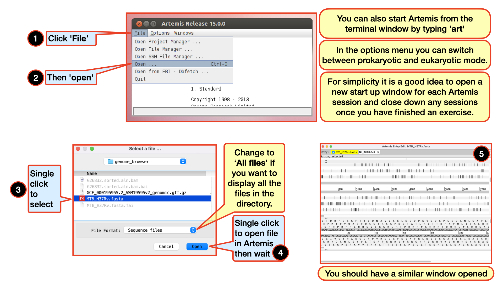

#### Loading an annotation file (entry) into Artemis
Follow the numbers to load the annotation file `MTB_H37Rv_annotation.gb`.

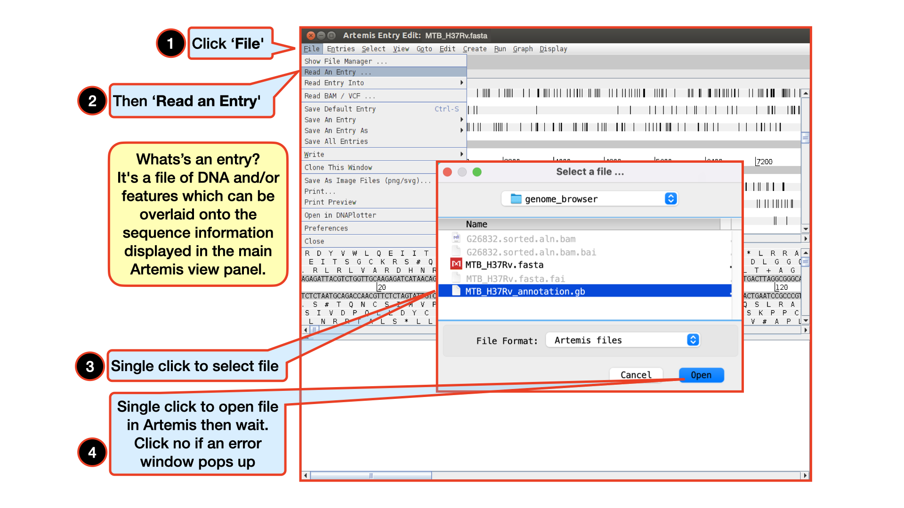


#### The basics of Artemis
Let's take a closer look at what Artemis offers us:

1. Drop-down menus: There are lots in there so don`t worry about all the details right now.

2. Entry (top line): shows which entries are currently loaded with the default entry highlighted in yellow (this is the entry into which newly created features are created). Selected feature: the details of a selected feature are shown here; in this case gene STY0004 (yellow box surrounded by thick black line).

3. This is the main sequence view panel. The central 2 grey lines represent the forward (top) and reverse (bottom) DNA strands. Above and below those are the 3 forward and 3 reverse reading frames. Stop codons are marked on the reading frames as black vertical bars. Genes and other annotated features (eg. Pfam and Prosite matches) are displayed as coloured boxes. We often refer to predicted genes as coding sequences or CDSs.

4. This panel has a similar layout to the main panel but is zoomed in to show nucleotides and amino acids. Double click on a **CDS** in the main view to see the zoomed view of the start of that CDS. Note that both this and the main panel can be scrolled left and right (7, below) zoomed in and out (6, below).

5. Feature panel: This panel contains details of the various features, listed in the order that they occur on the DNA. Any selected features are highlighted. The list can be scrolled (8, below).

6. Sliders for zooming view panels.

7. Sliders for scrolling along the DNA.

8. Slider for scrolling feature list.

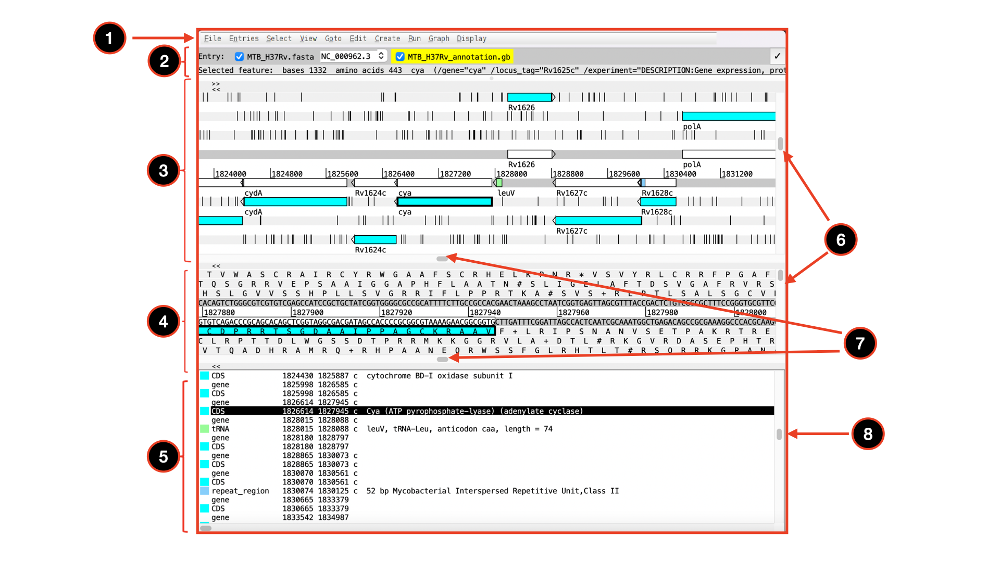


#### Getting around in Artemis
There are three main ways of getting to a particular DNA region in Artemis:

-the Goto drop-down menu

-the Navigator and

-the Feature Selector

The best method depends on what you are trying to do. Knowing which one to use comes with practice.

The functions on the 'Goto' menu (below the Navigator option) are shortcuts for getting to locations within a selected feature or for jumping to the start or end of the DNA sequence. This is really intuitive. You can give it a try.
The Navigator panel is also within the `Goto` menu and fairly intuitive so open it up and give it a try.

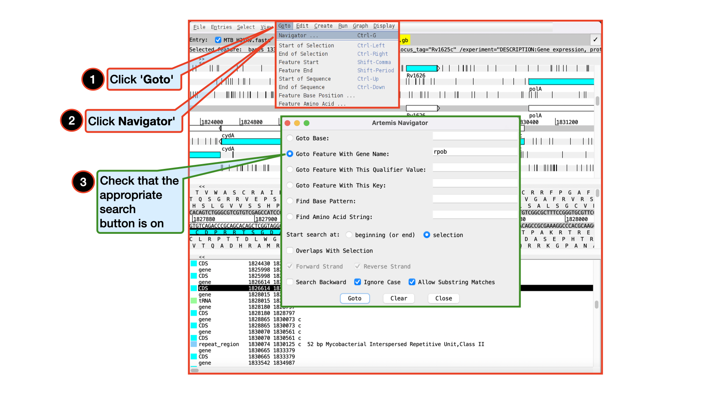

It may seem that `Goto` `Start of Selection` and `Goto` `Feature Start` do the same thing. Well they do if you have a feature selected but `Goto` `Start of Selection` will also work for a region which you have selected by click-dragging in the main window. So yes, give it a try!

:::{.callout}
### Suggested tasks I:

1. Zoom out, select / highlight a large region of sequence by clicking the left hand
button and dragging the cursor then go to the start and end of this selected
region.

2. Select a CDS then go to the start and end.

3. Go to the start and end of the genome sequence.

4. Select a CDS. Within it, go to a base (nucleotide) and/or amino acid of your choice.

5. Highlight a region then, from the right click menu, select `Zoom to Selection`.
:::


:::{.callout}
### Suggested tasks II:

Below are a few more suggested places to try your hands on.

1. Think of a number between 1 and 4411532 and go to that base (notice
how the cursors on the horizontal sliders move with you).

2. Your favourite gene name (it may not be there so you could try `rpob`).

3. Use `Goto Feature With This Qualifier value` to search the contents
of all qualifiers for a particular term. For example using the word
`pseudogene` will take you to the next feature with the word `pseudogene` in any of its qualifiers. Note how repeated clicking of the `Goto` button takes you to the following pseudogene in the order that they occur on the chromosome.

4. tRNA genes. Type `tRNA` in the `Goto Feature With This Key`.

5. Regulator-binding DNA consensus sequence (real or made up!). Note
that degenerate base values can be used.

6. Amino acid consensus sequences (real or made up!). You can use `X`s
Note that it searches all six reading frames regardless of whether the
amino acids are encoded or not. Try searching for the protein `SSTYI`
:::


:::::{.callout-note}
Feature Keys and Qualifiers – a brief explanation of what they are
and a sample of the ones we use.

:::{.callout}
### Feature Keys:

They describe features with DNA coordinates and once marked, they all appear in the Artemis main window. The ones we use are:

- CDS: Marks the extent of the coding sequence.
- RBS: Ribosomal binding site
- misc_feature: Miscellaneous feature in the DNA
- rRNA: Ribosomal RNA
- repeat_region
- repeat_unit
- stem_loop
- tRNA: Transfer RNA
:::

:::{.callout}
### Qualifiers: 

They describe features in relation to their coordinates. 

Once marked they appear in the lower part of the Artemis window. They describe the feature whose coordinates appear in the *location* part of the editing window. The ones commonly use for annotation at the Sanger Institute are:

-class: Classification scheme used *in-house*
-colour: Also used in-house in order to differentiate between different types of genes and other features.
-gene: Descriptive gene a name, eg. ilvE, argA etc.
-label: Allows you to label a gene/feature in the main view panel.
-note: This qualifier allows for the inclusion of free text. This could be a description of the evidence supporting the functional prediction or other notable features/information which cannot be described using other qualifiers.
-product: The assigned possible function for the protein goes here.
-pseudo: Matches in different frames to consecutive segments of the same protein in the databases can be linked or joined as one and edited in one window. They are marked as pseudogenes. They are normally not functional and are considered to have been mutated.
-locus_tag : Systematic gene number, eg SAS1670, Sty2412 etc.
:::

The list of keys and qualifiers accepted by EMBL in sequence/annotation submission files are listed at the following [web page](http://www3.ebi.ac.uk/Services/WebFeat/):
(http://www3.ebi.ac.uk/Services/WebFeat/)

:::::


#### Viewing Plots and Graphs
Feature plots can be displayed by selecting a CDS feature then clicking `View` and `Feature Plots`. The window which appears shows plots predicting hydrophobicity, hydrophilicity and coiled-coil regions for the protein product of the selected CDS.

In addition to looking at the fine detail of the annotated features it is also possible to look at the characteristics of the DNA covering the region displayed. This can be done by adding various plots to the display, showing different characteristics of the DNA. Some of the plots can be used to look at the protein coding potential of translation frames within the DNA, and others can be used to search for horizontally acquired DNA (such as GC frame plot).

To view the graphs: Click on the `Graph` menu to see all those available and then tick the box for `GC Content (%)`. To adjust the smoothing of the graph you change the window size over which the points on the graph are calculated, using the slider shown below.

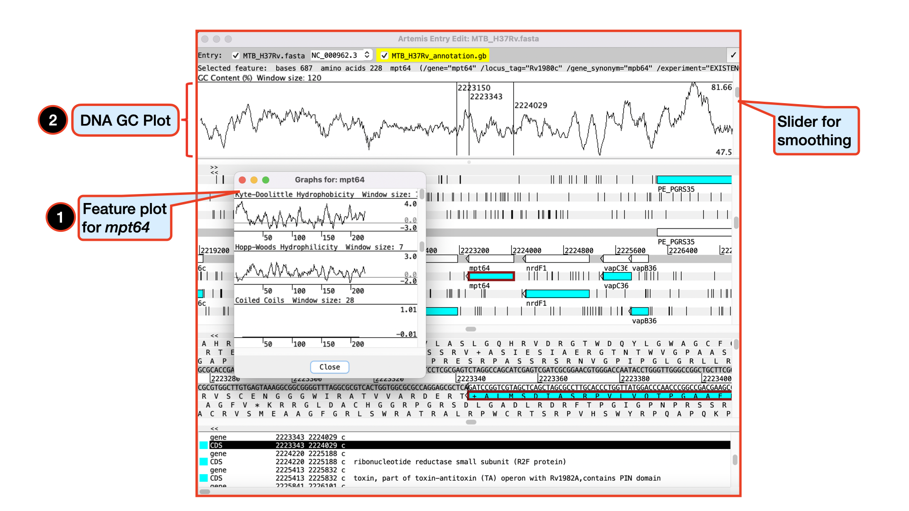


#### Viewing and exploring bam files in Artemis
Like we did with IGV, it is also very possible and maybe much intuitive to view `bam` files in Artemis. Let's go ahead and load in our `G26832.sorted.aln.bam` file by following the instructions below.

:::{.callout-note}
## May require more time to load

Please make sure you do not go to a zoomed-out view of Artemis, but stay at this level, as display of BAM files does take time to load!
:::

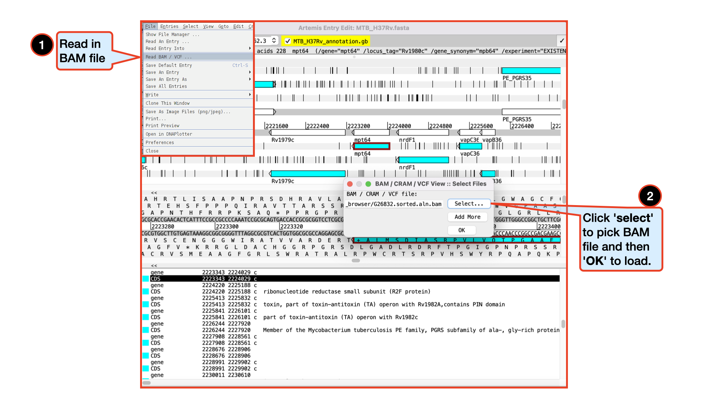


You should see the BAM window appear as in the screen shot below. In the top panel of the window each little horizontal line represents a sequencing read. Notice that all the reads are blue which indicates that these are unique reads, whereas we would have seen alternating green reads representing “duplicated” reads that have been mapped to exactly the same position on the reference sequence. Remember we have removed duplicates during our trimming hence don't expect to see it them here. *(To save space, if there are duplicated reads only one is shown, which means that there could be a large number of duplicated reads at a given position but the software only depicts one)*.

If you click a read its mate pair will also be selected. Also note that if the cursor hovers over a read for long enough details of that read will appear in a small box. You can right-click in the bam view (the panel showing the coloured sequence reads) to see more options and explore them. Note that, if selected reads fall in a region of interest, being able to access some information easily can be really helpful.

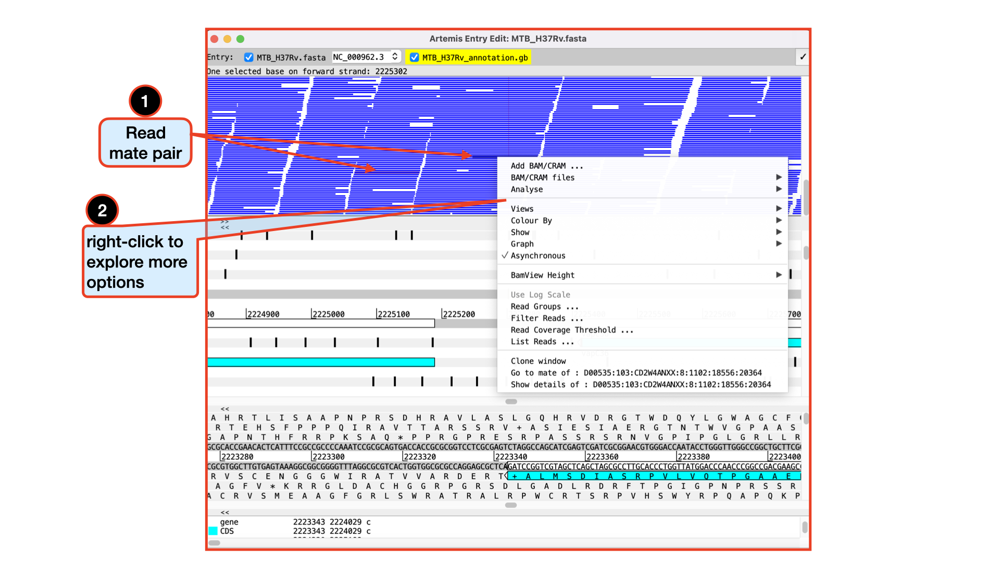

There are a lot of quality checks you can perform with a loaded `bam` file especially if it has not been cleaned. You can explore these quality features with a raw *(unfiltered/untrimmed)* `bam` file.
You can actually use several details relating to the mapping of a read to filter the reads from the BAM file that are shown in the window. To do this, right-click again over the stack plot window showing the reads and select `Filter Reads…`. A window will appear with many options for filtering.


#### Viewing and calling out SNPs

To view SNPs use your right mouse button to click in the BAM view window. Then in the popup menu click on `Show` and check the `SNP marks` box. SNPs in your data in comparison to the reference sequence are shown as red marks on the individual reads.
In other words, the red marks appear on the stacked reads highlighting every base in a read that does not match the reference. When you zoom in you can see some SNPs that are present in all reads and appear as vertical red lines, whereas other SNPs are more sporadically distributed. The former are more likely to be true SNPs whereas the latter may be sequencing errors, although this would not always be true.


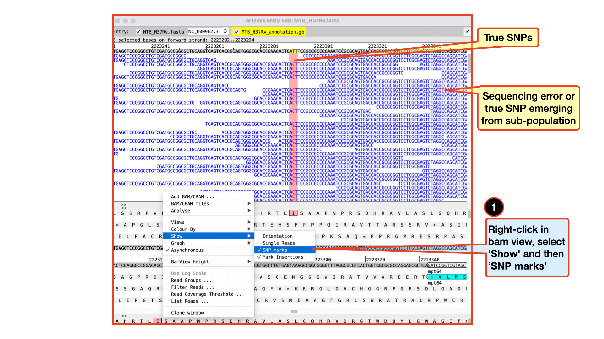


Clearly there are many more features of Artemis which we will not have time to explain in detail. If you still have time, before getting on with the next section it might be worth browsing the menus. Hopefully you will find most of them easy to understand. You can always go back to this after the when you have enough time to explore. All the lessons we learnt in exploring the BAM file in IGV can also be explored in Artemis. 


:::::{.callout-important icon=false}
## ***Exercise 5.1.4.3:*** Viewing multiple BAM files in Artemis

You are not limited to viewing only one BAM file in Artemis, you can also view multiple BAM files at the same time. Remember that a BAM file is a processed set of aligned reads from (in this case) one bacterium aligned against a reference sequence. So in principle we can view multiple different bacterial isolates mapped against the same reference concurrently. 

Your task is to read in another BAM file generated from our mapping script and compare the two files.

Do you see any striking differences?
Make a short comparative report on what you see and present it to the class.

:::{.callout collapse="true"}
## ***Solution:***
- Right click in the BAM view window, select `Add BAM/CRAM ...` and load in the second `bam` file.

:::{.callout-note}
In the first instance Artemis reads all the new reads into the same window. This is useful if you have multiple sequencing runs for the same sample. But in this instance you may want to split the reads into separate windows so that we can view them independently. This is done in the next step.
:::

- First, clone the BAM view window. Right-click over the BAM window and select ‘Clone window’.


:::{.callout-note}
If you right-click over the top BAM window and select BAM files you can individually select the files as desired. This means you can display each BAM file in its own window by de-selecting one or the other file.
:::

- Now compare both sequences and produce your report.

All participants will be given 3 minutes each and expected to present their findings in class.
:::
:::::


:::::{.callout-important icon=false}
## ***Exercise 5.1.4.4:*** Repeat IGV and Artemis exploration on *Staphyloccocus aureus* genome

You should be familiar with navigating your way through the IGV and Artemis genome browsers. You can use any preferred genome browser for this exercise.

Try your hands on this using the *Staphylococcus aureus* genome present in the same `genome_browser` directory.

1. What is the full length of the *Staphylococcus aureus* genome?

2. You saw earlier on the `rpob` gene in the MTB H37Rv geneome. Do you think this gene is also present in the *Staphylococcus aureus* genome? Go ahead and look for it and write down its exact position in the genome. How does it compare with that in the MTB H37Rv genome?

3. Blast the `rpob` gene in NCBI and explore the first 1000 hits. List the number of species that share closely related `rpob` sequences with that of *Staphylococcus aureus* `rpob`? 

:::{.callout collapse="true"}
## ***Solution:***
We will go through the solution in class.
<!--FIXME: Add answer here-->
:::
:::::


## 5.1.5 Variant calling
As you saw from the genome visualization tools, it may be tedious to generate a list of variants if you are working with several BAM files. 
Thankfully, there are command line tools that helps us achieve this purpose and even perform more advanced analysis on our BAM files, which have been developed by the same samtools development team. It isn't called `samtools` this time, but rather `bcftools`, I guess the name originated from the output file format -- `.bcf`. 

[`bcftools`](https://github.com/samtools/bcftools) is a set of utilities for variant calling and that also manipulate variant calls in the Variant Call Format (`VCF`) and its binary counterpart `BCF`. All commands work transparently with both VCFs and BCFs, both uncompressed and BGZF-compressed.

BCFtools is designed to work on a stream. It regards an input file "-" as the standard input (stdin) and outputs to the standard output (stdout). Several commands can thus be combined with Unix pipes

You can check out their [publications](http://samtools.github.io/bcftools/howtos/publications.html) and their [manual page](http://samtools.github.io/bcftools/bcftools.html) to get more information.

:::{.callout}
## Help

Do this to get the help information for bcftools
```bash
bcftools --help
```
```
Program: bcftools (Tools for variant calling and manipulating VCFs and BCFs)
License: GNU GPLv3+, due to use of the GNU Scientific Library
Version: 1.14 (using htslib 1.14)

Usage:   bcftools [--version|--version-only] [--help] <command> <argument>

Commands:

 -- Indexing
    index        index VCF/BCF files

 -- VCF/BCF manipulation
    annotate     annotate and edit VCF/BCF files
    concat       concatenate VCF/BCF files from the same set of samples
    convert      convert VCF/BCF files to different formats and back
    isec         intersections of VCF/BCF files
    merge        merge VCF/BCF files files from non-overlapping sample sets
    norm         left-align and normalize indels
    plugin       user-defined plugins
    query        transform VCF/BCF into user-defined formats
    reheader     modify VCF/BCF header, change sample names
    sort         sort VCF/BCF file
    view         VCF/BCF conversion, view, subset and filter VCF/BCF files

 -- VCF/BCF analysis
    call         SNP/indel calling
    consensus    create consensus sequence by applying VCF variants
    cnv          HMM CNV calling
    csq          call variation consequences
    filter       filter VCF/BCF files using fixed thresholds
    gtcheck      check sample concordance, detect sample swaps and contamination
    mpileup      multi-way pileup producing genotype likelihoods
    polysomy     detect number of chromosomal copies
    roh          identify runs of autozygosity (HMM)
    stats        produce VCF/BCF stats

 Most commands accept VCF, bgzipped VCF, and BCF with the file type detected
 automatically even when streaming from a pipe. Indexed VCF and BCF will work
 in all situations. Un-indexed VCF and BCF and streams will work in most but
 not all situations.
```
:::


:::{.callout}
### Usage

The general format of running commands with the `bcftool` is:

```
bcftools [COMMAND] [OPTIONS]
```  
:::


For this workshop, we will explore only four of the commands.
- bcftools mpileup
- bcftools call
- bcftools view
- bcftools filter


### [bcftools: mpileup, call and view](http://samtools.github.io/bcftools/bcftools.html) 
`bcftools mpileup` -- Generates VCF or BCF containing genotype likelihoods at each genomic position with coverage for one or multiple alignment (BAM or CRAM) files. 

`bcftools call` --  SNP/indel variant calling from VCF/BCF. To be used in conjunction with bcftools mpileup. This command replaces the former bcftools view caller.

`bcftools view` -- subset and filter VCF or BCF files by position and filtering expression. Convert between VCF and BCF. 


:::{.callout}
## Help

For specific help on any of the above tools use these commands:

Do this to get the help information for bcftools mpileup
```bash
bcftools mpileup
```

Do this to get the help information for bcftools call
```bash
bcftools call
```

Do this to get the help information for bcftools view
```bash
bcftools view
```
:::


:::{.callout}
## Usage
The general format of the commands are:

for bcftools mpileup:
```bash
bcftools mpileup [OPTIONS] -f ref.fa in.bam [in2.bam […​]]
```  

for bcftools call:
```bash
bcftools call [OPTIONS] FILE
```  

for bcftools view:
```bash
bcftools view [OPTIONS] file.vcf.gz [REGION […​]]
```  
:::


I am sure we are now very much aware and happy with the use of the pipe `|`.
We will combine all three commands with `|` in order to speed up things.


:::{.callout}

### We do this by running the following command:

```bash
bcftools mpileup --fasta-ref MTB_H37Rv.fasta --min-BQ 20 --annotate FORMAT/AD,FORMAT/ADF,FORMAT/ADR,FORMAT/DP,FORMAT/SP,INFO/AD,INFO/ADF,INFO/ADR G26832.sorted.aln.bam | bcftools call --output-type v --ploidy 1 --multiallelic-caller | bcftools view --output-file G26832.vcf.gz --output-type z
```
```
[mpileup] 1 samples in 1 input files
[mpileup] maximum number of reads per input file set to -d 250
```
:::


Let's briefly define each of the options we have used in the above command


<!--FIXME: Find a way to show the "--" correctly in the table below. You can consider using `--` -->

| Input option | Input required | Description |
|:-- |:-- | :---------- |
| --fasta-ref | *FILE* | The faidx-indexed reference file in the FASTA format. The file can be optionally compressed by bgzip. Reference is required by default unless the --no-reference option is set [null] |
| --min-BQ | *INT* | Caps the base quality to a maximum value [60]. This can be particularly useful on technologies that produce overly optimistic high qualities, leading to too many false positives or incorrect genotype assignments. |
| --annotate | *LIST* |  Comma-separated list of FORMAT and INFO tags to output. (case-insensitive, the "FORMAT/" prefix is optional, and use "?" to list available annotations on the command line) [null]: *(see table below for the list of  "FORMAT/" and "ÏNFO/" tags)* |
| --output-type | *`b|u|z|v[0-9]`* | Output compressed BCF (b), uncompressed BCF (u), compressed VCF (z), uncompressed VCF (v). Use the -Ou option when piping between bcftools subcommands to speed up performance by removing unnecessary compression/decompression and VCF←→BCF conversion.   The compression level of the compressed formats (b and z) can be set by by appending a number between 0-9. |
| --ploidy | *ASSEMBLY[?]* | predefined ploidy, use list (or any other unused word) to print a list of all predefined assemblies. Append a question mark to print the actual definition. |
| --multiallelic-caller | | alternative model for multiallelic and rare-variant calling designed to overcome known limitations in -c calling model (conflicts with -c) |


***"FORMAT/" and "INFO/" tags***

| Tag | Description |
|:-- |:----------- |
| FORMAT/AD   | .. Allelic depth (Number=R,Type=Integer) |
| FORMAT/ADF  | .. Allelic depths on the forward strand (Number=R,Type=Integer) |
| FORMAT/ADR  | .. Allelic depths on the reverse strand (Number=R,Type=Integer) |
| FORMAT/DP   | .. Number of high-quality bases (Number=1,Type=Integer) | 
| FORMAT/SP   | .. Phred-scaled strand bias P-value (Number=1,Type=Integer) |
| FORMAT/SCR  | .. Number of soft-clipped reads (Number=1,Type=Integer) |
| INFO/AD     | .. Total allelic depth (Number=R,Type=Integer) |
| INFO/ADF    | .. Total allelic depths on the forward strand (Number=R,Type=Integer) |
| INFO/ADR    | .. Total allelic depths on the reverse strand (Number=R,Type=Integer) |
| INFO/SCR    | .. Number of soft-clipped reads (Number=1,Type=Integer) |
| FORMAT/DV   | .. Deprecated in favor of FORMAT/AD; Number of high-quality non-reference bases, (Number=1,Type=Integer) |
| FORMAT/DP4 | .. Deprecated in favor of FORMAT/ADF and FORMAT/ADR; Number of high-quality ref-forward, ref-reverse, alt-forward and alt-reverse bases (Number=4,Type=Integer) |
| FORMAT/DPR  | .. Deprecated in favor of FORMAT/AD; Number of high-quality bases for each observed allele (Number=R,Type=Integer) |
| INFO/DPR   | .. Deprecated in favor of INFO/AD; Number of high-quality bases for each observed allele (Number=R,Type=Integer) |


You can have a quick look at the output file **G26832.vcf.gz**
Note that, the output file is a compressed file.
To view a compressed file we use `zcat`, and since we do not want to view the entire content of the file, we pipe it to head. Pipe `|` should be your friend by now. :)


:::{.callout}
### quick look at first 42 lines

```bash
zcat G26832.vcf.gz | head -n 42
```
```
##fileformat=VCFv4.2
##FILTER=<ID=PASS,Description="All filters passed">
##bcftoolsVersion=1.14+htslib-1.14
##bcftoolsCommand=mpileup --fasta-ref MTB_H37Rv.fasta --min-BQ 20 --annotate FORMAT/AD,FORMAT/ADF,FORMAT/ADR,FORMAT/DP,FORMAT/SP,INFO/AD,INFO/ADF,INFO/ADR G26832.sorted.aln.bam
##reference=file://MTB_H37Rv.fasta
##contig=<ID=NC_000962.3,length=4411532>
##ALT=<ID=*,Description="Represents allele(s) other than observed.">
##INFO=<ID=INDEL,Number=0,Type=Flag,Description="Indicates that the variant is an INDEL.">
##INFO=<ID=IDV,Number=1,Type=Integer,Description="Maximum number of raw reads supporting an indel">
##INFO=<ID=IMF,Number=1,Type=Float,Description="Maximum fraction of raw reads supporting an indel">
##INFO=<ID=DP,Number=1,Type=Integer,Description="Raw read depth">
##INFO=<ID=VDB,Number=1,Type=Float,Description="Variant Distance Bias for filtering splice-site artefacts in RNA-seq data (bigger is better)",Version="3">
##INFO=<ID=RPBZ,Number=1,Type=Float,Description="Mann-Whitney U-z test of Read Position Bias (closer to 0 is better)">
##INFO=<ID=MQBZ,Number=1,Type=Float,Description="Mann-Whitney U-z test of Mapping Quality Bias (closer to 0 is better)">
##INFO=<ID=BQBZ,Number=1,Type=Float,Description="Mann-Whitney U-z test of Base Quality Bias (closer to 0 is better)">
##INFO=<ID=MQSBZ,Number=1,Type=Float,Description="Mann-Whitney U-z test of Mapping Quality vs Strand Bias (closer to 0 is better)">
##INFO=<ID=SCBZ,Number=1,Type=Float,Description="Mann-Whitney U-z test of Soft-Clip Length Bias (closer to 0 is better)">
##INFO=<ID=FS,Number=1,Type=Float,Description="Phred-scaled p-value using Fisher's exact test to detect strand bias">
##INFO=<ID=SGB,Number=1,Type=Float,Description="Segregation based metric.">
##INFO=<ID=MQ0F,Number=1,Type=Float,Description="Fraction of MQ0 reads (smaller is better)">
##FORMAT=<ID=PL,Number=G,Type=Integer,Description="List of Phred-scaled genotype likelihoods">
##FORMAT=<ID=DP,Number=1,Type=Integer,Description="Number of high-quality bases">
##FORMAT=<ID=SP,Number=1,Type=Integer,Description="Phred-scaled strand bias P-value">
##FORMAT=<ID=AD,Number=R,Type=Integer,Description="Allelic depths (high-quality bases)">
##FORMAT=<ID=ADF,Number=R,Type=Integer,Description="Allelic depths on the forward strand (high-quality bases)">
##FORMAT=<ID=ADR,Number=R,Type=Integer,Description="Allelic depths on the reverse strand (high-quality bases)">
##INFO=<ID=AD,Number=R,Type=Integer,Description="Total allelic depths (high-quality bases)">
##INFO=<ID=ADF,Number=R,Type=Integer,Description="Total allelic depths on the forward strand (high-quality bases)">
##INFO=<ID=ADR,Number=R,Type=Integer,Description="Total allelic depths on the reverse strand (high-quality bases)">
##FORMAT=<ID=GT,Number=1,Type=String,Description="Genotype">
##INFO=<ID=AC,Number=A,Type=Integer,Description="Allele count in genotypes for each ALT allele, in the same order as listed">
##INFO=<ID=AN,Number=1,Type=Integer,Description="Total number of alleles in called genotypes">
##INFO=<ID=DP4,Number=4,Type=Integer,Description="Number of high-quality ref-forward , ref-reverse, alt-forward and alt-reverse bases">
##INFO=<ID=MQ,Number=1,Type=Integer,Description="Average mapping quality">
##bcftools_callVersion=1.14+htslib-1.14
##bcftools_callCommand=call --output-type v --ploidy 1 --multiallelic-caller; Date=Mon Nov 14 15:29:39 2022
##bcftools_viewVersion=1.14+htslib-1.14
##bcftools_viewCommand=view --output-file G26832.vcf.gz --output-type z; Date=Mon Nov 14 15:29:39 2022
#CHROM  POS     ID      REF     ALT     QUAL    FILTER  INFO    FORMAT  G26832.sorted.aln.bam
NC_000962.3     1       .       T       .       284.59  .       DP=41;ADF=33;ADR=7;AD=40;MQSBZ=0;FS=0;MQ0F=0;AN=1;DP4=33,7,0,0;MQ=59        GT:DP:SP:ADF:ADR:AD     0:40:0:33:7:40
NC_000962.3     2       .       T       .       284.59  .       DP=45;ADF=37;ADR=7;AD=44;MQSBZ=0;FS=0;MQ0F=0;AN=1;DP4=37,7,0,0;MQ=59        GT:DP:SP:ADF:ADR:AD     0:44:0:37:7:44
NC_000962.3     3       .       G       .       284.59  .       DP=45;ADF=37;ADR=7;AD=44;MQSBZ=0;FS=0;MQ0F=0;AN=1;DP4=37,7,0,0;MQ=59        GT:DP:SP:ADF:ADR:AD     0:44:0:37:7:44 
```
:::


:::::{.callout-important icon=false}
## ***Exercise 5.1.5.1:*** View only informative lines.

Write down a quick command that you will use to view only the informative lines starting from the **#chrom** line.

:::{.callout collapse="true"}
## ***Solution:***
The command below performs the requested task.
**NB.** The -v, --invert-match option tells grep to select only non-matching lines.

```bash
zcat G26832.vcf.gz | grep -v "##" | head -n 10
```
```
#CHROM  POS     ID      REF     ALT     QUAL    FILTER  INFO    FORMAT  G26832.sorted.aln.bam
NC_000962.3     1       .       T       .       284.59  .       DP=41;ADF=33;ADR=7;AD=40;MQSBZ=0;FS=0;MQ0F=0;AN=1;DP4=33,7,0,0;MQ=59GT:DP:SP:ADF:ADR:AD      0:40:0:33:7:40
NC_000962.3     2       .       T       .       284.59  .       DP=45;ADF=37;ADR=7;AD=44;MQSBZ=0;FS=0;MQ0F=0;AN=1;DP4=37,7,0,0;MQ=59GT:DP:SP:ADF:ADR:AD      0:44:0:37:7:44
NC_000962.3     3       .       G       .       284.59  .       DP=45;ADF=37;ADR=7;AD=44;MQSBZ=0;FS=0;MQ0F=0;AN=1;DP4=37,7,0,0;MQ=59GT:DP:SP:ADF:ADR:AD      0:44:0:37:7:44
NC_000962.3     4       .       A       .       284.59  .       DP=46;ADF=38;ADR=7;AD=45;MQSBZ=0;FS=0;MQ0F=0;AN=1;DP4=38,7,0,0;MQ=59GT:DP:SP:ADF:ADR:AD      0:45:0:38:7:45
NC_000962.3     5       .       C       .       284.59  .       DP=50;ADF=40;ADR=8;AD=48;MQSBZ=0;FS=0;MQ0F=0;AN=1;DP4=40,8,0,0;MQ=59GT:DP:SP:ADF:ADR:AD      0:48:0:40:8:48
NC_000962.3     6       .       C       .       284.59  .       DP=51;ADF=41;ADR=8;AD=49;MQSBZ=0;FS=0;MQ0F=0;AN=1;DP4=41,8,0,0;MQ=59GT:DP:SP:ADF:ADR:AD      0:49:0:41:8:49
NC_000962.3     7       .       G       .       284.59  .       DP=52;ADF=42;ADR=8;AD=50;MQSBZ=0;FS=0;MQ0F=0;AN=1;DP4=42,8,0,0;MQ=59GT:DP:SP:ADF:ADR:AD      0:50:0:42:8:50
NC_000962.3     8       .       A       .       284.59  .       DP=52;ADF=42;ADR=8;AD=50;MQSBZ=0;FS=0;MQ0F=0;AN=1;DP4=42,8,0,0;MQ=59GT:DP:SP:ADF:ADR:AD      0:50:0:42:8:50
NC_000962.3     9       .       T       .       284.59  .       DP=52;ADF=42;ADR=8;AD=50;MQSBZ=0;FS=0;MQ0F=0;AN=1;DP4=42,8,0,0;MQ=59GT:DP:SP:ADF:ADR:AD      0:50:0:42:8:50
```
:::
:::::


:::::{.callout-important icon=false}
## ***Exercise 5.1.5.2:*** Count number of INDELS
Write down a quick command that you will use to count only the insertions and deletions (INDELS) present in our `.vcf` file.

How many INDELS do you find?

Go ahead and list the first 9 INDELS.

<details><summary>Hint</summary>There is a flag called 'INDEL'</details>

:::{.callout collapse="true"}
## ***Solution:***
The command below counts the number of INDELS.

:::{.callout}
```bash
zcat G26832.vcf.gz | grep "INDEL" | wc -l
```
```
95
```
:::

The command below lists the first 9 lines containing INDELS.

:::{.callout}
#

```bash
zcat G26832.vcf.gz | grep "INDEL" | head -n 10
```
```
##INFO=<ID=INDEL,Number=0,Type=Flag,Description="Indicates that the variant is an INDEL.">
NC_000962.3     27518   .       TAAAAA  TAAAA   228.359 .       INDEL;IDV=88;IMF=0.926316;DP=95;ADF=0,47;ADR=4,36;AD=4,83;VDB=0.7912;SGB=-0.693147;RPBZ=-4.01107;MQBZ=0;MQSBZ=0;SCBZ=-2.34859;FS=0;MQ0F=0;AC=1;AN=1;DP4=0,4,47,36;MQ=60 GT:PL:DP:SP:ADF:ADR:AD  1:255,0:87:14:0,47:4,36:4,83
NC_000962.3     47138   .       CTTT    CTT     225.417 .       INDEL;IDV=92;IMF=0.948454;DP=97;ADF=0,49;ADR=0,37;AD=0,86;VDB=0.657263;SGB=-0.693147;RPBZ=-0.661043;MQBZ=0;MQSBZ=0;SCBZ=-2.85007;FS=0;MQ0F=0;AC=1;AN=1;DP4=0,0,49,37;MQ=60     GT:PL:DP:SP:ADF:ADR:AD   1:255,0:86:0:0,49:0,37:0,86
NC_000962.3     49233   .       AGGG    AGG     225.417 .       INDEL;IDV=81;IMF=0.94186;DP=86;ADF=0,44;ADR=0,36;AD=0,80;VDB=0.00122889;SGB=-0.693147;RPBZ=-3.73886;MQBZ=0;MQSBZ=0;SCBZ=-2.06091;FS=0;MQ0F=0;AC=1;AN=1;DP4=0,0,44,36;MQ=60     GT:PL:DP:SP:ADF:ADR:AD   1:255,0:80:0:0,44:0,36:0,80
NC_000962.3     55553   .       CCG     CCGTCG  228.31  .       INDEL;IDV=46;IMF=0.647887;DP=71;ADF=5,21;ADR=2,25;AD=7,46;VDB=0.0134748;SGB=-0.693147;RPBZ=1.91017;MQBZ=0;MQSBZ=0;BQBZ=-4.33586;SCBZ=-3.44435;FS=0;MQ0F=0;AC=1;AN=1;DP4=5,2,21,25;MQ=60 GT:PL:DP:SP:ADF:ADR:AD  1:255,0:53:6:5,21:2,25:7,46
NC_000962.3     125830  .       GAAAA   GAAAAA  228.416 .       INDEL;IDV=67;IMF=0.8375;DP=80;ADF=1,28;ADR=2,36;AD=3,64;VDB=0.730354;SGB=-0.693147;RPBZ=-3.82272;MQBZ=0;MQSBZ=0;SCBZ=-4.61458;FS=0;MQ0F=0;AC=1;AN=1;DP4=1,2,28,36;MQ=60 GT:PL:DP:SP:ADF:ADR:AD  1:255,0:67:0:1,28:2,36:3,64
NC_000962.3     131174  .       TGG     TGGG    228.424 .       INDEL;IDV=87;IMF=0.977528;DP=89;ADF=0,46;ADR=1,39;AD=1,85;VDB=0.0036349;SGB=-0.693147;RPBZ=-0.152335;MQBZ=0;MQSBZ=0;SCBZ=0.265603;FS=0;MQ0F=0;AC=1;AN=1;DP4=0,1,46,39;MQ=60    GT:PL:DP:SP:ADF:ADR:AD   1:255,0:86:0:0,46:1,39:1,85
NC_000962.3     175277  .       GC      GCC     228.38  .       INDEL;IDV=67;IMF=0.943662;DP=71;ADF=2,24;ADR=1,39;AD=3,63;VDB=0.0525057;SGB=-0.693147;RPBZ=-1.65917;MQBZ=0;MQSBZ=0;SCBZ=0;FS=0;MQ0F=0;AC=1;AN=1;DP4=2,1,24,39;MQ=60     GT:PL:DP:SP:ADF:ADR:AD  1:255,0:66:3:2,24:1,39:3,63
NC_000962.3     234496  .       C       CGT     228.391 .       INDEL;IDV=78;IMF=0.896552;DP=87;ADF=2,46;ADR=2,31;AD=4,77;VDB=0.617617;SGB=-0.693147;RPBZ=-1.63117;MQBZ=0;MQSBZ=0;SCBZ=-4.37836;FS=0;MQ0F=0;AC=1;AN=1;DP4=2,2,46,31;MQ=60      GT:PL:DP:SP:ADF:ADR:AD   1:255,0:81:0:2,46:2,31:4,77
NC_000962.3     330711  .       GCACCATGAACCATCTGGCGT   G       228.424 .       INDEL;IDV=66;IMF=0.825;DP=80;ADF=1,34;ADR=0,32;AD=1,66;VDB=3.86599e-10;SGB=-0.693147;RPBZ=-5.86754;MQBZ=0;MQSBZ=0;SCBZ=-8.45738;FS=0;MQ0F=0;AC=1;AN=1;DP4=1,0,34,32;MQ=60       GT:PL:DP:SP:ADF:ADR:AD  1:255,0:67:0:1,34:0,32:1,66
```
:::
:::
:::::


### [bcftools filter](http://samtools.github.io/bcftools/bcftools.html)
`bcftools filter` -- basically filters VCF files by applying fixed-threshold filters

:::{.callout}
## Help
Do this to get the help information for `bcftools filter`

```bash
bcftools filter
```
```
About:   Apply fixed-threshold filters.
Usage:   bcftools filter [options] <in.vcf.gz>

Options:
    -e, --exclude EXPR             Exclude sites for which the expression is true (see man page for details)
    -g, --SnpGap INT[:TYPE]        Filter SNPs within <int> base pairs of an indel (the default) or any combination of indel,mnp,bnd,other,overlap
    -G, --IndelGap INT             Filter clusters of indels separated by <int> or fewer base pairs allowing only one to pass
    -i, --include EXPR             Include only sites for which the expression is true (see man page for details
    -m, --mode [+x]                "+": do not replace but add to existing FILTER; "x": reset filters at sites which pass
        --no-version               Do not append version and command line to the header
    -o, --output FILE              Write output to a file [standard output]
    -O, --output-type u|b|v|z[0-9] u/b: un/compressed BCF, v/z: un/compressed VCF, 0-9: compression level [v]
    -r, --regions REGION           Restrict to comma-separated list of regions
    -R, --regions-file FILE        Restrict to regions listed in a file
        --regions-overlap 0|1|2    Include if POS in the region (0), record overlaps (1), variant overlaps (2) [1]
    -s, --soft-filter STRING       Annotate FILTER column with <string> or unique filter name ("Filter%d") made up by the program ("+")
    -S, --set-GTs .|0              Set genotypes of failed samples to missing (.) or ref (0)
    -t, --targets REGION           Similar to -r but streams rather than index-jumps
    -T, --targets-file FILE        Similar to -R but streams rather than index-jumps
        --targets-overlap 0|1|2    Include if POS in the region (0), record overlaps (1), variant overlaps (2) [0]
        --threads INT              Use multithreading with <int> worker threads [0]
```
:::


:::{.callout}
## Usage
The general format of the command is:

```bash
bcftools filter [OPTIONS] FILE
```  
:::


Before we run `bcftools filter` we will need to create an index of our `.vcf.gz` file.
To do this, we will use the command `tabix`.


:::::{.callout}
### tabix

You can check out it's help function

:::{.callout}
## Help
Do this to get the help information for tabix
```bash
tabix --help
```
```
Version: 1.14
Usage:   tabix [OPTIONS] [FILE] [REGION [...]]

Indexing Options:
   -0, --zero-based           coordinates are zero-based
   -b, --begin INT            column number for region start [4]
   -c, --comment CHAR         skip comment lines starting with CHAR [null]
   -C, --csi                  generate CSI index for VCF (default is TBI)
   -e, --end INT              column number for region end (if no end, set INT to -b) [5]
...
```
:::

:::{.callout}
### Usage

The general format of the command is:

```bash
tabix [OPTIONS] [FILE] [REGION [...]]
```  
:::

We will index our file by running the following command:

```bash
tabix -p vcf -f G26832.vcf.gz
```
You shouldn't expect a message printed out on the screen.

Just look out for the new file generated
```
G26832.vcf.gz.tbi
```
:::::


Now that we have our index file let's go back to perform our filtering.


We perform the filtering by running the following command:

:::{.callout}
### bcftools filter

```bash
bcftools filter --output G26832.filtered.vcf.gz --soft-filter LowQual --exclude "%QUAL<25 || FORMAT/DP<10 || MAX(FORMAT/ADF)<2 || MAX(FORMAT/ADR)<2 || MAX(FORMAT/AD)/SUM(FORMAT/DP)<0.9 || MQ<30 || MQ0F>0.1" --output-type z G26832.vcf.gz
```
```
busy
```

*Don't expect any print out on your terminal. The expected file `G26832.filtered.vcf.gz` should be created by now. Look out for it in your directory.*

The optional arguments we have used in the above command have the following meaning:

| option | interpretation |
|--|------------|
| `--soft-filter` | Annotate FILTER column with the unique filter name LowQual |
| `--exclude` | Exclude sites for which the expression is true see this [link]( http://samtools.github.io/bcftools/bcftools.html#expressions) for all the possible expressions|
| `--output-type z` | Specifies a compressed VCF output |


:::


Can you think of any analysis we can use our `G26832.filtered.vcf.gz` file for?

The last thing we will do is to try to generate a consensus sequence or an assembled genome from our `G26832.filtered.vcf.gz` file. We call this assembled genome a **pseudogenome**. Remember that the assembled genome will be coming from our mapped sequences and so will have the same number of genomic positions as our reference genome. Later in this course, we will see how to assemble a genome directly from the raw reads. We call this kind of assembly a `denovo` assembly.

For now, let's focus on getting our pseudogenome.

There are various tools to do this but we will use a simple python script to archive this.


## 5.1.6 Generating a consensus sequence 

Our consensus sequence (pseudogenome) will be generated in a `fasta` file format.


### Parse `vcf` files into `fasta` format

We will run a simple python script to achieve this purpose. In your working directory, you will find a file named `vcf2pseudogenome.py`. This is a simple python script that will do the job for us.

We can go ahead and execute that python script by running the command below:

:::{.callout}
### execute python script
```bash
python vcf2pseudogenome.py  -r MTB_H37Rv.fasta -b G26832.filtered.vcf.gz -o G26832.fas
```
```
10000
20000
30000
40000
50000
60000
70000
...
```
:::

<!--FIXME: I don't know if my explanation to how the scripts function is accurate-->
You should now see another file generated in your directory called `G26832.fas`. 
What the python script did was to pick the variants called from the vcf file and replace them in the reference genome to call out the new file.

Now let's go ahead and have a look at the top five lines of the `G26832.fas` file with the command:

:::{.callout}
```bash
head -n 5 G26832.fas
```
```
>G26832
ttgaccgatgaccccggttcaggcttcaccacagtgtggaacgcggtcgtctccgaactt
aacggcgaccctaaggttgacgacggacccagcagtgatgctaatctcagcgctccgctg
acccctcagcaaagggcttggctcaatctcgtccagccattgaccatcgtcgaggggttt
gctctgttatccgtgccgagcagctttgtccaaaacgaaatcgagcgccatctgcgggcc
```
:::


<!-- FIXME: This set of codes does not apply to this course but worth exploring.

## Cleaning FASTA Files

To proceed with our analysis, we need a FASTA file containing _all_ of our consensus sequences.
However, our `ncov2019-artic-nf` Nextflow workflow outputs _separate_ FASTA files for each sample and in individual directories. 
We can see this by running (from within the `02-consensus/uk_illumina/` directory): 

```bash
$ ls results/consensus/qc_pass_climb_upload/uk/
```

Also, the workflow modifies our original sample names in the FASTA file, by adding information about the steps used in the analysis. 
For example:

```bash
$ head -n 1 results/consensus/qc_pass_climb_upload/uk/ERR5761182/ERR5761182.primertrimmed.consensus.fa
```

```
>Consensus_ERR5761182.primertrimmed.consensus_threshold_0.75_quality_20
```

What we want to do is clean these sample names, so that we end up with:

```
>ERR5761182
```

We also want to make sure to combine all the samples into a single FASTA file. 

We can the command-line skills we acquired so far, in particular the use of the `cat` command to combine (or _concatenate_) the individual files and the `sed` command to replace text and clean our sample names. 
Let's do this step by step.

First, we can use the `*` _wildcard_ to combine all the FASTA files with the `cat` command:

```bash
$ cat results/consensus/qc_pass_climb_upload/uk/*/*.fa
```

Running this command will print all of the sequences on the screen!
To see what happened a little better, we could _pipe_ this command to `less` to browse up-and-down through the file:

```bash
$ cat results/consensus/qc_pass_climb_upload/uk/*/*.fa | less
```

We could also check that we now have all our samples combined, we could pass the results to `grep` and search for the word `>`, which in the FASTA format indicates the sequence name:

```bash
$ cat results/consensus/qc_pass_climb_upload/uk/*/*.fa | grep ">" | wc -l
```

This should give us 7 as the result (which makes sense, since we have 7 samples). 

We can now proceed with cleaning the names of the sequences, by using `sed`:

```bash
cat results/consensus/qc_pass_climb_upload/uk/*/*.fa | sed 's/Consensus_//' | sed 's/.primertrimmed.consensus_threshold_0.75_quality_20//' > results/consensus/clean_sequences.fa
```

Notice how we use two rounds of text replacement, first we replace the word `Consensus_` by an empty string, and then again `.primertrimmed.consensus_threshold_0.75_quality_20` with nothing. 

We also make sure to redirect the result to a new file.


:::exercise

In this exercise we will create a clean FASTA file for the samples collected in India. 
These are found in the `02-consensus/india_nanopore` directory, so make sure to change to that directory first (on our training machines you can do: `cd ~/Course_Materials/02-consensus/india_nanopore`)

If we look at one of the files

```bash
$ head -n 1 results/consensus/qc_pass_climb_upload/india/india_barcode01/india_barcode01.consensus.fasta
```

```
>india_barcode01/ARTIC/medaka MN908947.3
```

We want to clean the name of the sequences so that the result is:

```
>barcode01
```

- Use the tools `cat` and `sed` to construct a command that generates a new file called `results/consensus/clean_sequences.fa` containing all the sequences with "clean" sequence names. 

<details><summary>Hint</summary>Remember the syntax for pattern replacement with `sed` is: `sed 's/replace this/with that/'`. Also remember that if you want to replace the character "/", you need to use the special _escape character_, for example: `sed 's/replace \/ slash//'`</details>

<details><summary>Answer</summary>

The complete code to achieve the desired outcome is:

```bash
cat results/consensus/qc_pass_climb_upload/india/*/*.fasta | sed 's/india_//' | sed 's/\/ARTIC\/medaka MN908947.3//' > results/consensus/clean_sequences.fa
```

Note that in order to replace the pattern `/ARTIC/medaka MN908947.3`, we needed to "_escape_" the `/` symbol by using `\/`.
This is because `/` alone is used by `sed` to separate different parts of the command. 

Look at the [section about pattern replacement](02-unix-sed.html) for a reminder of how the `sed` command works.

</details>

:::

-->


### Disk Usage II --- Cleaning up after analysis
Now that we are done investigating our genomic sequences, let's pause again and check the space of our current working directory.

You can do this with the **d**isk **u**sage `du` command
```bash
du -h
```

How much disk space have you used since the start of the analysis?
I'm sure it's about 2.2G. Just from one set of reads, we have generated about 2G of data we may not need. Imaging if we had hundreds of samples.
What files do you consider not necessary to keep?
Let's do some cleaning up.
We will remove `rm` all files that we may not need for further analysis. 
Most of these files are intermediate files and can always be reproduced if we need to.

#### remove all `.sam` files if not needed
```bash
rm *.sam
```

#### remove all `bam` files if not needed
```bash
rm *bam*
```


## 5.1.7 Mapping to pseudogenome bash script: Putting it all together

Now let's try this out! We will generate pseudogenomes and some quality statistics for three pairs of reads from Illumina paired-end sequencing. We will perform all the analysis above in one run while generating all the various files at each stage within the pipeline in tandem. 

### Running multiple samples with a simple bash script
This is a pipeline to map short reads to a reference assembly. It outputs some quality statistics, does variant calling and produces a pseudogenome of each input sample.


All the `fastq` files needed for this analysis are located in the current working `short_read_mapping_MTB` directory.
You can have a look by simply running the below command to check out all the forward reads present in the current directory.

:::{.callout}
```  bash
ls *R1.trim.fastq.gz
```
```
G26831_R1.trim.fastq.gz  G26832_R1.trim.fastq.gz  G26854_R1.trim.fastq.gz
```
:::


Let's have a look at the QC bash script we are going to run:


```bash
cat mappingTofasta.sh
```

Just like the script used in our previous lesson, this script also contains several commands, some are combined together using pipes. (UNIX pipes is a very powerful and elegant concept which allows us to feed the output of one command into the next command and avoid writing intermediate files. If you are not comfortable with UNIX or how scripts look like and how they work, consider revisiting the [UNIX](../02-unix_intro/) tutorial or more specifically [bonus shell script](../02-unix_intro/2.9-bonus_shell_scripts.md).

Now run the script to create the quality statistics and pseudogenomes (this may take a while):

:::{.callout}
### mapping to fasta
```bash
bash mappingTofasta.sh
```
<!--FIXME: edit the mapping output below with the correct MAPPING tag-->
```
#################################################################################
#### loop bash script for running Mapping to generating pseudogenome fasta files ######
#######################################################################################
#               #
#  ___   ____   #
# / _ \ / ___|  #
# | | | | |     #
# | |_| | |___  #
# \__\_\ \____| #
#               #
#               #
#######################################################################################
MTB_H37Rv.fasta exists and will be used in the next run in a second.
 <<<<<<<running bwa index>>>>>>>
[bwa_index] Pack FASTA... 0.04 sec
[bwa_index] Construct BWT for the packed sequence...
[bwa_index] 0.98 seconds elapse.
...
```
:::


The script will produce all the intermediate and final files we have encountered in this session.

Perform a simple `ls` command with the arguments `-lhrt` and view the most recent files created.

```bash
ls -lhrt
```

Congratulations!!! You just created your first set of pseudogenomes using a bash script. 


----


:::::{.callout-important icon=false}
## ***Exercise 5.1.7.1:*** Advance Exercise: Reproducible Research Assessment

Let's try to apply what we've learnt so far to see if we can reproduce the output figure below retrieved from a publication.

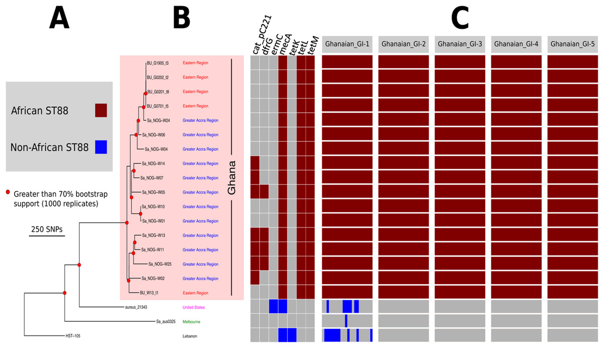

You can click [here](https://peerj.com/articles/3047/) to read the abstract of the publication [Kpeli et. a., 2017 PeerJ](https://peerj.com/articles/3047/)

In the publication, they state that they used comparative genomics to assess relatedness among 17 ST88 CA-MRSA isolates recovered from patients attending Buruli ulcer treatment centres in Ghana, three non-African ST88s and 15 other MRSA lineages from the current study and [Amissah et. al., 2015 PNTD](https://www.ncbi.nlm.nih.gov/pmc/articles/PMC4567303/).

Your task is simple. Each person will be provided with two pairs of sequencing reads -- one from the above paper and the other from elsewhere.

1. Navigate to the `short_read_mapping_Staph` directory and activate the `mapping` environment. You have all you need for this exercise in this directory.
2. Performs QC on the pair of genome and select the best genome
3. Perform mapping analysis and generate a pseudogenome 
4. Upload your pseudogenome to the [dropbox folder]()
<!--FIXME: insert the dropbox link above--> 

**NB.** All the pseudogenomes would be concatenated to draw a tree at the end of the phylogenetic lesson.

:::{.callout collapse="true"}
## ***Solution:***
Change to the required working directory
```bash
cd ~/Desktop/workshop_files_Bact_Genomics_2023/05_mapping/short_read_mapping_Staph/
```

run the qc analysis
```bash

```

run the mappingTofasta analysis
```bash

```

:::
:::::

----

## 5.1.8 Deactivate `mapping` environment

Now that we are done with all our analysis, let's deactivate the `mapping` environment:

```bash
mamba deactivate
```


## 5.1.9 Credit
Information on this page has been adapted and modified from the following source(s):

- https://github.com/cambiotraining/sars-cov-2-genomics

- https://bio-bwa.sourceforge.net/

- http://www.htslib.org/doc/samtools.html

- https://software.broadinstitute.org/software/igv/home

- https://www.ncbi.nlm.nih.gov/pmc/articles/PMC3346182/

- https://github.com/sanger-pathogens/Artemis

- Wellcome Genome Campus Advanced Courses and Scientific Conferences 2017 - WORKING WITH PATHOGEN GENOMES Course Manual http://www.wellcome.ac.uk/advancedcourses