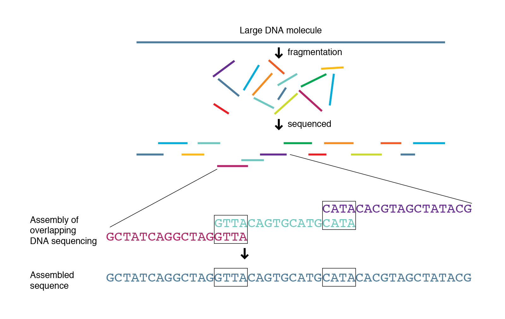

**Teaching: 50 min** || **Exercises: 20 min**

## Overview

:::::{.callout}

:::{.callout-important icon=false}
### Questions:
- What is *de novo* genome assembly?
- How do I assemble my genome?
- How do I assess the quality of my genome?
- What is genome annotation?
- How do I annotate my genome?
:::

:::{.callout-important icon=false}
### Learning Objectives:
- Understand what *de novo* genome assembly is and how it differs from reference-based assembly.
- Assemble sequence data with `shovill`
- Generate metrics for your assembly with `QUAST`.
- Annotate your genome with `Bakta`
:::

:::{.callout-tip}
### Keypoints:
- Understand what *de novo* genome assembly is and how we can use `shovill` to create one.
- Extract and interprete the assembly metrics using `QUAST` to decide how good your assembly is.
- Understand what genome annotation is and how these can be added using `Bakta`.
:::
:::::

## 6.1 Background

There are two approaches for genome assembly: reference-based (or comparative)  or *de novo*.  In a reference-based assembly, we use a reference genome as a guide to map our sequence data to and thus reassemble our sequence this way (this is what we did in the previous module).  Alternatively, we can create a 'new' (*de novo*) assembly that does not rely on a map or reference and more closely reflects the actual genome structure of the isolate that was sequenced.



### Genome assemblers

Several tools are available for *de novo* genome assembly depending on whether you're trying to assemble short-read sequence data, long reads or else a combination of both.  Two of the most commonly used assemblers for short-read Illumina data are `Velvet` and `SPAdes`.  SPAdes has become the *de facto* standard de novo genome assembler for Illumina whole genome sequencing data of bacteria and is a major improvement over previous assemblers like Velvet. However, some of its components can be slow and it traditionally did not handle overlapping paired-end reads well.  `Shovill` is a pipeline which uses `SPAdes` at its core, but alters the steps before and after the primary assembly step to get similar results in less time. Shovill also supports other assemblers like `SKESA`, `Velvet` and `Megahit`.  

<details><summary>Disk Usage I --- Before analysis</summary>

Before we start performing any assemblies, let's pause and check the space of our current working directory as we did for our previous lesson.

You can do this with the **d**isk **u**sage `du` command
```bash
du -h
```

<details><summary>Current Disk Space In assembly_annotation_MTB Directory</summary>~247MB</details>

Now, keep this value in mind, and this time, don't forget it. We will come back to it at the end of this chapter.
</details>

## 6.3 *de novo* genome assembly

### *de novo* genome assembly with [`Shovill`](https://github.com/tseemann/shovill)

We're going to use `Shovill` to create our *de novo* genome assemblies.  Let's navigate the module directory and activate the `shovill` environment:

```bash

cd workshop_files_Bact_Genomics_2023 

conda activate shovill
```

:::{.callout}
## Help
Do this to get the help information for `Shovill`:
```bash
shovill -h
```
```bash
SYNOPSIS
  De novo assembly pipeline for Illumina paired reads
USAGE
  shovill [options] --outdir DIR --R1 R1.fq.gz --R2 R2.fq.gz
GENERAL
  --help          This help
  --version       Print version and exit
  --check         Check dependencies are installed
INPUT
  --R1 XXX        Read 1 FASTQ (default: '')
  --R2 XXX        Read 2 FASTQ (default: '')
  --depth N       Sub-sample --R1/--R2 to this depth. Disable with --depth 0 (default: 150)
  --gsize XXX     Estimated genome size eg. 3.2M <blank=AUTODETECT> (default: '')
OUTPUT
  --outdir XXX    Output folder (default: '')
  --force         Force overwite of existing output folder (default: OFF)
  --minlen N      Minimum contig length <0=AUTO> (default: 0)
  --mincov n.nn   Minimum contig coverage <0=AUTO> (default: 2)
  --namefmt XXX   Format of contig FASTA IDs in 'printf' style (default: 'contig%05d')
  --keepfiles     Keep intermediate files (default: OFF)
RESOURCES
  --tmpdir XXX    Fast temporary directory (default: '')
  --cpus N        Number of CPUs to use (0=ALL) (default: 8)
  --ram n.nn      Try to keep RAM usage below this many GB (default: 16)
ASSEMBLER
  --assembler XXX Assembler: megahit skesa velvet spades (default: 'spades')
  --opts XXX      Extra assembler options in quotes eg. spades: '--sc' (default: '')
  --kmers XXX     K-mers to use <blank=AUTO> (default: '')
MODULES
  --trim          Enable adaptor trimming (default: OFF)
  --noreadcorr    Disable read error correction (default: OFF)
  --nostitch      Disable read stitching (default: OFF)
  --nocorr        Disable post-assembly correction (default: OFF)
HOMEPAGE
  https://github.com/tseemann/shovill - Torsten Seemann
```
:::

We've chosen one of the TB genomes from our course dataset to assemble with `Shovill`: ERX1275297_ERR1203055 (TBNm 2359).

:::{.callout}
## Usage

The basic command for running `Shovill` is as follows:

```bash
shovill --outdir <OUTDIR> --R1 <FWD FASTQ> --R2 <REV FASTQ> --gsize <GENOME SIZE>
```
The meaning of the options used is:

| Input option | Input required | Description |
|:-- |:-- | :---------- |
| --outdir | *DIRECTORY* | directory to write the output files to |
| --R1 | *FILE* | Read 1 FASTQ file |
| --R2 | *FILE* | Read 2 FASTQ file |
| --gsize | *TXT* | The estimated genome size that shovill will use to calculate read coverage |
:::

:::{.callout}
## Run shovill

Let's build our first  *de novo* assembly with shovill:

```bash
shovill --outdir ERX1275297_ERR1203055 --R1 ERX1275297_ERR1203055_1.fastq.gz --R2 ERX1275297_ERR1203055_2.fastq.gz --gsize 4.3M
```
```bash
[shovill] Hello ajv37
[shovill] You ran: /home/ajv37/miniconda3/envs/shovill/bin/shovill --outdir ERX1275297_ERR1203055 --R1 ERX1275297_ERR1203055_1.fastq.gz --R2 ERX1275297_ERR1203055_2.fastq.gz --gsize 4.3M
[shovill] This is shovill 1.1.0
[shovill] Written by Torsten Seemann
[shovill] Homepage is https://github.com/tseemann/shovill
[shovill] Operating system is linux
[shovill] Perl version is v5.32.1
[shovill] Machine has 64 CPU cores and 187.36 GB RAM
[shovill] Using bwa - /home/ajv37/miniconda3/envs/shovill/bin/bwa | Version: 0.7.17-r1188
[shovill] Using flash - /home/ajv37/miniconda3/envs/shovill/bin/flash | FLASH v1.2.11
[shovill] Using java - /home/ajv37/miniconda3/envs/shovill/bin/java | openjdk version "11.0.8-internal" 2020-07-14
[shovill] Using kmc - /home/ajv37/miniconda3/envs/shovill/bin/kmc | K-Mer Counter (KMC) ver. 3.2.1 (2022-01-04)
[shovill] Using lighter - /home/ajv37/miniconda3/envs/shovill/bin/lighter | Lighter v1.1.2
[shovill] Using megahit - /home/ajv37/miniconda3/envs/shovill/bin/megahit | MEGAHIT v1.2.9
[shovill] Using megahit_toolkit - /home/ajv37/miniconda3/envs/shovill/bin/megahit_toolkit | v1.2.9
[shovill] Using pigz - /home/ajv37/miniconda3/envs/shovill/bin/pigz | pigz 2.6
[shovill] Using pilon - /home/ajv37/miniconda3/envs/shovill/bin/pilon | Pilon version 1.24 Thu Jan 28 13:00:45 2021 -0500
[shovill] Using samclip - /home/ajv37/miniconda3/envs/shovill/bin/samclip | samclip 0.4.0
[shovill] Using samtools - /home/ajv37/miniconda3/envs/shovill/bin/samtools | Version: 1.16.1 (using htslib 1.16)
[shovill] Using seqtk - /home/ajv37/miniconda3/envs/shovill/bin/seqtk | Version: 1.3-r106
[shovill] Using skesa - /home/ajv37/miniconda3/envs/shovill/bin/skesa | SKESA 2.4.0
...
```
The following files will be created in the `ERX1275297_ERR1203055` directory:

| Output file | Description |
|:-- | :---------- |
| `contigs.fa` | The final assembly you should use |
| `shovill.log` | Full log file for bug reporting |
| `shovill.corrections` | List of post-assembly corrections |
| `contigs.gfa` | Assembly graph |
| `spades.fasta` | Raw assembled contigs |

:::

Before we move on to the next step, let's rename our assembly (`contigs.fa`) to something more useful:

```bash
cd ERX1275297_ERR1203055

mv contigs.fa ERX1275297_ERR1203055_contigs.fa
```
Finally, deactivate the `shovill` environment:

```bash
mamba deactivate
```

## 6.4 Assembly quality assessment

### Assembly QC with [`QUAST`](https://quast.sourceforge.net/)

Before we do any further analyses with our assemblies, we need to assess the quality.  To do this we use a tool called `QUAST` which generates a number of useful metrics for assemblies.  These include but aren't limited to:

1. The total number of contigs greater than 0 bp.  Ideally, we like to see assemblies in the smallest number of contigs ('pieces') as this means there is likely less missing data contained in gaps between contigs.
2. The total length of the assembly.  We normally know what the expected length of our assembly is (for more diverse organisms like *E. coli* there may be a range of genome sizes). The length of your assembly should be close to the expected genome size.  If it's too big or too small, either there is some kind of contamination or else you've sequenced the wrong species!
3. The N50 of the assembly.  This is the final metric often used to assess the quality of an assembly.  The N50 is typically calculated by averaging the length of the largest contigs that account for 50% of the genome size. This is a bit more complicated conceptually but the higher the N50 the better.  A large N50 implies that you have a small number of larger contigs in your assembly which equals a good assembly.

Let's activate the `quast` environment:

```bash
conda activate quast
```

:::{.callout}
## Help
Do this to get the help information for `QUAST`:

```bash
quast -h
```
```bash
QUAST: Quality Assessment Tool for Genome Assemblies
Version: 5.0.2

Usage: python /home/ajv37/.conda/envs/quast/bin/quast [options] <files_with_contigs>

Options:
-o  --output-dir  <dirname>       Directory to store all result files [default: quast_results/results_<datetime>]
-r                <filename>      Reference genome file
-g  --features [type:]<filename>  File with genomic feature coordinates in the reference (GFF, BED, NCBI or TXT)
                                  Optional 'type' can be specified for extracting only a specific feature type from GFF
-m  --min-contig  <int>           Lower threshold for contig length [default: 500]
-t  --threads     <int>           Maximum number of threads [default: 25% of CPUs]

Advanced options:
-s  --split-scaffolds                 Split assemblies by continuous fragments of N's and add such "contigs" to the comparison
-l  --labels "label, label, ..."      Names of assemblies to use in reports, comma-separated. If contain spaces, use quotes
-L                                    Take assembly names from their parent directory names
-e  --eukaryote                       Genome is eukaryotic (primarily affects gene prediction)
    --fungus                          Genome is fungal (primarily affects gene prediction)
    --large                           Use optimal parameters for evaluation of large genomes
                                      In particular, imposes '-e -m 3000 -i 500 -x 7000' (can be overridden manually)
-k  --k-mer-stats                     Compute k-mer-based quality metrics (recommended for large genomes)
                                      This may significantly increase memory and time consumption on large genomes
    --k-mer-size                      Size of k used in --k-mer-stats [default: 101]
    --circos                          Draw Circos plot
-f  --gene-finding                    Predict genes using GeneMarkS (prokaryotes, default) or GeneMark-ES (eukaryotes, use --eukaryote)
    --mgm                             Use MetaGeneMark for gene prediction (instead of the default finder, see above)
    --glimmer                         Use GlimmerHMM for gene prediction (instead of the default finder, see above)
    --gene-thresholds <int,int,...>   Comma-separated list of threshold lengths of genes to search with Gene Finding module
                                      [default: 0,300,1500,3000]
    --rna-finding                     Predict ribosomal RNA genes using Barrnap
-b  --conserved-genes-finding         Count conserved orthologs using BUSCO (only on Linux)
    --operons  <filename>             File with operon coordinates in the reference (GFF, BED, NCBI or TXT)
    --est-ref-size <int>              Estimated reference size (for computing NGx metrics without a reference)
    --contig-thresholds <int,int,...> Comma-separated list of contig length thresholds [default: 0,1000,5000,10000,25000,50000]
-u  --use-all-alignments              Compute genome fraction, # genes, # operons in QUAST v1.* style.
                                      By default, QUAST filters Minimap's alignments to keep only best ones
-i  --min-alignment <int>             The minimum alignment length [default: 65]
    --min-identity <float>            The minimum alignment identity (80.0, 100.0) [default: 95.0]
-a  --ambiguity-usage <none|one|all>  Use none, one, or all alignments of a contig when all of them
                                      are almost equally good (see --ambiguity-score) [default: one]
    --ambiguity-score <float>         Score S for defining equally good alignments of a single contig. All alignments are sorted 
                                      by decreasing LEN * IDY% value. All alignments with LEN * IDY% < S * best(LEN * IDY%) are 
                                      discarded. S should be between 0.8 and 1.0 [default: 0.99]
    --strict-NA                       Break contigs in any misassembly event when compute NAx and NGAx.
                                      By default, QUAST breaks contigs only by extensive misassemblies (not local ones)
-x  --extensive-mis-size  <int>       Lower threshold for extensive misassembly size. All relocations with inconsistency
                                      less than extensive-mis-size are counted as local misassemblies [default: 1000]
    --scaffold-gap-max-size  <int>    Max allowed scaffold gap length difference. All relocations with inconsistency
                                      less than scaffold-gap-size are counted as scaffold gap misassemblies [default: 10000]
    --unaligned-part-size  <int>      Lower threshold for detecting partially unaligned contigs. Such contig should have
                                      at least one unaligned fragment >= the threshold [default: 500]
    --skip-unaligned-mis-contigs      Do not distinguish contigs with >= 50% unaligned bases as a separate group
                                      By default, QUAST does not count misassemblies in them
    --fragmented                      Reference genome may be fragmented into small pieces (e.g. scaffolded reference) 
    --fragmented-max-indent  <int>    Mark translocation as fake if both alignments are located no further than N bases 
                                      from the ends of the reference fragments [default: 85]
                                      Requires --fragmented option
    --upper-bound-assembly            Simulate upper bound assembly based on the reference genome and reads
    --upper-bound-min-con  <int>      Minimal number of 'connecting reads' needed for joining upper bound contigs into a scaffold
                                      [default: 2 for mate-pairs and 1 for long reads]
    --est-insert-size  <int>          Use provided insert size in upper bound assembly simulation [default: auto detect from reads or 255]
    --plots-format  <str>             Save plots in specified format [default: pdf].
                                      Supported formats: emf, eps, pdf, png, ps, raw, rgba, svg, svgz
    --memory-efficient                Run everything using one thread, separately per each assembly.
                                      This may significantly reduce memory consumption on large genomes
    --space-efficient                 Create only reports and plots files. Aux files including .stdout, .stderr, .coords will not be created.
                                      This may significantly reduce space consumption on large genomes. Icarus viewers also will not be built
-1  --pe1     <filename>              File with forward paired-end reads (in FASTQ format, may be gzipped)
-2  --pe2     <filename>              File with reverse paired-end reads (in FASTQ format, may be gzipped)
    --pe12    <filename>              File with interlaced forward and reverse paired-end reads. (in FASTQ format, may be gzipped)
    --mp1     <filename>              File with forward mate-pair reads (in FASTQ format, may be gzipped)
    --mp2     <filename>              File with reverse mate-pair reads (in FASTQ format, may be gzipped)
    --mp12    <filename>              File with interlaced forward and reverse mate-pair reads (in FASTQ format, may be gzipped)
    --single  <filename>              File with unpaired short reads (in FASTQ format, may be gzipped)
    --pacbio     <filename>           File with PacBio reads (in FASTQ format, may be gzipped)
    --nanopore   <filename>           File with Oxford Nanopore reads (in FASTQ format, may be gzipped)
    --ref-sam <filename>              SAM alignment file obtained by aligning reads to reference genome file
    --ref-bam <filename>              BAM alignment file obtained by aligning reads to reference genome file
    --sam     <filename,filename,...> Comma-separated list of SAM alignment files obtained by aligning reads to assemblies
                                      (use the same order as for files with contigs)
    --bam     <filename,filename,...> Comma-separated list of BAM alignment files obtained by aligning reads to assemblies
                                      (use the same order as for files with contigs)
                                      Reads (or SAM/BAM file) are used for structural variation detection and
                                      coverage histogram building in Icarus
    --sv-bedpe  <filename>            File with structural variations (in BEDPE format)

Speedup options:
    --no-check                        Do not check and correct input fasta files. Use at your own risk (see manual)
    --no-plots                        Do not draw plots
    --no-html                         Do not build html reports and Icarus viewers
    --no-icarus                       Do not build Icarus viewers
    --no-snps                         Do not report SNPs (may significantly reduce memory consumption on large genomes)
    --no-gc                           Do not compute GC% and GC-distribution
    --no-sv                           Do not run structural variation detection (make sense only if reads are specified)
    --no-gzip                         Do not compress large output files
    --no-read-stats                   Do not align reads to assemblies
                                      Reads will be aligned to reference and used for coverage analysis,
                                      upper bound assembly simulation, and structural variation detection.
                                      Use this option if you do not need read statistics for assemblies.
    --fast                            A combination of all speedup options except --no-check

Other:
    --silent                          Do not print detailed information about each step to stdout (log file is not affected)
    --test                            Run QUAST on the data from the test_data folder, output to quast_test_output
    --test-sv                         Run QUAST with structural variants detection on the data from the test_data folder,
                                      output to quast_test_output
-h  --help                            Print full usage message
-v  --version                         Print version

Online QUAST manual is available at http://quast.sf.net/manual
```

:::

:::{.callout}
## Usage

The basic command for running `QUAST` is as follows:

```bash
quast.py --output-dir <OUTDIR> <ASSEMBLY>  
```
The meaning of the option used is:

| Input option | Input required | Description |
|:-- |:-- | :---------- |
| --output-dir | *DIRECTORY* | Directory to write the output files to |

:::

:::{.callout}
## Run QUAST

Let's run `QUAST` on the genome we've just created to assess the quality:

```bash
quast.py --output-dir quast ERX1275297_ERR1203055_contigs.fa
```
```bash
Version: 5.0.2

System information:
  OS: Linux-3.10.0-1160.80.1.el7.x86_64-x86_64-with-redhat-7.9-Nitrogen (linux_64)
  Python version: 3.7.12
  CPUs number: 64

Started: 2022-12-15 16:44:12

Logging to /rds/project/rds-PzYD5LltalA/Teaching/Ghana/shovill/ERX1275297_ERR1203055.1/quast/quast.log
NOTICE: Maximum number of threads is set to 16 (use --threads option to set it manually)

CWD: /rds/project/rds-PzYD5LltalA/Teaching/Ghana/shovill/ERX1275297_ERR1203055.1
Main parameters: 
  MODE: default, threads: 16, minimum contig length: 500, minimum alignment length: 65, \
  ambiguity: one, threshold for extensive misassembly size: 1000
...
```

The following files will be created in the `quast` directory:

| Output file | Description |
|:-- | :---------- |
| `report.txt` | Assessment summary in plain text format |
| `report.tsv` | Tab-separated version of the summary, suitable for spreadsheets (Google Docs, Excel, etc) |
| `report.tex` | LaTeX version of the summary |
| `icarus.html` | Icarus main menu with links to interactive viewers |
| `report.pdf` | All other plots combined with all tables (file is created if matplotlib python library is installed) |
| `report.html` | HTML version of the report with interactive plots inside |
| `transposed_report.txt` | Transposed assessment summary in plain text format |
| `transposed_report.tsv` | Transposed tab-separated version of the summary |
| `transposed_report.tex` | Transposed LaTeX version of the summary |

:::

:::::{.callout-important icon=false}
### ***Exercise 6.1.1:*** Investigate the QUAST output
Now that we've got the results from `QUAST`, how good is the assembly we created with `shovill`?

1. What is the total number of contigs?
2. What is the total length of the assembly?
3. What is the N50 of the assembly?

:::{.callout collapse="true"}
### ***Solution:***
There are a couple of ways we could answer the questions above as the assembly metrics can be parsed in different ways.  Let's parse the `report.tsv`:

```bash
cat report.tsv
```

This will provide all the information we need:

```bash
Assembly	ERX1275297_ERR1203055_contigs
# contigs (>= 0 bp)	227
# contigs (>= 1000 bp)	86
# contigs (>= 5000 bp)	61
# contigs (>= 10000 bp)	55
# contigs (>= 25000 bp)	48
# contigs (>= 50000 bp)	35
Total length (>= 0 bp)	4397844
Total length (>= 1000 bp)	4361978
Total length (>= 5000 bp)	4311192
Total length (>= 10000 bp)	4270901
Total length (>= 25000 bp)	4162429
Total length (>= 50000 bp)	3732349
# contigs	105
Largest contig	298563
Total length	4376331
GC (%)	65.58
N50	99158
N75	64010
L50	15
L75	28
# N's per 100 kbp	0.00
```

1. The total number of contigs > 0bp is `227`
2. The total length of the assembly is `4397844`
3. The N50 of the assembly is `99158`

What do you think? Should we move forward with this assembly? The answer is yes!
:::
:::::

Finally, deactivate the `quast` environment:

```bash
mamba deactivate
```

## 6.5 Genome annotation

Genome annotation is a multi-level process that includes prediction of protein-coding genes (CDSs), as well as other functional genome units such as structural RNAs, tRNAs, small RNAs, pseudogenes, control regions, direct and inverted repeats, insertion sequences, transposons and other mobile elements.  The most commonly used tools for annotating bacterial genomes are `prokka` and, more recently, `Bakta`.  Both use a tool called `prodigal` to predict the protein-coding regions along with other tools for predicting other genomic features such as `Aragorn` for tRNA.  Once the genomic regions have been predicted, the tools use a database of existing bacterial genome annotations, normally generated from a large collection of genomes such as UniRef, to add this information to your genome.

### Annotation with [`Bakta`](https://github.com/oschwengers/bakta)

`Bakta` is a tool for the rapid & standardized annotation of bacterial genomes and plasmids from both isolates and MAGs (Metagenome assembled genomes).  It was designed with `prokka` as a template but adds several features such as predicting pseudogenomes and additional annotations (COG, KEGG, AMR) that aren't part of `prokka`.  As `prokka` is no longer being actively supported, there is a move to replacing it with `Bakta` in our analysis pipelines.

Before we run `Bakta` we need to download and set up the database `Bakta` will use to annotate our genome.  Given the size of the database, for the purposes of this course, we've already done this.  However, if you'd like to download and update the database yourself, there are instructions on the [Setup](../../setup.md) page.

First, let's activate the environment:

```bash
conda activate bakta
```

:::{.callout}
## Help
Do this to get the help information for `bakta`:
```bash
bakta -h
```
```bash
usage: bakta [--db DB] [--min-contig-length MIN_CONTIG_LENGTH] [--prefix PREFIX] [--output OUTPUT] [--genus GENUS] [--species SPECIES] [--strain STRAIN] [--plasmid PLASMID] [--complete]
             [--prodigal-tf PRODIGAL_TF] [--translation-table {11,4}] [--gram {+,-,?}] [--locus LOCUS] [--locus-tag LOCUS_TAG] [--keep-contig-headers] [--replicons REPLICONS] [--compliant]
             [--proteins PROTEINS] [--skip-trna] [--skip-tmrna] [--skip-rrna] [--skip-ncrna] [--skip-ncrna-region] [--skip-crispr] [--skip-cds] [--skip-pseudo] [--skip-sorf] [--skip-gap] [--skip-ori] [--help]
             [--verbose] [--threads THREADS] [--tmp-dir TMP_DIR] [--version]
             <genome>

Rapid & standardized annotation of bacterial genomes, MAGs & plasmids

positional arguments:
  <genome>              Genome sequences in (zipped) fasta format

Input / Output:
  --db DB, -d DB        Database path (default = <bakta_path>/db). Can also be provided as BAKTA_DB environment variable.
  --min-contig-length MIN_CONTIG_LENGTH, -m MIN_CONTIG_LENGTH
                        Minimum contig size (default = 1; 200 in compliant mode)
  --prefix PREFIX, -p PREFIX
                        Prefix for output files
  --output OUTPUT, -o OUTPUT
                        Output directory (default = current working directory)

Organism:
  --genus GENUS         Genus name
  --species SPECIES     Species name
  --strain STRAIN       Strain name
  --plasmid PLASMID     Plasmid name

Annotation:
  --complete            All sequences are complete replicons (chromosome/plasmid[s])
  --prodigal-tf PRODIGAL_TF
                        Path to existing Prodigal training file to use for CDS prediction
  --translation-table {11,4}
                        Translation table: 11/4 (default = 11)
  --gram {+,-,?}        Gram type for signal peptide predictions: +/-/? (default = ?)
  --locus LOCUS         Locus prefix (default = 'contig')
  --locus-tag LOCUS_TAG
                        Locus tag prefix (default = autogenerated)
  --keep-contig-headers
                        Keep original contig headers
  --replicons REPLICONS, -r REPLICONS
                        Replicon information table (tsv/csv)
  --compliant           Force Genbank/ENA/DDJB compliance
  --proteins PROTEINS   Fasta file of trusted protein sequences for CDS annotation

Workflow:
  --skip-trna           Skip tRNA detection & annotation
  --skip-tmrna          Skip tmRNA detection & annotation
  --skip-rrna           Skip rRNA detection & annotation
  --skip-ncrna          Skip ncRNA detection & annotation
  --skip-ncrna-region   Skip ncRNA region detection & annotation
  --skip-crispr         Skip CRISPR array detection & annotation
  --skip-cds            Skip CDS detection & annotation
  --skip-pseudo         Skip pseudogene detection & annotation
  --skip-sorf           Skip sORF detection & annotation
  --skip-gap            Skip gap detection & annotation
  --skip-ori            Skip oriC/oriT detection & annotation

General:
  --help, -h            Show this help message and exit
  --verbose, -v         Print verbose information
  --threads THREADS, -t THREADS
                        Number of threads to use (default = number of available CPUs)
  --tmp-dir TMP_DIR     Location for temporary files (default = system dependent auto detection)
  --version             show program's version number and exit

Version: 1.5.0
DOI: 10.1099/mgen.0.000685
URL: github.com/oschwengers/bakta

Citation:
Schwengers O., Jelonek L., Dieckmann M. A., Beyvers S., Blom J., Goesmann A. (2021).
Bakta: rapid and standardized annotation of bacterial genomes via alignment-free sequence identification.
Microbial Genomics, 7(11). https://doi.org/10.1099/mgen.0.000685
```
:::

:::{.callout}
## Usage

The basic command for running `Bakta` is as follows:

```bash
bakta --prefix <OUTPUT PREFIX> --db <PATH TO BAKTA DB> <ASSEMBLY>
```

The meaning of the options used is:

| Input option | Input required | Description |
|:-- |:-- | :---------- |
| --prefix | *PREFIX* | Prefix for output files |
| --db | *DIRECTORY* | Path to Bakta DB directory |

:::

:::{.callout}
## Run Bakta

Let's run `Bakta` on the genome we created earlier to do produce annotation files for this sample:

```bash
bakta --prefix ERX1275297_ERR1203055 --db /home/ajv37/rds/hpc-work/databases/db ERX1275297_ERR1203055_contigs.fa
```

```bash
parse genome sequences...
	imported: 227
	filtered & revised: 227
	contigs: 227

start annotation...
predict tRNAs...
...
```

The following files will be created:

| Output file | Description |
|:-- | :---------- |
|`ERX1275297_ERR1203055.tsv` | annotations as simple human readable TSV |
| `ERX1275297_ERR1203055.gff3` | annotations & sequences in GFF3 format |
| `ERX1275297_ERR1203055.gbff` | annotations & sequences in (multi) GenBank format |
| `ERX1275297_ERR1203055.embl` | annotations & sequences in (multi) EMBL format |
| `ERX1275297_ERR1203055.fna` | replicon/contig DNA sequences as FASTA |
| `ERX1275297_ERR1203055.ffn` | feature nucleotide sequences as FASTA |
| `ERX1275297_ERR1203055.faa` | CDS/sORF amino acid sequences as FASTA |
| `ERX1275297_ERR1203055.hypotheticals.tsv` | further information on hypothetical protein CDS as simple human readble tab separated values |
| `ERX1275297_ERR1203055.hypotheticals.faa` | hypothetical protein CDS amino acid sequences as FASTA |
| `ERX1275297_ERR1203055.txt` | summary as TXT |
| `ERX1275297_ERR1203055.png` | circular genome annotation plot as PNG |
| `ERX1275297_ERR1203055.svg` | circular genome annotation plot as SVG |
:::

The file format most commonly used for downstream analyses such as manual curation or pan-genome analysis is the `gff3` file.  We covered `gff` files back in [Common File Formats](../03-file_formats/3.1-file_formats.md) so you may want to remind yourself what's inside them.

:::::{.callout-important icon=false}
### ***Exercise 6.1.2:*** Investigate the Bakta output

We can extract summary statistics for `Bakta` by examining the output files.

1. How many coding regions (CDS) did `Bakta` predict?
2. How many pseudogenes were identified?
3. What was the coding density?

:::{.callout collapse="true"}
### ***Solution:***

The easiest way to pull out the summary statistics is to examine the `ERX1275297_ERR1203055.txt` file:

```bash
cat ERX1275297_ERR1203055.txt
```

```bash
Sequence(s):
Length: 4397844
Count: 227
GC: 65.6
N50: 99158
N ratio: 0.0
coding density: 89.7

Annotation:
tRNAs: 46
tmRNAs: 1
rRNAs: 3
ncRNAs: 20
ncRNA regions: 13
CRISPR arrays: 3
CDSs: 4082
pseudogenes: 19
hypotheticals: 365
signal peptides: 0
sORFs: 2
gaps: 0
oriCs: 2
oriVs: 0
oriTs: 0

Bakta:
Software: v1.6.1
Database: v4.0
DOI: 10.1099/mgen.0.000685
URL: github.com/oschwengers/bakta
```

1. `bakta` predicted 4082 CDSs in ERX1275297_ERR1203055
2. 19 pseudogenes were identified
3. The coding density was 89.7

:::
:::::

Finally, deactivate the `bakta` environment:

```bash
mamba deactivate
```

<details><summary>Disk Usage II --- Cleaning up after analysis</summary>
Now that we are done investigating our assembling and annotating our genome, let's pause again and check the space of our current working directory.

You can do this with the **d**isk **u**sage `du` command
```bash
du -h
```

How much disk space have you used since the start of the analysis?

</details>

## Credit
Information on this page has been adapted and modified from the following source(s):
https://github.com/Joseph7e/MDIBL-T3-WGS-Tutorial#genome-assembly