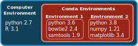

**Teaching: -- min** || **Exercises: -- min**

## Overview

:::::{.callout}

:::{.callout-important icon=false}
### Questions:
- How do I install and manage software on my computre and the HPC?
:::

:::{.callout-important icon=false}
### Learning Objectives:
- Understand what a package manager is, and how it can be used to manage software instalation on a HPC environment.
- Install the _Conda_ package manager.
- Create a software environment and install software using _Conda_.
:::

:::{.callout-tip}
### Keypoints:
- To install your own software, you can use the _Conda_ package manager.
  - _Conda_ allows you to have separate "software environments", where multiple package versions can co-exist on your system.
- Use `conda env create <ENV>` to create a new software environment and `conda install -n <ENV> <PROGRAM>` to install a program on that environment. 
- Use `conda activate <ENV>` to "activate" the software environment and make all the programs installed there available. 
  - When submitting jobs to `sbatch`, always remember to include `source $CONDA_PREFIX/etc/profile.d/conda.sh` at the start of the shell script, followed by the `conda activate` command. 
:::
:::::


## Managing Software

## The `conda` Package Manager

Often you may want to use software packages that are not be installed by default on the HPC.
There are several ways you could manage your own software installation, but in this course we will be using _Conda_, which gives you access to a large number of scientific packages.

There are two main software distributions that you can download and install, called _Anaconda_ and _Miniconda_.  
_Miniconda_ is a lighter version, which includes only base Python, while _Anaconda_ is a much larger bundle of software that includes many other packages (see the [Documentation Page](https://docs.conda.io/projects/conda/en/latest/user-guide/install/download.html#anaconda-or-miniconda) for more information).

One of the strengths of using _Conda_ to manage your software is that you can have different versions of your software installed alongside each other, organised in **environments**. 
Organising software packages into environments is extremely useful, as it allows to have a _reproducible_ set of software versions that you can use and resuse in your projects. 




### Installing _Conda_

To start with, let's install _Conda_ on the HPC. 
In this course we will install the _Miniconda_ bundle, as it's lighter and faster to install:

1. Make sure you're logged in to the HPC and in the home directory (`cd ~`).
2. Download the _Miniconda_ installer by running: 
```bash
wget https://repo.anaconda.com/miniconda/Miniconda3-latest-Linux-x86_64.sh
```
3. Run the installation script just downloaded: 
```bash
bash Miniconda3-latest-Linux-x86_64.sh
```
4. Follow the installation instructions accepting default options (answering 'yes' to any questions)
5. Run the following command:
```bash
conda config --add channels defaults; conda config --add channels bioconda; conda config --add channels conda-forge; conda config --set channel_priority strict
```
This adds two *channels* (sources of software) useful for bioinformatics and data science applications.

:::note
_Anaconda_ and _Miniconda_ are also available for Windows and Mac OS. 
See the [Conda Installation Documents](https://docs.conda.io/projects/conda/en/latest/user-guide/install/index.html#regular-installation) for instructions. 
:::


### Installing Software Using `conda`

The command used to install and manage software is called `conda`. 
Although we will only cover the basics in this course, it has an [excellent documentation](https://docs.conda.io/projects/conda/en/latest/user-guide/) and a useful [cheatsheet](https://docs.conda.io/projects/conda/en/latest/_downloads/1f5ecf5a87b1c1a8aaf5a7ab8a7a0ff7/conda-cheatsheet.pdf).

The first thing to do is to create a software environment for our project. 
Although this is optional (you could instead install everything in the "base" default environment), it is a good practice as it means the software versions remain stable within each project. 

To create an environment we use:

```bash
conda create --name ENV
```

Where "ENV" is the name we want to give to that environment. 
Once the environment is created, we can install packages using:

```bash
conda install --name ENV PROGRAM
```

Where "PROGRAM" is the name of the software we want to install. 

:::note
One way to organise your software environments is to create an environment for each kind of analysis that you might be doing regularly. 
For example, you could have an environment named `bioinformatics` with software that you use for analysing sequence data (e.g. fastQC, bwa) and another called `processing` with software you use for downstream analysis of your results (e.g. Python's pandas). 
Alternatively, you can create a separate environment for each tool you'd like to install and use.
:::

To search for the software packages that are available through `conda`:

- go to [anaconda.org](https://anaconda.org).
- in the search box search for a program of your choice. For example: "bowtie2".
- the results should be listed as `CHANNEL/PROGRAM`, where *CHANNEL* will the the source channel from where the software is available. Usually scientific/bioinformatics software is available through the `conda-forge` and `bioconda` channels.

If you need to install a program from a different channel than the defaults, you can specify it during the install command using the `-c` option. 
For example `conda install --chanel CHANNEL --name ENV PROGRAM`.

Let's see this with an example, where we create a new environment called "scipy" and install the python scientific packages:

```bash
conda create --name scipy
conda install --name scipy --channel conda-forge numpy matplotlib
```

To see all the environments you have available, you can use:

```bash
conda info --env
```

```
# conda environments:
#
base                  *  /home/participant36/miniconda3
scipy                    /home/participant36/miniconda3/envs/scipy
```

In our case it lists the _base_ (default) environment and the newly created _scipy_ environment.
The asterisk ("*") tells us which environment we're using at the moment.


### Loading _Conda_ Environments

Once your packages are installed in an environment, you can load that environment by using `conda activate ENV`, where "ENV" is the name of your environment. 
For example, we can activate our previously created environment with:

```bash
conda activate scipy
```

If you chech which `python` executable is being used now, you will notice it's the one from this new environment:

```bash
which python
```

```
~/miniconda3/envs/scipy/bin/python
```

You can also check that the new environment is in use from:

```bash
conda env list
```

```
# conda environments:
#
base                     /home/participant36/miniconda3
scipy                 *  /home/participant36/miniconda3/envs/scipy
```

And notice that the asterisk "*" is now showing we're using the `scipy` environment.

:::warning
**Loading Environments in Shell Script**

To load environments in a shell script that is being submitted to SLURM, you need to first source a configuration file from _Conda_.
For example, to load the `scipy` environment we created, this would be the code:

```
source $CONDA_PREFIX/etc/profile.d/conda.sh  # Always add this command to your scripts
conda activate scipy
```

This is because when we submit jobs to SLURM the jobs will start in a non-interactive shell, and `conda` doesn't get automatically set. 
Running the `source` command shown will ensure `conda activate` becomes available. 
:::


:::exercise

In the `hpc_workshop/data` folder, you will find some files resulting from whole-genome sequencing individuals from the model organism _Drosophila melanogaster_ (fruit fly). 
Our objective will be to align our sequences to the reference genome, using a software called _bowtie2_.

{ width=50% }

But first, we need to prepare our genome for this alignment procedure (this is referred to as indexing the genome). 
We have a file with the _Drosophila_ genome in `data/genome/drosophila_genome.fa`. 

1. Create a new conda environment named "bioinformatics". <details><summary>Hint</summary>Remember the syntax to create a new environment is: `conda create --name ENV`</details>
1. Install the `bowtie2` program in your new environment. <details><summary>Hint</summary>Go to [anaconda.org](https://anaconda.org/) and search for "bowtie2" to confirm it is available through _Conda_ and which software _channel_ it is provided from. Remember that you can install packages using `conda install --channel CHANNEL-NAME --name ENVIRONMENT-NAME SOFTWARE-NAME`.</details>
1. Check that the software installed correctly by running `which bowtie2` and `bowtie2 --help`. <details><summary>Hint</summary>Remember to activate your environment first with `conda activate bioinformatics`.</details>
1. Open the script in `slurm/drosophila_genome_indexing.sh` and edit the `#SBATCH` options with the word "FIXME". Submit the script to SLURM using `sbatch`, check it's progress, and whether it ran successfully. Troubleshoot any issues that may arise.

<details><summary>Answer</summary>

**A1.**

To create a new conda environment we run:

```bash
conda create --name bioinformatics
```

**A2.**

If we search for this software on the _Anaconda_ website, we will find that it is available via the "_bioconda_" channel: https://anaconda.org/bioconda/bowtie2 

We can install it on our environment with:

```bash
conda install --name bioinformatics --channel bioconda bowtie2
```

**A3.**

First we need to activate our environment:

```bash
conda activate bioinformatics
```

Then, if we run `bowtie2 --help`, we should get the software help printed on the console.

**A4.**

We need to fix the script to specify the correct working directory with our username (only showing the relevant line of the script):

```
#SBATCH -D /scratch/USERNAME/hpc_workshop
```

Replacing "USERNAME" with your username. 

We also need to make sure we activate our conda environment, by adding: 

```
source $CONDA_PREFIX/etc/profile.d/conda.sh
conda activate bioinformatics
```

At the start of the script.
This is because we did not load the conda environment in our script. 
Remember that even though we may have loaded the environment on the login node, the scripts are run on a different machine (one of the compute nodes), so we need to remember to **always load the conda environment in our SLURM submission scripts**. 

We can then launch it with sbatch:

```bash
$ sbatch slurm/drosophila_genome_indexing.sh
```

We can check the job status by using `squeue -u USERNAME`. 
And we can obtain more information by using `seff JOBID` or `scontrol show job JOBID`. 

We should get several output files in the directory `results/drosophila/genome` with an extension ".bt2":

```bash
$ ls results/drosophila/genome
```

```
index.1.bt2
index.2.bt2
index.3.bt2
index.4.bt2
index.rev.1.bt2
index.rev.2.bt2
```

</details>

:::

#### Further resources

- Search for _Conda_ packages at [anaconda.org](https://anaconda.org)
- Learn more about _Conda_ from the [Conda User Guide](https://docs.conda.io/projects/conda/en/latest/user-guide/)
- [Conda Cheatsheet](https://docs.conda.io/projects/conda/en/latest/user-guide/cheatsheet.html) (PDF)

## Credit
Information on this page has been adapted and modified from the following source(s):
https://github.com/cambiotraining/hpc-intro-sanger/blob/main/04-software.md