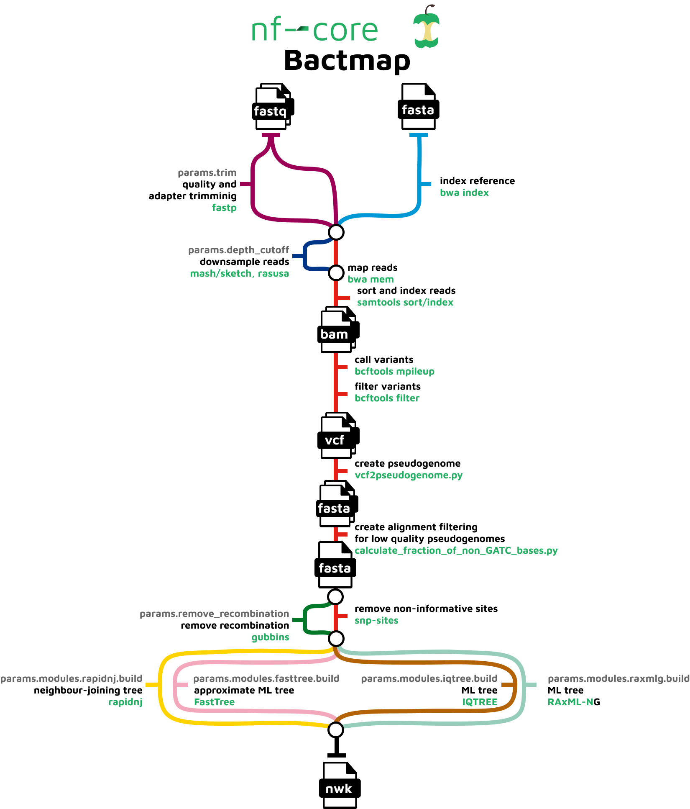

**Teaching: 60 min** || **Exercises: 30 min**

## Overview

:::::{.callout}

:::{.callout-important icon=false}
### Questions:
- What is nf-core/bactmap?
- How can I produce a multiple sequence alignment of TB sequences?
:::

:::{.callout-important icon=false}
### Learning Objectives:
- Use `nf-core/bactmap` to produce a multiple sequence alignment.
:::

:::{.callout-tip}
### Keypoints:
- To build a phylogenetic tree we need a _multiple sequence alignment_ of the sequences we want to infer a tree from. 
- Alignments are usually done against a reference genome.
- We can use the pipeline `nf-core/bactmap` to produce a multiple sequence alignment.
:::
:::::

## 9.1 nf-core/bactmap

nf-core/bactmap is a bioinformatics best-practice analysis pipeline for mapping short reads from bacterial WGS to a reference sequence, creating filtered VCF files, making pseudogenomes based on high quality positions in the VCF files and optionally creating a phylogeny from an alignment of the pseudogenomes.  It makes use of many of the tools and techniques we've covered so far this week.



## 9.2 TB dataset

We will be analysing a dataset of 83 TB genomes previously analysed by Prince as part of his PhD.

## 9.3 Activate the `nextflow` environment

Now navigate into the `09-bactmap/` directory and activate the `nextflow` environment:

```bash
cd ~/Desktop/bact_gen_workshop2022/09-bactmap/
```

```bash
mamba activate nextflow
```

<details><summary>Disk Usage I --- Before analysis</summary>

Before we run `nf-core/bactmap`, let's pause and check the space of our current working directory as we did for our previous lesson.

You can do this with the **d**isk **u**sage `du` command
```bash
du -h
```

<details><summary>Current Disk Space In 09-bactmap Directory</summary>~247MB</details>

Now, keep this value in mind, and this time, don't forget it. We will come back to it at the end of this chapter.
</details>

## 9.4 The MTBC ancestral sequence

The reference sequence we'll use to map our TB samples back to is one commonly used in the MTBC community and is known as the MTBC ancestral sequence.  It was generated as part of Comas *et al.* 2013 (link to paper). This sequence was created by building an alignment and phylogenetic tree of the known MTBC genomes at the time and inferring what the most likely sequence of the ancestor of the MTBC was.  It is a useful sequence to use when comparing different members of the MTBC as it should reduce the amount of bias towards any particular reference that is more closely related to one lineage than another.


## 9.5 Setting up the Nextflow config file

As we learnt in the [nf-core pipelines](../08-workflow_managers/8.2-nfcore.md) module, we can create a config file that tells `Nextflow` which parameters to use e.g. the job submission system.  We've create a basic template that will allow you to run nf-core/bactmap on the teaching computers/HPC.  The config file looks like this:

```groovy
params {
  config_profile_description = 'Noguchi HPC profile.'
  config_profile_contact = 'Prince Asare (PAsare@noguchi.ug.edu.gh)'
  config_profile_url = ""
}
singularity {
  enabled = true
  autoMounts = true
  // Save singularity containers to a directory so they don't
  // have to be pulled every time the pipeline is run
  singularity.cacheDir = 'DIR'
}
process {
  executor = 'slurm'
  // Selects cclake nodes and account to charge CPU hours to
  clusterOptions = '-p QUEUE -A ACCOUNT'
}
// Max resources for each node on Noguchi HPC
params {
  max_memory = 192.GB
  max_cpus = 56
  max_time = 12.h
}
```

## 9.6 Run nf-core/bactmap to generate an alignment

The first step in building a phylogenetic tree is to generate a multiple sequence alignment.  To do this, we're going to map the sequence data for our 83 TB genomes to a reference, in this case the MTBC inferred ancestral sequence, using the `nf-core/bactmap` pipeline.

First create a directory a directory for the output:

```bash
mkdir -p results/bactmap
```

### Generate a samplesheet

Now create a `samplesheet.csv` file containing the sample IDs and the location of the files to be mapped:

```bash
python fastq_dir_to_samplesheet.py \
    data \
    samplesheet.csv \
    -r1 _1.fastq.gz \
    -r2 _2.fastq.gz
```

The meaning of the options used is:

| Input option | Input required | Description |
|:-- |:-- | :---------- |
|`data` | *DIRECTORY* | Directory containing the fastq files |
|`samplesheet.csv` | *FILENAME* | Name of the input file for `nf-core/bactmap`
| `-r1` | *FILE SUFFIX* | Suffix of the Read 1 FASTQ file |
| `-r2` | *FILE SUFFIX* | Suffix of the Read 2 FASTQ file* |


`*` The `fastq_dir_to_samplesheet.py` script will use everything before this to create the sample IDs

:::{.callout}
## Run `nf-core/bactmap`

Now run `nf-core/bactmap` with `Nextflow` to generate a reference-based alignment:

```bash
nextflow run nf-core/bactmap \
    -profile singularity \
    --input samplesheet.csv \
    --reference reference/MTB_ANC_unwrapped.fasta \
    --genome_size 4.3mb \
    --outdir results/bactmap
```

`nf-core/bactmap` has a number of optional arguments but for now these are the ones we're going to use:

| Input option | Description |
|:-- | :---------- |
|`-profile singularity` | Pull `singularity` containers for each tool in the pipeline (we could also use `Docker` or `Conda`) |
|`--input samplesheet.csv` | The samplesheet we created above containing the sample ids and location of the fastq files |
| `--reference reference/MTB_ANC_unwrapped.fasta`| The reference sequence we're going to map our samples to |
| `--genome_size 4.3mb` |  This is used by the pipeline to calculate the approximate genome coverage in the fastq files. By default the pipeline uses a tool called `rasusa` to subsample the fastq files so the genome coverage is <= 100X |
| `--outdir results/bactmap` | The directory we're going to save the outputs from `nf-core/bactmap` to |

Visit the [`nf-core/bactmap`](https://nf-co.re/bactmap) page for further information on running the pipeline with different options.

If the pipeline has started successfully, you should see something like this:

```groovy
N E X T F L O W  ~  version 22.04.3
Launching `https://github.com/nf-core/bactmap` [special_kare] DSL2 - revision: e83f8c5f0e [master]


------------------------------------------------------
                                        ,--./,-.
        ___     __   __   __   ___     /,-._.--~'
  |\ | |__  __ /  ` /  \ |__) |__         }  {
  | \| |       \__, \__/ |  \ |___     \`-._,-`-,
                                        `._,._,'
  nf-core/bactmap v1.0.0
------------------------------------------------------
Core Nextflow options
  revision                  : master
  runName                   : special_kare
  containerEngine           : singularity
  launchDir                 : /rds/project/rds-PzYD5LltalA/Teaching/Ghana
  workDir                   : /rds/project/rds-PzYD5LltalA/Teaching/Ghana/work
  projectDir                : /home/ajv37/.nextflow/assets/nf-core/bactmap
  userName                  : ajv37
  profile                   : singularity
  configFiles               : /home/ajv37/.nextflow/assets/nf-core/bactmap/nextflow.config, /rds/project/rds-PzYD5LltalA/Teaching/Ghana/cambridge.config

Input/output options
  input                     : samplesheet.csv
  outdir                    : bactmap_results

Compulsory parameters
  reference                 : MTB_ANC_unwrapped.fasta

Optional pipeline steps
  adapter_file              : /home/ajv37/.nextflow/assets/nf-core/bactmap/assets/adapters.fas
  genome_size               : 4.3mb

Max job request options
  max_cpus                  : 56
  max_memory                : 192 GB
  max_time                  : 12h

Institutional config options
  config_profile_description: Cambridge HPC cluster profile.
  config_profile_contact    : Andries van Tonder (ajv37@cam.ac.uk)
  config_profile_url        : https://docs.hpc.cam.ac.uk/hpc

!! Only displaying parameters that differ from the pipeline defaults !!
------------------------------------------------------
If you use nf-core/bactmap for your analysis please cite:

* The nf-core framework
  https://doi.org/10.1038/s41587-020-0439-x

* Software dependencies
  https://github.com/nf-core/bactmap/blob/master/CITATIONS.md
------------------------------------------------------
executor >  slurm (2)
executor >  slurm (2)
[3f/931dc1] process > NFCORE_BACTMAP:BACTMAP:INPUT_CHECK:SAMPLESHEET_CHECK (samplesheet.csv)   [  0%] 0 of 1
[59/74ef4b] process > NFCORE_BACTMAP:BACTMAP:BWA_INDEX (MTB_ANC_unwrapped.fasta)               [  0%] 0 of 1
[-        ] process > NFCORE_BACTMAP:BACTMAP:FASTP                                             -
[-        ] process > NFCORE_BACTMAP:BACTMAP:SUB_SAMPLING:RASUSA                               -
[-        ] process > NFCORE_BACTMAP:BACTMAP:BWA_MEM                                           -
[-        ] process > NFCORE_BACTMAP:BACTMAP:BAM_SORT_SAMTOOLS:SAMTOOLS_SORT                   -
[-        ] process > NFCORE_BACTMAP:BACTMAP:BAM_SORT_SAMTOOLS:SAMTOOLS_INDEX                  -
[-        ] process > NFCORE_BACTMAP:BACTMAP:BAM_SORT_SAMTOOLS:BAM_STATS_SAMTOOLS:SAMTOOLS_... -
[-        ] process > NFCORE_BACTMAP:BACTMAP:BAM_SORT_SAMTOOLS:BAM_STATS_SAMTOOLS:SAMTOOLS_... -
[-        ] process > NFCORE_BACTMAP:BACTMAP:BAM_SORT_SAMTOOLS:BAM_STATS_SAMTOOLS:SAMTOOLS_... -
[-        ] process > NFCORE_BACTMAP:BACTMAP:VARIANTS_BCFTOOLS:BCFTOOLS_MPILEUP                -
[-        ] process > NFCORE_BACTMAP:BACTMAP:VARIANTS_BCFTOOLS:BCFTOOLS_FILTER                 -
[-        ] process > NFCORE_BACTMAP:BACTMAP:VCF2PSEUDOGENOME                                  -
[-        ] process > NFCORE_BACTMAP:BACTMAP:ALIGNPSEUDOGENOMES                                -
[-        ] process > NFCORE_BACTMAP:BACTMAP:SNPSITES                                          -
[-        ] process > NFCORE_BACTMAP:BACTMAP:GET_SOFTWARE_VERSIONS                             -
[-        ] process > NFCORE_BACTMAP:BACTMAP:MULTIQC                                           -
```
:::

The pipeline will take a while to run so we'll have a look at the results after lunch.

:::::{.callout-important icon=false}
### ***Exercise 9.1.1:*** Check if jobs are running

We can see that `nf-core/bactmap` is running and submitting jobs for each part of the process using `SLURM`.  It's a good idea to keep an eye on the status of the jobs e.g. are they pending or running? How do you think we might do this with `SLURM`? Feel free to google for a solution.

:::{.callout collapse="true"}
### ***Solution:***

To check the status of a user's job on a `SLURM` system we use the `squeue` command specifying your user id:

```bash
squeue -u user
```

What do you get when you run this command? Check with your neighbour to see whether more of their jobs have run or are both your jobs pending? Why might this be?
:::
:::::
