**Teaching: 20 min** || **Exercises: 10 min**

## Overview

:::::{.callout}

:::{.callout-important icon=false}
### Questions:
- Where does nf-core/bactmap put the results files?
- What outputs does nf-core/bactmap produce?
- How do we tell if all the samples passed QC and should be included in the final analysis?
- How do we clean up after nf-core/bactmap?
:::

:::{.callout-important icon=false}
### Learning Objectives:
- Learn where the output files created by nf-core/bactmap are located.
- Understand the output files created by nf-core/bactmap.
- Learn how to interpret a MultiQC summary and make a decision whether to exclude poor quality samples.
- Understand that nf-core/bactmap produces a lot of intermediate files which take up space and can be deleted once the pipeline has run successfully.
:::

:::{.callout-tip}
### Keypoints:
- nf-core/bactmap allows you to easily produce a sequence alignment by aligning sequences to a reference genome in a reproducible, documentable fashion
:::
:::::

## 9.1 nf-core/bactmap results

This morning, we left nf-core/bactmap running.  Now, we can look at the output directory (`results/bactmap`) to see the various directories containing output files created by `nf-core/bactmap`.

```bash
cd results/bactmap/bactmap_results

ls
```

You should see the following:

```bash
bwa  fastp  multiqc  pipeline_info  pseudogenomes  rasusa  samtools  snpsites  variants 
```
The directories in `results/bactmap/bactmap_results` contain the following:

| Directory | Description |
|:-- | :---------- |
| `bwa/index` | Contains the index of the reference sequence |
|`fastp` | Contains the results of the trimming and adapter removal performed by `fastp` |
|`fastqc` | Contains QC metrics for the fastq files generated with `fastQC` |
|`multiqc` | Contains a html file containing summaries of the various outputs |
|`pipeline_info` | Contains information about the pipeline run |
|`pseudogenomes` | Contains consensus fasta files for each sample which have the sample variants compared to the reference included.  The alignment we'll use for the next step can also be found in this directory (`aligned_pseudogenomes.fas`) |
|`rasusa` | Contains the subsampled post-trimmed fastq files |
|`samtools` | Contains the sorted bam files and indices created by `bwa` and `samtools` as part of the mapping process |
|`snpsites` | Contains a variant alignment file created from `aligned_pseudogenomes.fas` with `snp-sites `that can be used as input for tree inference tools |
|`variants` | Contains filtered `vcf` files which contain the variants for each sample |

### The MultiQC summary report

The first thing we'll check is the `html` report file created by `MultiQC`.  Copy this to your desktop:

```bash
cp results/bactmap/bactmap_results/multiqc/multiqc_report.html Desktop
```

Go to `File Explorer`, navigate to your Desktop and double click on `multiqc_report.html`.  This will open the file in your web browser of choice:

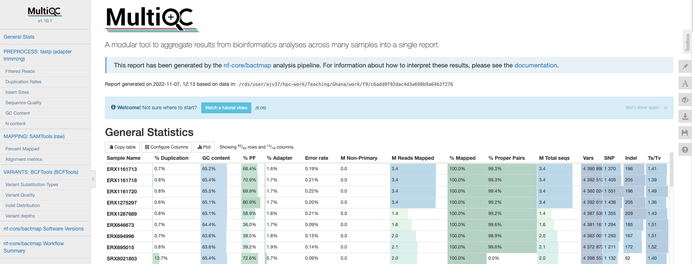

#### General statistics

Let's go through each section starting with the `General Statistics`:

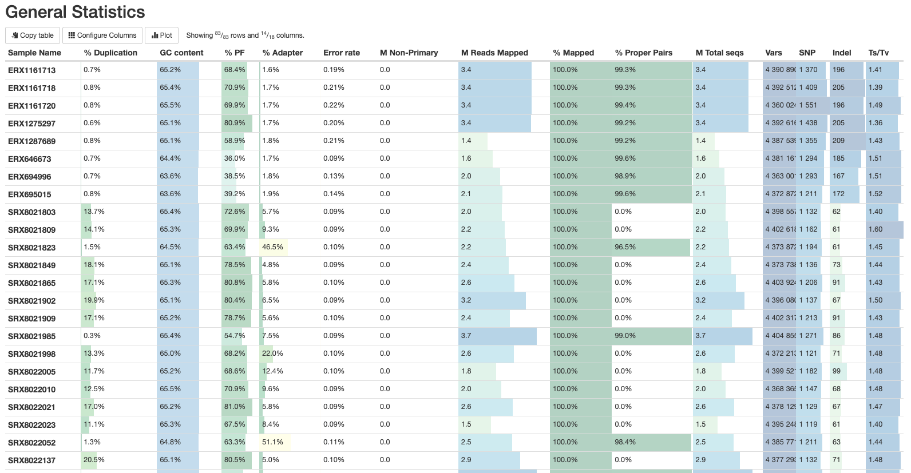

This is a compilation of statistics collected from the outputs of tools such as fastp, samtools and BCFtools.  Sequencing metrics such as the % of duplicated reads and GC content of the reads are shown alongside the results of the mapping (% reads mapped, num). This is a useful way of quickly identifying samples that are of lower quality or perhaps didn't map very well due to species contamination. 

#### fastp

There are a number of plots showing the results of the fastp step in the pipeline.  The first shows the results of the read filtering step where reads are trimmed, adapters removed and low quality reads are thrown out.  The reads that passed this step are highlighted in blue.

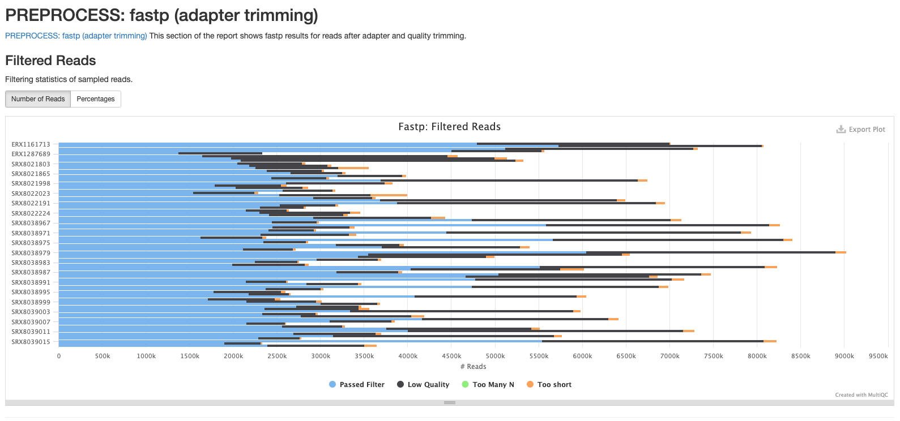

The second plot shows the frequency of duplicated reads in each sample.  If you hover over the plot around 1 on the x-axis you'll see that the majority of reads in each sample only appear once.

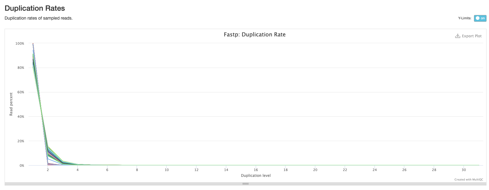

The third plot shows the distribution of insert sizes for each set of sequence files.  As we've included data sequenced on different Illumina platforms with different library construction protocols, there's a mix of insert sizes.

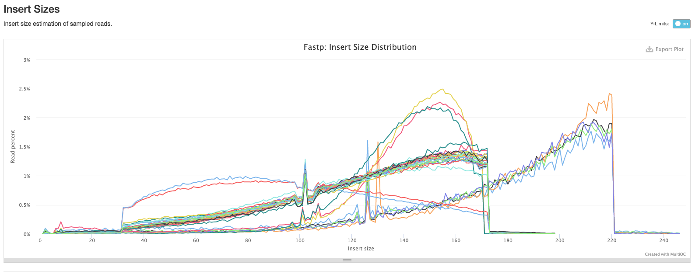

The next plot shows the average sequence quality across the reads in each sample. You can see we have drop offs in quality at the beginning and end of reads; this is pretty typical and is an artefact of the sequencing process.

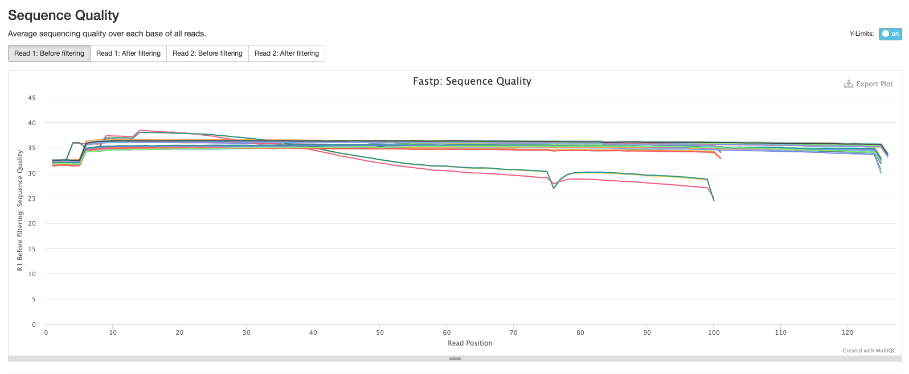

The fifth plot shows the average GC content across the reads in each sample.  As you might expect, the average GC content is conserved across all the samples as they are all from the same organism (MTB).

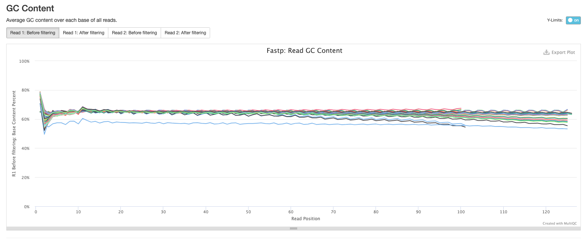

The final fastp plot shows the average N content across the reads in each sample.  Similar to what we see in the sequence quality plot, the number of Ns tends to increase towards the end of reads.

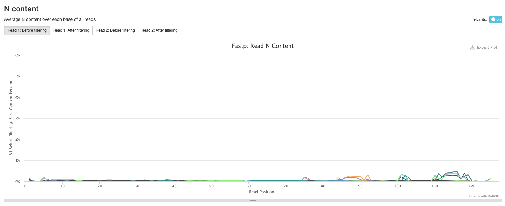

#### Samtools

The plots in this section are created from the results of running `samtool stats` on the sorted bam files produce during the mapping process.  The first shows the number or percentage of reads that mapped to the reference.

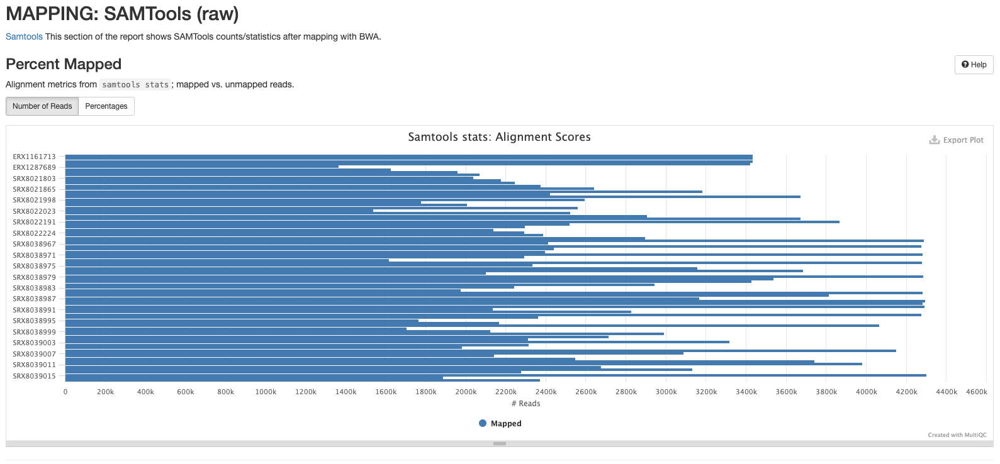

The second plot shows the overall alignment metrics for each sample.  Hover over each dot to see more detailed information.

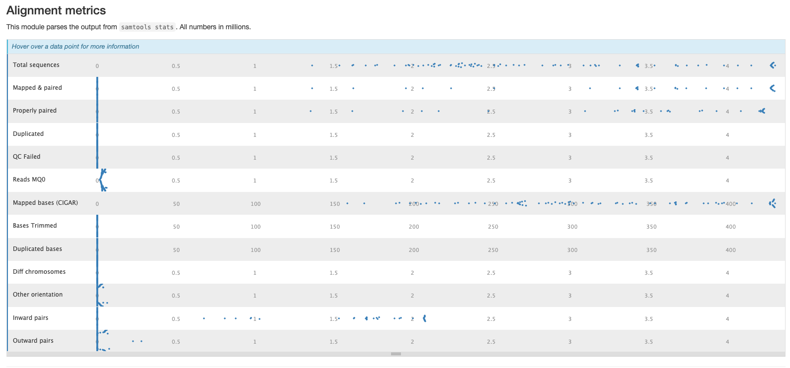

#### BCFtools

The plots in this section provide information about the variants called using `bcftools`.  The first plot shows the numbers or percentage of each type of variant in each sample.

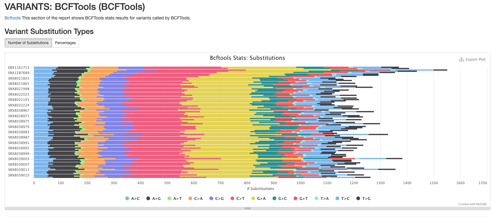

The second plot shows the quality of each variant called by `bcftools`. The majority of variants in each sample are high quality.

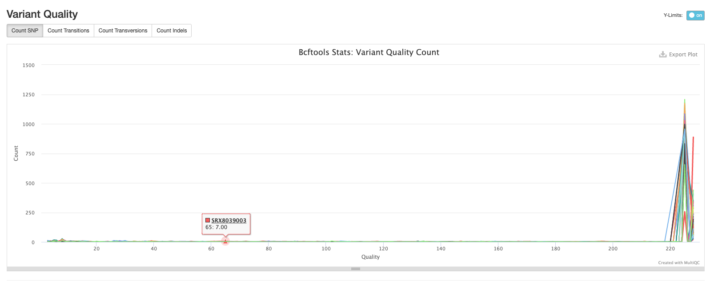

The third plot shows the distribution of lengths of Indels (insertions are positive values and deletions are negative values).  This is useful information to have, but in practice we tend to exclude indels when building alignments for phylogenetic tree building.

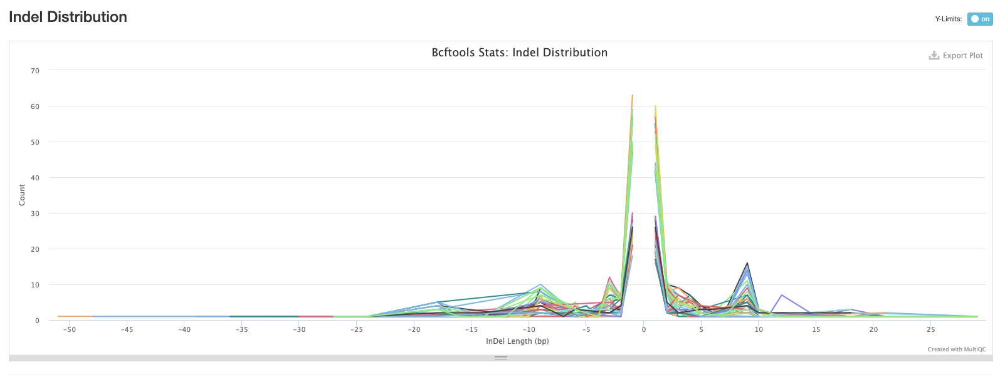

The final bcftools plot shows the distribution of the number of reads mapping to each variant position and is one of the metrics used to filter out low quality variants (the fewer the reads mapping to a variant position, the lower the confidence we have that the variant is in fact real).

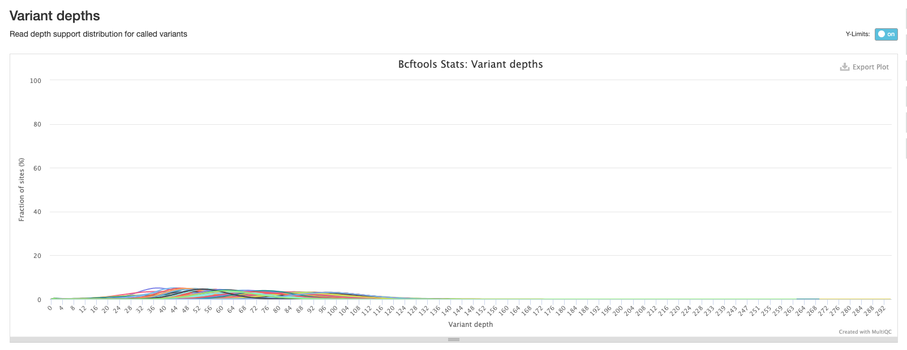

#### Software versions

This section of the report shows the software run as part of nf-core/bactmap and the versions used.  This is particularly important when reproducing the analysis on a different system or when writing the methods section of a paper.

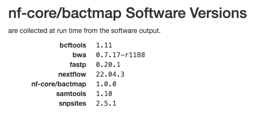

:::::{.callout-important icon=false}
### ***Exercise 9.2.1:*** Extract data from MultiQC report

1. How many reads in sample SRX8022206 passed the fastp filtering step?
2. How many reads in sample SRX8038977 mapped to the reference genome?
3. How many A->G variants were called in sample SRX8038976?
4. Which version of samtools does the nf-core/bactmap pipeline use?

:::{.callout collapse="true"}
### ***Solution:***

1. 2148657 reads passed the fastp filtering step
2. 3685855 reads mapped to the reference genome
3. 107 (8.9%) A->G variants were called by `bcftools`
4. The version of samtools used in the pipeline is `1.10`

:::
:::::

### The pseudogenomes directory

This directory contains the files that are most useful for our downstream analyses (at least for now).  Change to the directory and list the files:

```bash
cd bactmap_results/pseudogenomes

ls
```

You will see the pseudogenome fasta files (a version of the reference file where the sample variants have been inserted and low-quality or missing data has been masked) for each sample, an alignment of all the samples  and the reference sequence (`aligned_pseudogenomes.fas`), and a tsv file of genomes removed from the complete alignment due to poor mapping (`low_quality_pseudogenomes.tsv`):

```bash
aligned_pseudogenomes.fas      SRX8021902.fas  SRX8022224.fas  SRX8038978.fas  SRX8038993.fas  SRX8039008.fas
ERX1161713.fas                 SRX8021909.fas  SRX8038964.fas  SRX8038979.fas  SRX8038994.fas  SRX8039009.fas
ERX1161718.fas                 SRX8021985.fas  SRX8038965.fas  SRX8038980.fas  SRX8038995.fas  SRX8039010.fas
ERX1161720.fas                 SRX8021998.fas  SRX8038966.fas  SRX8038981.fas  SRX8038996.fas  SRX8039011.fas
ERX1275297.fas                 SRX8022005.fas  SRX8038967.fas  SRX8038982.fas  SRX8038997.fas  SRX8039012.fas
ERX1287689.fas                 SRX8022010.fas  SRX8038968.fas  SRX8038983.fas  SRX8038998.fas  SRX8039013.fas
ERX646673.fas                  SRX8022021.fas  SRX8038969.fas  SRX8038984.fas  SRX8038999.fas  SRX8039014.fas
ERX694996.fas                  SRX8022023.fas  SRX8038970.fas  SRX8038985.fas  SRX8039000.fas  SRX8039015.fas
ERX695015.fas                  SRX8022052.fas  SRX8038971.fas  SRX8038986.fas  SRX8039001.fas  SRX8039016.fas
low_quality_pseudogenomes.tsv  SRX8022137.fas  SRX8038972.fas  SRX8038987.fas  SRX8039002.fas  SRX8039017.fas
SRX8021803.fas                 SRX8022138.fas  SRX8038973.fas  SRX8038988.fas  SRX8039003.fas
SRX8021809.fas                 SRX8022191.fas  SRX8038974.fas  SRX8038989.fas  SRX8039004.fas
SRX8021823.fas                 SRX8022198.fas  SRX8038975.fas  SRX8038990.fas  SRX8039005.fas
SRX8021849.fas                 SRX8022201.fas  SRX8038976.fas  SRX8038991.fas  SRX8039006.fas
SRX8021865.fas                 SRX8022206.fas  SRX8038977.fas  SRX8038992.fas  SRX8039007.fas
```

Let's check to see if any of our samples were removed from our alignment:

```bash
cat low_quality_pseudogenomes.tsv
```
This returns an empty file; all of our samples mapped well enough to the reference to be included in our complete alignment.  That means we can proceed to the next step of our analysis: phylogenetic tree inference.

:::::{.callout-important icon=false}
### ***Exercise 9.2.2:*** Count the number of sequences in the complete alignment

It's good practice to sanity check our results before proceeding to the next step of our analysis, phylogenetic tree inference.  Count the number of fasta sequences in `aligned_pseudogenomes.fas`.

:::{.callout collapse="true"}
### ***Solution:***

One way to do this is to count the number of times the fasta signifier `>` appears in `aligned_pseudogenomes.fas` using `grep`:

```bash
grep -c ">" aligned_pseudogenomes.fas
```

This gives us our answer: there are 84 fasta sequences in the alignment (reference + 83 samples):

```bash
84
```

:::
:::::

<details><summary>Disk Usage II --- Cleaning up after analysis</summary>
Now that we are done investigating our assembling and annotating our genome, let's pause again and check the space of our current working directory.

You can do this with the **d**isk **u**sage `du` command
```bash
du -h
```

How much disk space have you used since the start of the analysis?

### The work directory

Each step of the pipeline produces one or more files that are not saved to the results directory but are kept in the work directory.  This means that if, for whatever reason, the pipeline doesn't finish successfully you can resume it.  However, once the pipeline has completed successfully, you no longer need this directory (it can take up a lot of space) so you can delete it:

```bash
rm -rf work
```

How much disk space did deleting the work directory free up?

</details>

## 9.2 Deactivate `nextflow` environment

Now that we are done with all our analysis, let’s deactivate the `nextflow` environment:

```bash
mamba deactivate
```