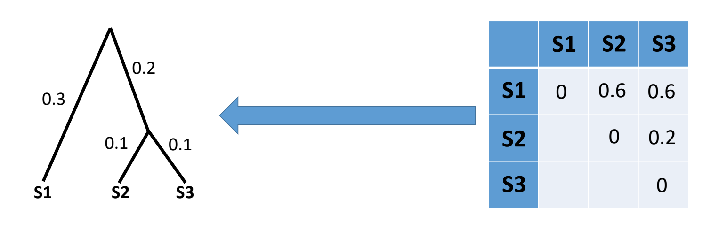
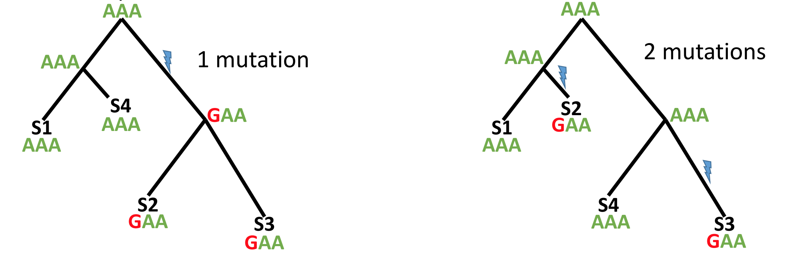
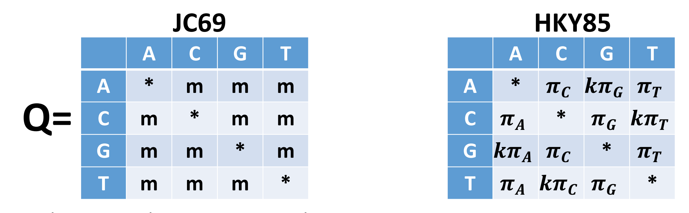
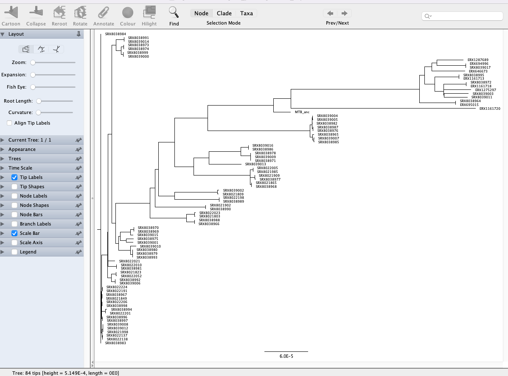
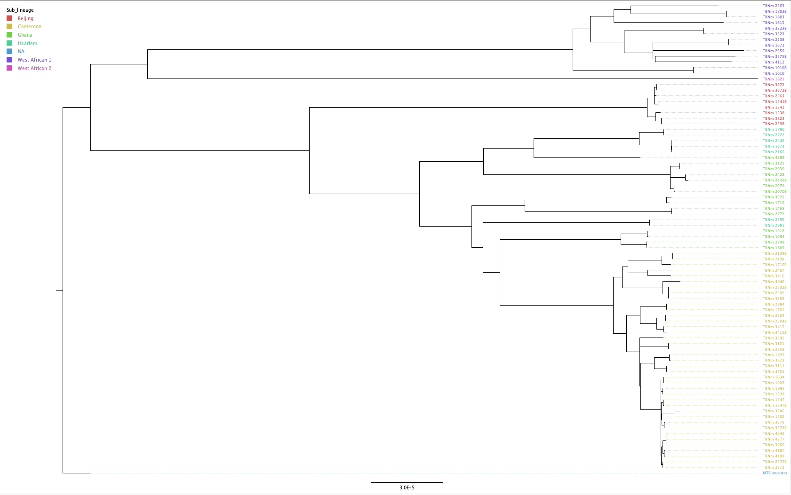
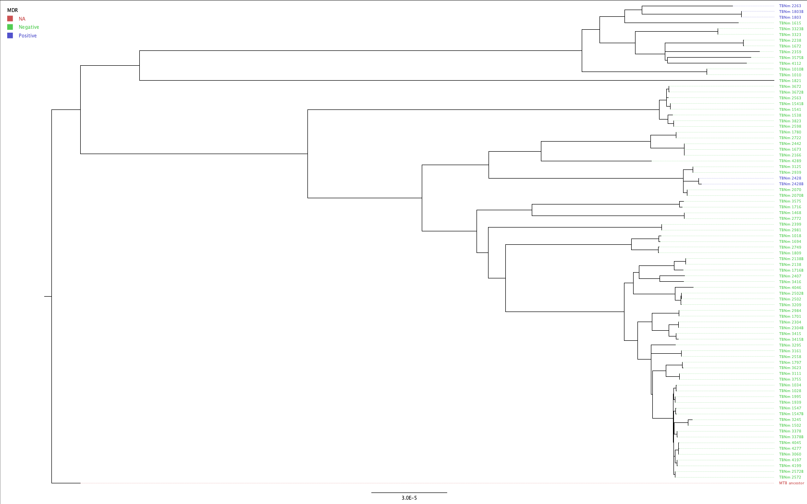
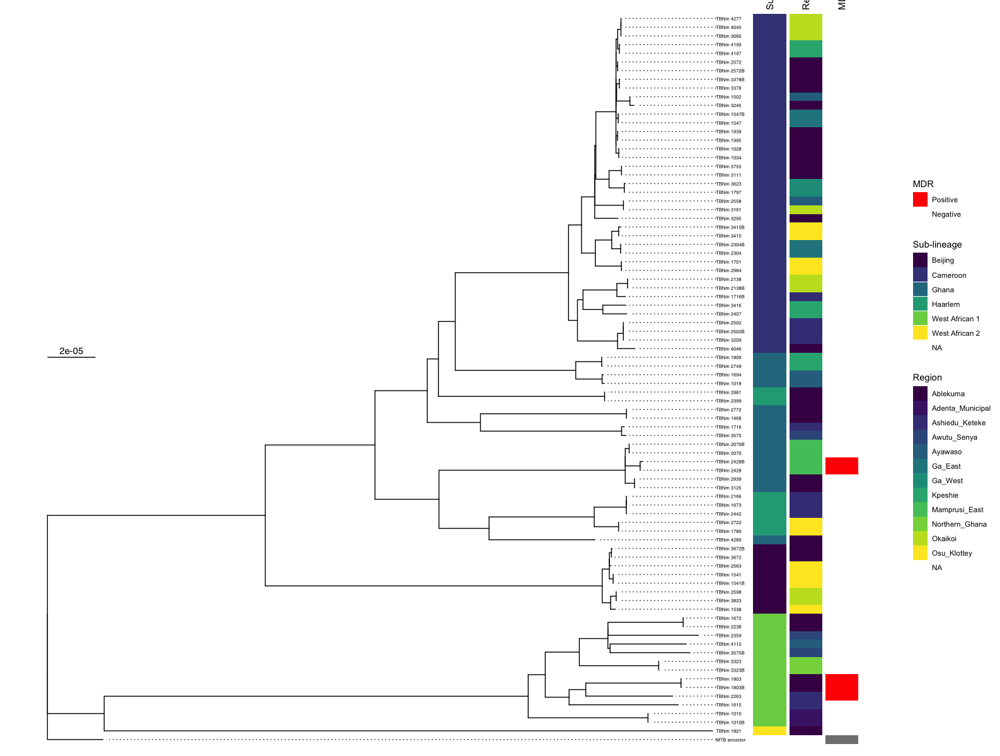

**Teaching: 90 min** || **Exercises: 40 min**

## Overview

:::::{.callout}

:::{.callout-important icon=false}
### Questions:
- What is a multiple sequence alignment (MSA)
- What is a phylogenetic tree?
- How can I build a phylogenetic tree from my multiple sequence alignment?
- How can I visualize and annotate my phylogenetic tree?

:::

:::{.callout-important icon=false}
### Learning Objectives:
- Understand how to generate a multiple sequence alignment using a standard pipeline such as `nf-core/bactmap`
- Understand the basics of how phylogeny trees are constructed using maximum likelihood methods.
- Use `IQ-TREE` for phylogenetic tree inference.
- Visualize and annotate your tree with `R` and `ggtree`
:::

:::{.callout-tip}
### Keypoints:
- Generating a multiple sequence alignment is the first step in building a phylogenetic tree.
- A phylogenetic tree is a graph representing evolutionary history and shared ancestry.
- There are multiple methods and tools available for constructing phylogenetic trees.
- Visualization of a phylogenetic tree alongside available metadata is commonly how the relatedness of samples is portrayed in a scientific paper.
:::
:::::

## 10.1 Multiple sequence alignments

Phylogenetic methods require sequence alignments.  These can range from alignments of a single gene from different species to whole genome alignments where a sample's sequence reads are mapped to a reference genome.  Alignments attempt to place nucleotides from the same ancestral nucleotide in the same column.  One of the most commonly used alignment formats in phylogenetics is `FASTA`:

```
>Sample_1
AA-GT-T
>Sample_2
AACGTGT
```

`N` and `-` characters represent missing data and are interpreted by phylogenetic methods as such.

The two most commonly used muliple sequence alignments in bacterial genomics are reference-based whole genome alignments and core genome alignments generated by comparing genes between different isolates and identifying the genes found in all or nearly all isolates (the core genome).  As a broad rule of thumb, if your species is not genetically diverse and doesn't recombine (TB, *Brucella*) then picking a suitable good-quality reference and generating a whole genome alignment is appropriate.  However, when you have a lot of diversity or multiple divergent lineages (*E. coli*) the a single reference may not represent all the diversity in your dataset.  Here it would be more typical to create *de novo* assemblies, annotate them and then use a tool like `roary` or `panaroo` to infer the pan-genome and create a core genome alignment.  The same phylogenetic methods are then applied to either type of multiple sequence alignment.

## 10.2 Phylogenetic tree inference

A phylogenetic tree is a graph (structure) representing evolutionary history and shared ancestry. It depicts the lines of evolutionary descent of different species, lineages or genes from a common ancestor. A phylogenetic tree is made of nodes and edges, with one edge connecting two nodes.

A node can represent an extant species, and extinct one, or a sampled pathogen: these are all cases of "terminal" nodes, nodes in the tree connected to only one edge, and usually associated with data, such as a genome sequence.

A tree also contains "internal" nodes: these usually represent most recent common ancestors (MRCAs) of groups of terminal nodes, and are typically not associated with observed data, although genome sequences and other features of these ancestors can be statistically inferred. An internal node is most often connected to 3 branches (two descendants and one ancestral), but a multifurcation node can have any number >2 of descendant branches.


### Tree topology

A clade is the set of all terminal nodes descending from the same ancestor. Each branch and internal node in a tree is associated with a clade. If two trees have the same clades, we say that they have the same topology. If they have the same clades and the same branch lengths, the two tree are equivalent, that is, they represent the same evolutionary history.

### Uses of phlogenetic trees

In may cases, the phylogenetic tree represents the end results of an analysis, for example if we are interested in the evolutionary history of a set of species.

However, in many cases a phylogenetic tree represents an intermediate step, and there are many ways in which phylogenetic trees can be used to help understand evolution and the spread of infectious disease.

In many cases, we may want to know more about genome evolution, for example about mutational pressures, but more frequently about selective pressures. Selection can affect genome evolution in many ways such as slowing down evolution of portion of the genome in which changes are deleterious ("purifying selection"). Instead, "positive selection" can favor changes at certain positions of the genome, effectively accelerating their evolution. Using genome data and phylogenetic trees, molecular evolution methods can infer different types of selection acting in different parts of the genome and different branches of a tree.

### Newick format

We often need to represent trees in text format, for example to communicate them as input or output of phylogenetic inference software.
The Newick format is the most common text format for phylogenetic trees.

The Newick format encloses each subtree (the part of a tree relating the terminal nodes part of the same clade) with parenthesis, and separates the two child nodes of the same internal node with a ",". At the end of a Newick tree there is always a ";".

For example, the Newick format of a rooted tree relating two samples "S1" and "S2", with distances from the root respectively of 0.1 and 0.2, is

`(S1:0.1,S2:0.2);`

If we add a third sample "S3" as an outgroup, the tree might become

`((S1:0.1,S2:0.2):0.3,S3:0.4);`

### Methods for inferring phylogenetic trees

A few different methods exist for inferring phylogenetic trees:

- Distance-based methods such as Neighbour-Joining and UPGMA
- Parsimony-based phylogenetics 
- Maximum likelihood methods making use of nuclotide substitution models

#### Distance-based methods

These are the simplest and fastest phylogenetic methods we can use and are often a useful way to have a quick look at our data before running more robust phylogenetic methods.  Here, we infer evolutionary distances from the multiple sequence alignment. In the example below there is 1 subsitution out of 16 informative columns (we exclude columns with gaps or N's) so the distance is approximately 1/16:


Typically, we have multiple sequences in an alignment so here we would generate a matrix of pairwise distances between all samples (distance matrix) and then use Neighbour-Joining or UPGMA to infer our phylogeny:



#### Parsimony methods

Maximum parsimony methods assume that the best phylogenetic tree requires the fewest number of mutations to explain the data (i.e. the simplest explanation is the most likely one).  By reconstructing the ancestral sequences (at each node), maximum parsimony methods evaluate the number of mutations required by a tree then modify the tree a little bit at a time to improve it.



Maximum parsimony is an intuitive and simple method and is reasonably fast to run.  However, because the most parsimonius tree is always the shortest tree, compared to the hypothetical "true" tree it will often underestimate the actual evolutionary change that may have occurred.


#### Maximum likelihood methods

The most commonly encountered phylogenetic method when working with bacterial genome datasets is maximum likelihood.  These methods use probabilistic models of genome evolution to evaluate trees and whilst similar to maximum parsimony, they allow statistical flexibility by permitting varying rates of evolution across different lineages and sites.  This additional complexity means that maximum likelihood models are much slower than the previous two models discussed.  Maximum likelihood methods make use of substitution models (models of DNA sequence evolution) that describe changes over evolutionary time. Two commonly used substitution models, Jukes-Cantor (JC69; assumes only one mutation rate) and Hasegawa, Kishino and Yano (HKY85; assumes different mutation rates - transitions have different rates) are depicted below:



It is also possible to incorporate additional assumptions about your data e.g. assuming that a proportion of the the alignment columns (the invariant or constant sites) cannot mutate or that there is rate variation between the different alignment columns (columns may evolve at different rates).  The choice of which is the best model to use is often a tricky one; generally starting with one of the simpler models e.g. General time reversible (GTR) or HKY is the best way to proceed.  Accounting for rate variation and invariant sites is an important aspect to consider so using models like HKY+G4+I (G4 = four types of rate variation allowed; I = invariant sites don't mutate) should also be considered.

There are a number of different tools for phylogenetic inference via maximum-likelihood and some of the most popular tools used for phylogenetic inference are [`FastTree`](http://www.microbesonline.org/fasttree/), [`IQ-TREE`](http://www.iqtree.org/) and [`RAxML-NG`](https://github.com/amkozlov/raxml-ng). For this lesson, we're going to use `IQ-TREE` as it is fast and has a large number of substitution models to consider.  It also has a model finder option which tells `IQ-TREE` to pick the best fitting model for your dataset, thus removing the decision of which model to pick entirely.

### Tree uncertainty - bootstrap

All the methods for phylogenetic inference that we discussed so far aim at estimating a single realistic tree, but they don't automatically tell us how confident we should be in the tree, or in individual branches of the tree.

One common way to address this limitation is using the phylogenetic bootstrap approach (Felsenstein, 1985).
This consist first in sampling a large number (say, 1000) of bootstrap alignments.
Each of these alignments has the same size as the original alignment, and is obtained by sampling with replacement the columns of the original alignment; in each bootstrap alignment some of the columns of the original alignment will usually be absent, and some other columns would be represented multiple times.
We then infer a bootstrap tree from each bootstrap alignment.
Because the bootstrap alignments differ from each other and from the original alignment, the bootstrap trees might different between each other and from the original tree.
The bootstrap support of a branch in the original tree is then defined as the proportion of times in which this branch is present in the bootstrap trees.

## 10.3 Activate the `phylogenetics` environment

```bash
mamba activate phylogenetics
```

<details><summary>Disk Usage I --- Before analysis</summary>

Before we start performing any assemblies, let's pause and check the space of our current working directory as we did for our previous lesson.

You can do this with the **d**isk **u**sage `du` command
```bash
du -h
```

<details><summary>Current Disk Space In results/iqtree Directory</summary>~247MB</details>

Now, keep this value in mind, and this time, don't forget it. We will come back to it at the end of this chapter.
</details>


## 10.4 Phylogenetic inference of TB dataset

For the rest of this lesson we're going to build a phylogenetic tree using the multiple sequence alignment we generated with `nf-core/bactmap`.

### Variant site extraction with [`snp-sites`](https://github.com/sanger-pathogens/snp-sites)

Phylogenetic inference software such as `IQ-tree` typically takes as input an alignment of just the variant sites in a multiple sequence alignment.  So, before running `IQ-tree`, we need to extract the variant sites from the masked alignment.  To ensure that the branch lengths are correctly scaled, we also need to tell `IQ-tree` how many invariant or constant sites there are in our multiple sequence alignment.  To do both those things, we can use a tool called [`snp-sites`](https://github.com/sanger-pathogens/snp-sites). 

:::{.callout}

## Help
Do this to get the help information for `snp-sites`:
```bash
snp-sites -h
```
```bash
snp-sites: invalid option -- 'h'
Usage: snp-sites [-rmvpcbhV] [-o output_filename] <file>
This program finds snp sites from a multi FASTA alignment file.
 -r     output internal pseudo reference sequence
 -m     output a multi fasta alignment file (default)
 -v     output a VCF file
 -p     output a phylip file
 -o STR specify an output filename [STDOUT]
 -c     only output columns containing exclusively ACGT
 -C     only output count of constant sites (suitable for IQ-TREE -fconst) and nothing else
 -b     output monomorphic sites, used for BEAST
 -h     this help message
 -V     print version and exit
 <file> input alignment file which can optionally be gzipped

Example: creating files for BEAST
 snp-sites -cb -o outputfile.aln inputfile.aln

If you use this program, please cite:
"SNP-sites: rapid efficient extraction of SNPs from multi-FASTA alignments",
Andrew J. Page, Ben Taylor, Aidan J. Delaney, Jorge Soares, Torsten Seemann, Jacqueline A. Keane, Simon R. Harris,
Microbial Genomics 2(4), (2016). http://dx.doi.org/10.1099/mgen.0.000056
```
:::

:::{.callout}
## Usage

The basic usage for `snp-sites` is:

```bash
snp-sites <ALIGNMENT> > -o <VARIANT SITE ALIGNMENT>
```
The meaning of the option used is:

| Input option | Input required | Description |
|:-- |:-- | :---------- |
| `-o` | *FILENAME* | Filename of output variant alignment |

:::

:::{.callout}
## Run snp-sites

To extract the variant site alignment and count the number of constant sites in our alignment, run the following commands in the `results/iqtree`directory:

```bash
snp-sites \
    aligned_pseudogenomes.fas \
    -o aligned_pseudogenomes_snps.fas

snp-sites \
    -C aligned_pseudogenomes.fas \
    > constant_sites.txt
```
:::

### Phylogenetic tree inference with [`IQ-TREE`](http://www.iqtree.org/)

:::{.callout}
## Help
Do this to get the help information for `IQ-TREE` (we've excluded much of what's printed as there's many, many options available for use with `IQ-TREE`):
```bash
iqtree -h
```
```bash
IQ-TREE multicore version 2.2.0.3 COVID-edition for Linux 64-bit built May 11 2022
Developed by Bui Quang Minh, James Barbetti, Nguyen Lam Tung,
Olga Chernomor, Heiko Schmidt, Dominik Schrempf, Michael Woodhams, Ly Trong Nhan.

Usage: iqtree [-s ALIGNMENT] [-p PARTITION] [-m MODEL] [-t TREE] ...

GENERAL OPTIONS:
  -h, --help           Print (more) help usages
  -s FILE[,...,FILE]   PHYLIP/FASTA/NEXUS/CLUSTAL/MSF alignment file(s)
  -s DIR               Directory of alignment files
  --seqtype STRING     BIN, DNA, AA, NT2AA, CODON, MORPH (default: auto-detect)
  -t FILE|PARS|RAND    Starting tree (default: 99 parsimony and BIONJ)
  -o TAX[,...,TAX]     Outgroup taxon (list) for writing .treefile
  --prefix STRING      Prefix for all output files (default: aln/partition)
  --seed NUM           Random seed number, normally used for debugging purpose
  --safe               Safe likelihood kernel to avoid numerical underflow
  --mem NUM[G|M|%]     Maximal RAM usage in GB | MB | %
  --runs NUM           Number of indepedent runs (default: 1)
  -v, --verbose        Verbose mode, printing more messages to screen
  -V, --version        Display version number
  --quiet              Quiet mode, suppress printing to screen (stdout)
  -fconst f1,...,fN    Add constant patterns into alignment (N=no. states)
  --epsilon NUM        Likelihood epsilon for parameter estimate (default 0.01)
  -T NUM|AUTO          No. cores/threads or AUTO-detect (default: 1)
  --threads-max NUM    Max number of threads for -T AUTO (default: all cores)
  --export-alisim-cmd  Export a command-line from the inferred tree and model params

  --> MORE OPTIONS
```
:::

:::{.callout}
## Usage

As indicated above, `IQ-TREE` has many different parameters available depending on what kind of tree you'd like to build including a comprehensive list of different nucleotide substitution models.  In practice, there only a few different options that need to be required to get a well-supported phylogentic tree using one of the the established nucleotide substitition models such as GTR or HKY.

```bash
iqtree \
    -fconst <NUMBER OF INVARIANT SITES FOR EACH NUCLEOTIDE>
    -s <VARIANT SITE ALIGNMENT>
    -m <NUCLEOTIDE SUBSTITUTION MODEL>
    -bb <ULTRAFAST BOOTSTRAPS>
```

The meaning of the options used is:

| Input option | Input required | Description |
|:-- |:-- | :---------- |
| `-fconst` | *INT* | The number of invariant/constant sites in the alignment (e.g. 15,10,10,15) |
| `-s` | *FILENAME* | The input variant (SNP) alignment |
| `-m` | *MODEL* | The nucleotide substitution model to use |
| `-bb` | *INT* | The number of ultrafast bootstraps to perform | 

:::

:::{.callout}
## Run IQ-TREE

Now we can run `IQ-TREE` using the two files we just created with `snp-sites` as input:

```bash
iqtree \
    -fconst $(cat constant_sites.txt) \
    -s aligned_pseudogenomes_snps.fas \
    -nt auto \
    -ntmax 8 \
    -mem 8G \
    -m GTR \
    -bb 1000
```

The meaning of the options used is:

| Input option | Description |
|:-- | :---------- |
|`--fconst $(cat constant_sites.txt)` | Extract the number of invariant sites from the file we created using `SNP-sites` |
|`-s aligned_pseudogenomes_snps.fas` | The variant site alignment |
|`-nt auto` | Autodetects the number of available cores |
|`-ntmax 8` | The maximum number of cores to use |
|`-mem 8G` | The maximum RAM usage in GB |
|`-m GTR` | Use the GTR (General time reversible model of) nucleotide substitution |
|`-bb 1000` | The number of ultrafast bootstraps to perform |

```bash
IQ-TREE multicore version 2.1.2 COVID-edition for Linux 64-bit built Mar 30 2021
Developed by Bui Quang Minh, James Barbetti, Nguyen Lam Tung,
Olga Chernomor, Heiko Schmidt, Dominik Schrempf, Michael Woodhams.

Host:    login-e-15 (AVX512, FMA3, 187 GB RAM)
Command: iqtree -fconst 757236,1447033,1441675,757145 -s aligned_pseudogenomes_snps.fas -nt auto -ntmax 8 -mem 8G -m GTR -bb 1000
Seed:    753164 (Using SPRNG - Scalable Parallel Random Number Generator)
Time:    Tue Dec 13 14:43:53 2022
Kernel:  AVX+FMA - auto-detect threads (64 CPU cores detected)

Reading alignment file aligned_pseudogenomes_snps.fas ... Fasta format detected
Alignment most likely contains DNA/RNA sequences
Alignment has 84 sequences with 8443 columns, 2717 distinct patterns
5840 parsimony-informative, 2603 singleton sites, 0 constant sites
            Gap/Ambiguity  Composition  p-value
   1  SRX8038984    5.35%    passed     97.21%
   2  SRX8038991    5.63%    passed     99.66%
...
```

Once IQ-TREE has run, we can look at the output directory (`results/iqtree`) to see the various  output files created by `IQ-tree`:

| Output file | Description |
|:-- | :---------- |
|`aligned_pseudogenomes_snps.fas.iqtree` | Text file containing a report of the IQ-Tree run, including a representation of the tree in text format |
|`aligned_pseudogenomes_snps.fas.treefile` | The estimated tree in NEWICK format. We can use this file with other programs, such as [`FigTree`](http://tree.bio.ed.ac.uk/software/figtree/), to visualise our tree | 
|`aligned_pseudogenomes_snps.fas.log` | The log file containing the messages that were also printed on the screen |
|`aligned_pseudogenomes_snps.fas.bionj` | The initial tree estimated by neighbour joining (NEWICK format) |
|`aligned_pseudogenomes_snps.fas.mldist` | The maximum likelihood distances between every pair of sequences |
|`aligned_pseudogenomes_snps.fas.ckp.gz` | This is a "checkpoint" file, which IQ-Tree uses to resume a run in case it was interrupted (e.g. if you are estimating very large trees and your job fails half-way through). |

:::

## 10.5 Visualization of phylogenetic trees

Depending on what you want to do with your phylogenetic tree, there are many programs that can be used to visualise phylogenetic trees.  Some of the most commonly used standalone tools are `iTOL`, `Microreact` and `Figtree`.  Increasingly, there is a move to visualizing and annotating your trees using `R` and `Python` packages.  For the purposes of today's lesson we're going to visualize your trees in Figtree showing how trees can quickly and easily be manipulated just by opening the file containing the tree data.  We've also provided an exercise showing how we could also do this using the `ggtree` package in `R`.

### Visualizing your phylogenetic trees with [`Figtree`](http://tree.bio.ed.ac.uk/software/figtree/)

`FigTree` is a very established piece of software as it provides a simple user graphical user interface and can be used to produce publication-ready figures.  We don't cover Bayesian phylogenetic methods for creating time-scaled phylogenies but displaying these kind of trees is what `FigTree` was designed to do.

The first thing we'll need to do is copy the phylogenetic tree we created to your Desktop:

```bash
cp results/iqtree/aligned_pseudogenomes_snps.fas.treefile Desktop
```

Open `FigTree`, then go to <kbd><kbd>File</kbd> > <kbd>Open...</kbd></kbd> and browse to the Desktop folder.

Select the file with `.treefile` extension and click <kbd>Open</kbd>.  Then click <kbd>OK</kbd> on the `Input` dialogue that pops up.  You will be presented with a visual representation of the tree:



We're currently looking at an unrooted tree so the first thing we're going to do is to root the tree with the MTB ancestral sequence (labelled `MTB_anc` in the tree).  Rooting a tree with a more distantly related lineage or species is important as it enables a better representation of the evolutionary history of the samples you're working with.  To root our tree, click on the branch leading to `MTB_anc` and click the `Reroot` button at the top of the window.  Now you'll see a different representation of the tree compared to the one we first loaded:


We can also import a "tab-separated values" (TSV) file with annotations to add to the tree.  We've provided a TSV file (`data/tb_metadata.tsv`) which contains the metadata for the isolates in our tree.  You can prepare this file in `Excel` or another spreadsheet program.  To load the annotation, go to <kbd><kbd>File</kbd> > <kbd>Import annotations...</kbd></kbd> and open the annotation file.  The first thing we're going to do is replace the ENA run accessions with the real names of our samples.  On the menu on the left, click <kbd>Tip Labels</kbd> and under "Display" choose the `TBNm_ID` field of our metadata table. You'll see that the tip labels have now been replaced with the correct sample names.  FigTree is pretty flexible in what it allows you to do.  For now we'll just change the colours of the tip labels to reflect the sub-lineage of the samples.  Again, under <kbd>Tip Labels</kbd> click "Colour by:" and change "User selection" to `Sub-lineage`. It's also good practice to add a legend to our figure.  At the top of the window click <kbd>Annotate</kbd> and select `Sub-lineage` then go to <kbd>Legend</kbd>, click the tick box and under "Attribute" select `Sub_lineage`. A legend should now be displayed. Finally click <kbd>Align Tip Labels</kbd> to line up our sample names on the left hand side of the figure. You should have a figure that looks something like this:



:::::{.callout-important icon=false}
### ***Exercise 10.1.1:*** Tweak the annotation

We loaded a few different types of information in our metadata TSV file.  Have a go at changing/adding the metadata in the tree:

1. Colour the labels according to the MDR status of the samples and update the legend.

:::{.callout collapse="true"}
### ***Solution:***

1. To change the label colour to show the MDR status for each sample, click <kbd>Tip Labels</kbd> and under "Display" choose the `MDR` field of our metadata table.  To update the legend, click <kbd>Annotate</kbd> and select `MDR` then go to <kbd>Legend</kbd>, click the tick box and under "Attribute" select `MDR`.



:::
:::::

:::::{.callout-important icon=false}
### ***Bonus Exercise:*** Use ggtree to produce a publication-quality image
If you've made it this far, congratulations! For this bonus exercise we're going to provide some code that you can run in RStudio.  This code will show you how to read in a phylogenetic tree and the metadata before plotting the tree with some of the metadata as strips.

```R
######################
## Import libraries ##
######################

library(tidyverse)
library(ggtree)
library(ggnewscale)
library(phytools)

######################################
## Read in metadata for all samples ##
######################################

metadata <- read_tsv("tb_metadata.tsv")

#########################
## Read in iqtree tree ##
#########################

tree <- read.tree("aligned_pseudogenomes_snps.fas.treefile")

#################################
## Root tree with MTB ancestor ##
#################################

treeRooted <- root(tree, outgroup = "MTB_anc", resolve.root = TRUE)

#################################
# Relabel tips with sample name #
#################################

treeRooted$tip.label <- metadata$TBNm_ID[match(treeRooted$tip.label, metadata$sample)]

##############################################
## Create a metadata dataframe for plotting ##
##############################################

metadataDF <- as.data.frame(metadata[,c(8:10,13)])

rownames(metadataDF) = metadata$TBNm_ID

################################
## Plot tree without metadata ##
################################

treePlot <- ggtree(treeRooted) +
  geom_tiplab(align = T, 
              size = 2) +
  geom_treescale(x = 0, y = 45) +
  xlim_tree(0.0001) +
  theme_tree()

##########################
## Add metadata to tree ##
##########################

# Add sub lineage

treePlotMeta <- gheatmap(treePlot, 
                         metadataDF[3],
                         offset = 0.00001,
                         color = NA,
                         width = 0.05, 
                         colnames = T,
                         colnames_angle=90,
                         colnames_position = "top",
                         hjust = 0,
                         font.size = 4) +
  scale_fill_viridis_d(option = "D", name = "Sub-lineage") +
  coord_cartesian(clip = "off")

treePlotMeta2 <- treePlotMeta + new_scale_fill()

# Add Region

treePlotMeta3 <- gheatmap(treePlotMeta2, 
                         metadataDF[1],
                         offset = 0.000025,
                         color = NA,
                         width = 0.05, 
                         colnames = T,
                         colnames_angle=90,
                         colnames_position = "top",
                         hjust = 0,
                         font.size = 4) +
  scale_fill_viridis_d(option = "D", name = "Region") +
  coord_cartesian(clip = "off")

treePlotMeta4 <- treePlotMeta3 + new_scale_fill()

# Add MDR status

suscColourStrips <- c("Positive" = "#ff0000","Negative" = "#ffffff")

treePlotMeta5 <- gheatmap(treePlotMeta4, 
                          metadataDF[4],
                          offset = 0.00004,
                          color = NA,
                          width = 0.05, 
                          colnames = T,
                          colnames_angle=90,
                          colnames_position = "top",
                          hjust = 0,
                          font.size = 4) +
  scale_fill_manual(values = suscColourStrips, name = "MDR") +
  coord_cartesian(clip = "off")
```
Hopefully, you get something like this:



Have a play with what metadata you display and try changing the colours.  A major advantage of ggtree is the flexibility it allows.
:::::

:::::{.callout-important icon=false}
### ***Bonus Exercise:*** Build and annotate a phylogenetic tree using reference-based assemblies from the [Short Read Mapping](../05-short_read_mapping/5.1-short_read_mapping.md) exercise

:::::

<details><summary>Disk Usage II --- Cleaning up after analysis</summary>
Now that we are done investigating our assembling and annotating our genome, let's pause again and check the space of our current working directory.

You can do this with the **d**isk **u**sage `du` command
```bash
du -h
```

How much disk space have you used since the start of the analysis?

</details>

## 10.6 Deactivate `phylogenetics` environment

Now that we are done with all our analysis, let’s deactivate the `phylogenetics` environment:

```bash
mamba deactivate
```

## Credit
Information on this page has been adapted and modified from the following source(s):

https://github.com/cambiotraining/sars-cov-2-genomics
