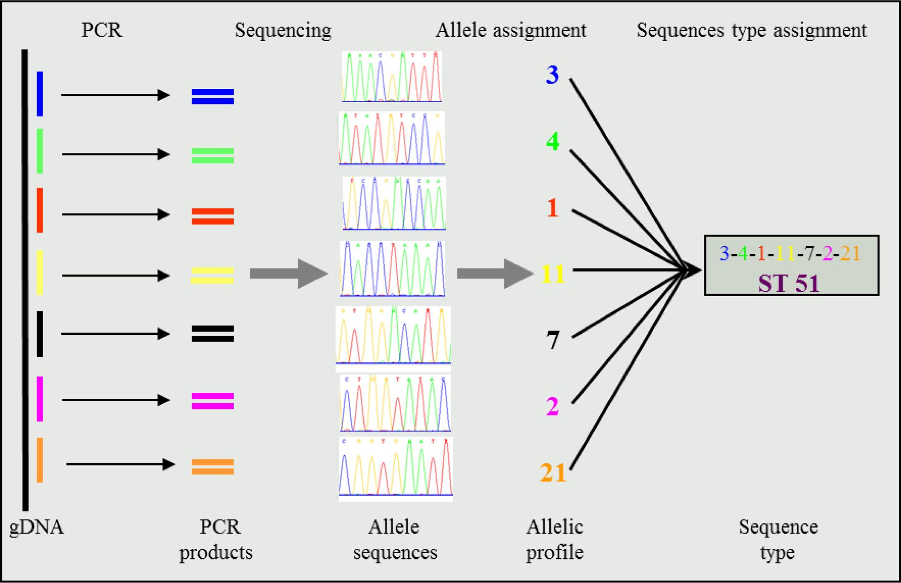
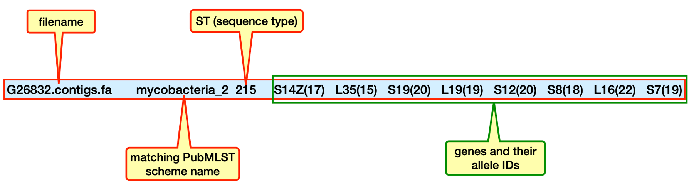
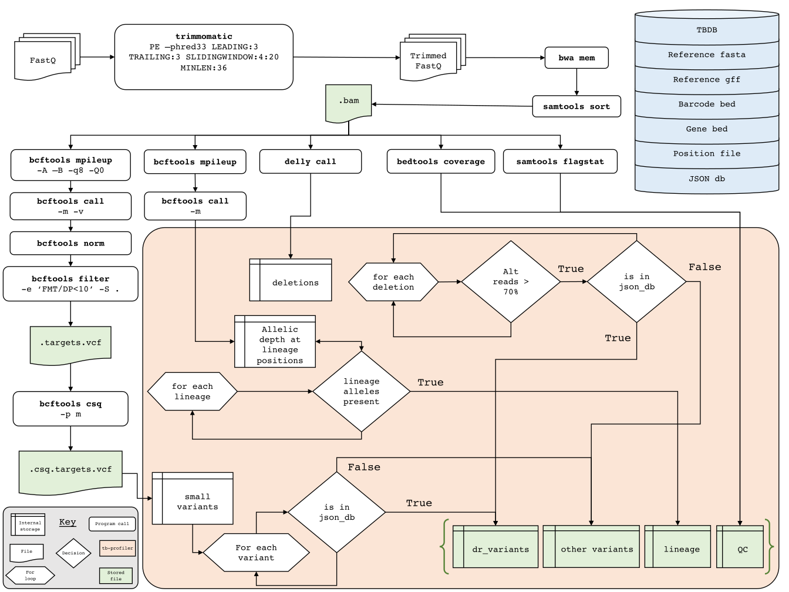
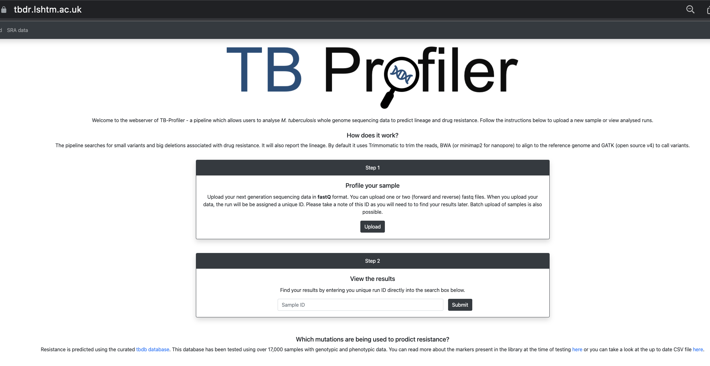

**Teaching: 120 min** || **Exercises: 30 min**

## Overview

:::::{.callout}

:::{.callout-important icon=false}
### Questions:
- How do I perform basic genotyping and serotyping of bacterial strains?
- What are the available genotyping and serotyping tools?
- How do I identify resistant bacteria?
:::

:::{.callout-important icon=false}
### Learning Objectives:
- To perform basic genotyping and serotyping of bacterial strains from WGS data.
- To perform antimicrobial resistance (AMR) prediction of bacterial strains using WGS data.
:::

:::{.callout-tip}
### Key points:
- Basic bioinformatics tools exists to genotype as well as serotype bacterial strains from identifying species right down to determining lineages, sub-lineages and strains.
- Using WGS data, and by just calling out drug resistant SNPs, you can readily determine the AMR pattern of bacterial strains. 
- Some widely used bacteria genotyping, serotyping and AST tools include:
  * Multi Locus Sequence Typing (MLST) --- *genotyping*
  * Seroba --- *serotyping*
  * TBprofiler --- *genotyping and AST*
  * Ariba --- *genotyping and AST* 
:::
:::::


## 11.1.1 Background

Whole genome sequencing data enables us to acquire several information relating to the:

- genotype, 
- serotype and 
- prediction of antimicrobial resistance 

... of our bacterial sample.

In this module of the workshop we will be introduced to the various tools that are widely used for obtaining the above information from our genome.

Let's jump into business by looking at our first tool.


## [11.1.2 MLST](https://en.wikipedia.org/wiki/Multilocus_sequence_typing)

**M**ulti-**L**ocus **S**equence **T**yping (**MLST**) typically refers to the systematic sequencing and typing of five to ten well-conserved (*usually seven*), house-keeping genes or loci within the bacterial genome. Allelic variation at each locus is catalogued, and a **sequence type** or **lineage** is assigned by comparing the set of alleles to other isolate profiles in one of several available databases. The majority of **MLST databases** are hosted at a web server currently located in Oxford University [pubmlst.org](http://www.pubmlst.org).

You can read more about the practical steps involved in **MLST** in this [publication](https://www.ncbi.nlm.nih.gov/pmc/articles/PMC3988353/).


:::{.callout-note}
### [House keeping genes](https://en.wikipedia.org/wiki/Housekeeping_gene)
Housekeeping genes are examples of regions in a genome that tend to be highly conserved and evolve slower than other genes mainly due to their roles in the maintenance of basic cellular functions and are essential for the existence of a cell. They are expressed in all cells of an organism under normal and patho-physiological conditions.
:::

It is worth noting that both the number and type of housekeeping genes interrogated by *MLST* may differ from species to species.
MLST typing for ***Staphylococcus aureus*** for example uses seven housekeeping genes. As specified by the MLST website, these genes include:

- carbamate kinase (arcC),
- shikimate dehydrogenase (aroE),
- glycerol kinase (glpF),
- guanylate kinase (gmk),
- phosphate acetyltransferase (pta),
- triosephosphate isomerase (tpi) and
- acetyl coenzyme A acetyltransferase (yqiL)

Whereas MLST typing for ***Vibrio vulnificus*** uses the following housekeeping genes:

- glucose-6-phosphate isomerase (glp),
- DNA gyrase, subunit B (gyrB),
- malate-lactate dehydrogenase (mdh),
- methionyl-tRNA synthetase (metG),
- phosphoribosylaminoimidazole synthetase (purM),
- threonine dehydrogenase (dtdS),
- diaminopimelate decarboxylase (lysA),
- transhydrogenase alpha subunit (pntA),
- dihydroorotase (pyrC) and 
- tryptophanase (tnaA). 


MLST compares allelic diversity based on approximately 450-500 bp internal gene fragments. For each house-keeping gene, the different sequences present within a bacterial species are assigned as distinct alleles and, for each isolate, the alleles at each of the seven (*or specific number of loci*) loci define the allelic profile or **S**equence **T**ype (**ST**).
You should remember encountering **ST** from two of our exercises (*Exercise 5.1.8*) in our [short read mapping](../05-short_read_mapping/5.1-short_read_mapping.md) and (*Exercise 11. <!--FIXME: add the correct exercise number here. This should be an advanced exercise under phylogenetics.-->*) in our [phylogenetics](../05-short_read_mapping/5.1-short_read_mapping.md) sessions, where we attempted to reproduce data results from the paper titled ["Genomic analysis of ST88 community-acquired methicillin resistant Staphylococcus aureus in Ghana"](https://peerj.com/articles/3047/). You can have a look at those exercises again if you haven't done that already.
Thousands of sequences have been submitted, generating numerous STs. Organisms that share all seven alleles are defined as clones, those that share five of seven identical alleles are defined as **C**lonal **C**omplexes (**CC**), and those that share less than five alleles are defined as unrelated.

In MLST the number of nucleotide differences between alleles is ignored and sequences are given different allele numbers whether they differ at a single nucleotide site or at many sites. The rationale is that a single genetic event resulting in a new allele can occur by a point mutation (altering only a single nucleotide site), or by a recombinational replacement (that will often change multiple sites) - weighting according to the number of nucleotide differences between alleles would erroneously consider the allele to be more different than by treating the nucleotide changes as a single genetic event.
The allelic profiles can be considered as a character set of *n* categorical characters (*n* being the number of house-keeping genes investigated). MLST has been used successfully to study population genetics and reconstruct micro-evolution of epidemic bacteria and other micro-organisms.


:::{.callout-note}
### Conventional MLST
Conventionally, MLST has been performed on purified isolates by running sequencing analysis on PCR amplified house-keeping genes. In the past, this really cut the cost of whole genome sequencing (WGS) by just performing a targeted sequencing on the main house-keeping genes used for MLST as per the organism. The figure below [adapted from ***Ruppitsch 2016***](https://sciendo.com/article/10.1515/boku-2016-0017) summarised this very well.


:::

With the growing decreasing cost of WGS, it is now even cheaper to perform WGS and then do in silico MLST analysis. This is what we will do in the workshop.

:::{.callout-note}
### A typical MLST phylogeny
All the MLST allelic information generated from a population of microorganisms can be nicely plotted to study the variation using phylogenetic analysis. You should be an expert of plotting phylogenetic trees by now.

](../fig/mlst_ST_phylogeny.png)

:::


This is too much of introduction.
Now let's get to what we are here for.
What bioinformatics tool can we apply to define **ST**s from our genome?

Fortunately for us, there is a tool called [**mlst**](https://github.com/tseemann/mlst).
What the ***mlst** tool does is to scan contig files against traditional PubMLST typing schemes.

:::{.callout}
## Help
Do this to get the help information for `mlst`
```bash
mlst -h
```
```
SYNOPSIS
  Automatic MLST calling from assembled contigs
USAGE
  % mlst --list                                            # list known schemes
  % mlst [options] <contigs.{fasta,gbk,embl}[.gz]          # auto-detect scheme
  % mlst --scheme <scheme> <contigs.{fasta,gbk,embl}[.gz]> # force a scheme
GENERAL
  --help            This help
  --version         Print version and exit(default ON)
  --check           Just check dependencies and exit (default OFF)
  --quiet           Quiet - no stderr output (default OFF)
  --threads [N]     Number of BLAST threads (suggest GNU Parallel instead) (default '1')
  --debug           Verbose debug output to stderr (default OFF)
SCHEME
  --scheme [X]      Don't autodetect, force this scheme on all inputs (default '')
  --list            List available MLST scheme names (default OFF)
  --longlist        List allelles for all MLST schemes (default OFF)
  --exclude [X]     Ignore these schemes (comma sep. list) (default 'ecoli,abaumannii,vcholerae_2')
OUTPUT
  --csv             Output CSV instead of TSV (default OFF)
  --json [X]        Also write results to this file in JSON format (default '')
  --label [X]       Replace FILE with this name instead (default '')
  --nopath          Strip filename paths from FILE column (default OFF)
  --novel [X]       Save novel alleles to this FASTA file (default '')
  --legacy          Use old legacy output with allele header row (requires --scheme) (default OFF)
...
```
:::


:::{.callout}
## Usage

The general format of the command is:

```bash
mlst [options] <contigs.{fasta,gbk,embl}[.gz]>
```  

Generally, the command above auto-detects an appropriate scheme to use. However, you can force a scheme by adding the option `--scheme` and specifying an appropriate scheme:

```bash
mlst --scheme <scheme> <contigs.{fasta,gbk,embl}[.gz]>
```  

You can list known schemes with the below command:

```bash
mlst --list 
```  

The above command gives a shortened list. You can get more details using `mlst --longlist`.

:::


As you can see from the general command above, you just simply give it a genome file in FASTA/GenBank/EMBL format, optionally compressed with gzip, zip or bzip2. You can also give it multiple files at once.


:::{.callout}
### Output
The command returns a tab-separated line containing

- the filename
- the matching PubMLST scheme name
- the ST (sequence type)
- the genes and their allele IDs


:::


If you have tried out any of the above commands, you may have realised it gives you error messages. This is because you probably don't have `mlst` installed on your system. We have created a conda environment called `mlst`. We will activate this environment to perform the tasks in this chapter of the workshop.

:::{.callout}
### Navigate to the `genotyping_and_dr` directory and activate the `mlst` environment


```bash
cd ~/Desktop/workshop_files_Bact_Genomics_2023/11_genotyping_and_dr/
```

```bash
mamba activate mlst
```

Have a quick look at the directory

```bash
ls -al
```
:::


We are now ready to perform some genotyping starting with `mlst`.

First, let's try our hands on knowing what the **ST** of our genome is. 
Our first genome to analyse is `G26832` and we will use the `contigs.fa` as our input.

Let's go ahead and run the below command with no options to genotype our sample:


:::{.callout}
### mlst --- *raw*
```bash
mlst G26832.contigs.fa 
``` 
```
[11:37:27] This is mlst 2.22.1 running on linux with Perl 5.032001
[11:37:27] Checking mlst dependencies:
[11:37:27] Found 'blastn' => /home/pa486/miniconda3/envs/mlst/bin/blastn
[11:37:27] Found 'any2fasta' => /home/pa486/miniconda3/envs/mlst/bin/any2fasta
[11:37:27] Found blastn: 2.13.0+ (002013)
[11:37:27] Excluding 3 schemes: vcholerae_2 ecoli abaumannii
[11:37:32] Found exact allele match mycobacteria_2.S7-19
[11:37:32] Found exact allele match mycobacteria_2.S12-20
[11:37:32] Found exact allele match mycobacteria_2.L19-19
[11:37:32] Found exact allele match mycobacteria_2.L35-15
[11:37:32] Found exact allele match mycobacteria_2.L16-22
[11:37:32] Found exact allele match mycobacteria_2.S8-18
[11:37:32] Found exact allele match mycobacteria_2.S19-20
[11:37:32] Found exact allele match mycobacteria_2.S14Z-17
G26832.contigs.fa       mycobacteria_2  215     S14Z(17)        L35(15) S19(20) L19(19) S12(20) S8(18)      L16(22) S7(19)
[11:37:32] If you have problems, please file at https://github.com/tseemann/mlst/issues
[11:37:32] Done.
```
:::


Are you happy with the output?

Let's say you are, because at least you can scan through and identify the line that contains the information you need. 
Can you think of a way to just get the line of output you need.

Yes, you can pipe the output to a grep command. Let's try our hands on this exercise and see if it works.


:::::{.callout-important icon=false}
## ***Exercise 11.1.2.1:*** Extracting informative line from mlst output

Using the mlst command above combined with any text finding command of your choice how will you obtain the expected output below.

```
G26832.contigs.fa       mycobacteria_2  215     S14Z(17)        L35(15) S19(20) L19(19) S12(20) S8(18)      L16(22) S7(19)
```

:::{.callout collapse="true"}
## ***Solution:***

You probably tried solving this by passing the output of mlst to grep using a `|` (pipe):

```bash
mlst G26832.contigs.fa | grep "G26832"
``` 
```
[12:40:24] This is mlst 2.22.1 running on linux with Perl 5.032001
[12:40:24] Checking mlst dependencies:
[12:40:24] Found 'blastn' => /home/pa486/miniconda3/envs/mlst/bin/blastn
[12:40:24] Found 'any2fasta' => /home/pa486/miniconda3/envs/mlst/bin/any2fasta
[12:40:24] Found blastn: 2.13.0+ (002013)
[12:40:24] Excluding 3 schemes: ecoli vcholerae_2 abaumannii
[12:40:27] Found exact allele match mycobacteria_2.S7-19
[12:40:27] Found exact allele match mycobacteria_2.S12-20
[12:40:27] Found exact allele match mycobacteria_2.L19-19
[12:40:27] Found exact allele match mycobacteria_2.L35-15
[12:40:27] Found exact allele match mycobacteria_2.L16-22
[12:40:27] Found exact allele match mycobacteria_2.S8-18
[12:40:27] Found exact allele match mycobacteria_2.S19-20
[12:40:27] Found exact allele match mycobacteria_2.S14Z-17
[12:40:27] Please also cite 'Jolley & Maiden 2010, BMC Bioinf, 11:595' if you use mlst.
[12:40:27] Done.
**G26832**.contigs.fa       mycobacteria_2  215     S14Z(17)        L35(15) S19(20) L19(19) S12(20) S8(18)      L16(22) S7(19)
```
Aww, but you end up with the same output but with **G26832** highlighted.

I guess we all failed the test. 
Yes, it does happen sometimes even when you are 100% sure that your command should give you an expected output.

:::
:::::


Although we probably failed the test, let's not worry, `mlst` has a special flag that we can use to get a *quiet* output by using the `--quiet` option.


Let's go ahead and try this out.


:::{.callout}
### Using the `--quiet` option

```bash
mlst --quiet G26832.contigs.fa
``` 
```
G26832.contigs.fa       mycobacteria_2  215     S14Z(17)        L35(15) S19(20) L19(19) S12(20) S8(18)      L16(22) S7(19)
```
:::


The `--quiet` option is also used in many other programs. 

You actually do not need to specify a `--quiet` option if the command is used in a pipeline as the output it actually passes on to the next command is just the line of interest.

You can check this by outputting our previous *raw* command to a text file:

```bash
mlst G26832.contigs.fa > G26832.mlst.txt
``` 

Now, view the text file 

```bash
head G26832.mlst.txt
``` 


Let's have a look at another option that helps you change the name of your sample in the output. This is very useful if your original sample name contains a name that you probably do not want to see in an excel file.


:::{.callout}
### Using the `--label` option

We can assign a new name to each sample by applying the `--label` option and specifying the new preferred name right after the option:

```bash
mlst --quiet --label firstTBsample G26832.contigs.fa
``` 
```
firstTBsample   mycobacteria_2  215     S14Z(17)        L35(15) S19(20) L19(19) S12(20) S8(18)  L16(22)     S7(19)
```
:::


Now we see how easy it is to genotype our sample using mlst.
Let's go ahead and type all the samples in our genotyping directory beginning with the letter **G**.

The easy way to do this is to use a wildcard to call all the contigs.fa samples beginning with **G** and run the mlst on each file.


:::{.callout}
### Genotype all samples beginning with the letter `G`

```bash
mlst --quiet G*.contigs.fa
``` 
```
G26831.contigs.fa       mycobacteria_2  299     S14Z(17)        L35(15) S19(20) L19(19) S12(20) S8(18)      L16(185)        S7(19)
G26832.contigs.fa       mycobacteria_2  215     S14Z(17)        L35(15) S19(20) L19(19) S12(20) S8(18)      L16(22) S7(19)
G26854.contigs.fa       mycobacteria_2  215     S14Z(17)        L35(15) S19(20) L19(19) S12(20) S8(18)      L16(22) S7(19)
```
:::


You can also direct the output to a specified file name say (**G_mlst.tsv**) and have a look at it with an appropriate spreadsheet application. 

```bash
mlst --quiet G*.contigs.fa > G_mlst.tsv
``` 

Examine the ouptut of the analysis and see what you make out of it.
Do you observe any possible clone or clonal complex?

The samples are probably related if they form a clone. What do you think?


**NB.** We can also specify a `.csv` output using the option `--csv`, in which case our output should be appropriately labelled as (**G_mlst.csv**)


:::::{.callout-important icon=false}
## ***Exercise 11.1.2.2:*** renaming mlst output using a `for loop`

Consider all the downloaded and processed samples from NCBI within the current genotyping directory. The processed samples have the prefix **ERR** or **SRR**.

Your task is to apply `mlst` on all these samples and rename them by removing the suffix `contigs.fa`. 

You can try first with multiple steps, however, your final task is to come up with a `for loop` that performs the task in a single line of code.

Go ahead and interpret your output after running the command.

- How many species do you see?
- What are their **ST**?
- Do you find anything strange?

:::{.callout collapse="true"}
## ***Solution:***

First let's have a look at all the **ERR** and **SRR** contigs.fa files in our directory.

We can do this by a simple `ls` with the wildcard `*`:

```bash
ls *RR*.contigs.fa 
```
```
ERR10437992.contigs.fa  ERR1638070.contigs.fa  ERR369522.contigs.fa
ERR10438004.contigs.fa  ERR1638071.contigs.fa  SRR16634399.contigs.fa
``` 
We see that we have exactly 6 contigs.fa files with our search.

Now, if we wanted to perform `mlst` on one sample (*say ERR10437992.contigs.fa*) and rename it concurrently, we will do this

```bash
mlst --quiet --label ERR10437992 ERR10437992.contigs.fa
```

But, how do we extract the ID individually to include as a label.

To extract just the ID, we can use a `for loop` as below:

:::{.callout}
```bash
for contig in *RR*.contigs.fa 
do 
echo ${contig%.contigs.fa}
done
```

or nicely in one line as:
```bash
for contig in *RR*.contigs.fa; do  echo ${contig%.contigs.fa}; done
```
```
ERR10437992
ERR10438004
ERR1638070
ERR1638071
ERR369522
SRR16634399
```
:::


Now let's fit the mlst command somewhere in the `for loop`:

```bash
for contig in *RR*.contigs.fa; do mlst --quiet --label ${contig%.contigs.fa} $contig >> downloaded_genome_mlst.tsv; done
```
:::
:::::


Till now, we have used the `contigs.fa` file. let's try one pseudogenome `.fasta` file from our `short_read_mapping` directory and see if we get the same output as with what we did with the `contigs.fa` file.

Let's first copy the file to our current working directory:

```bash
cp ../05_mapping/short_read_mapping_MTB/G26832.fas .
``` 

And now perform mlst (*focus on only the last two lines of the output*):

```bash
mlst --quiet G26832.fas G26832.contigs.fa
``` 
```
...
CFastaReader: Hyphens are invalid and will be ignored around line 70535
CFastaReader: Hyphens are invalid and will be ignored around line 70536
G26832.fas      mycobacteria_2  215     S14Z(17)        L35(15) S19(20) L19(19) S12(20) S8(18)  L16(22)     S7(19)
G26832.contigs.fa       mycobacteria_2  215     S14Z(17)        L35(15) S19(20) L19(19) S12(20) S8(18)      L16(22) S7(19)
```

Viola, we had the same **ST**. `mlst` did a great job.


### Using `mlst` without auto-detection

You can force a particular scheme (useful for reporting systems).

Let's try this on our famous genome:

```bash
mlst --quiet --scheme mycobacteria_2 G26832.contigs.fa
``` 
```
G26832.contigs.fa       mycobacteria_2  215     S14Z(17)        L35(15) S19(20) L19(19) S12(20) S8(18)      L16(22) S7(19)
```

:::{.callout-important}
### Specifying a wrong scheme

Don't expect to get anything if you specify a wrong scheme for your organism.

```bash
mlst --quiet --scheme neisseria G26832.contigs.fa
``` 
```
G26832.contigs.fa       neisseria       -       abcZ(-) adk(-)  aroE(-) fumC(-) gdh(-)  pdhC(-) pgm(-)
```
:::


### Generating a more friendly format with `--legacy` and `--scheme` options

You can make `mlst` behave like older version before auto-detection existed
by providing the `--legacy` parameter with the  `--scheme` parameter. In that case
it will print a fixed tabular output with a heading containing allele names specific to that scheme. This is very useful if you are investigating the same species :

```bash
mlst --quiet --legacy --scheme mycobacteria_2 G*.contigs.fa
```
```
G26831.contigs.fa       mycobacteria_2  299     17      15      20      19      20      18      18519
G26832.contigs.fa       mycobacteria_2  215     17      15      20      19      20      18      22 19
G26854.contigs.fa       mycobacteria_2  215     17      15      20      19      20      18      22 19
```

### Other useful information

:::{.callout}
### Missing data

Version 2.x does not just look for exact matches to full length alleles. 
It attempts to tell you as much as possible about what it found using the
notation below:

Symbol | Meaning | Length | Identity
--   | ------- | --- | ---
`n`   | exact intact allele                   | 100%            | 100%
`~n`  | novel full length allele similar to n | 100%            | &ge; `--minid`
`n?`  | partial match to known allele         | &ge; `--mincov` | &ge; `--minid`
`-`   | allele missing                        | &lt; `--mincov` | &lt; `--minid`
`n,m` | multiple alleles                      | &nbsp;          | &nbsp;

:::


:::{.callout}
### Scoring system

Each MLST prediction gets a score out of 100.
The score for a scheme with N alleles is as follows:

* +90/N points for an exact allele match _e.g._ `42`
* +63/N points for a novel allele match (50% of an exact allele) _e.g._ `~42`
* +18/N points for a partial allele match (20% of an exact alelle) _e.g._ `42?`
* 0 points for a missing allele _e.g._ `-`
* +10 points if there is a matching ST type for the allele combination

It is possible to filter results using the `--minscore` option which takes a
value between 1 and 100. If you only want to report known ST types, then use
`--minscore 100`. To also include novel combinations of existing alleles with
no ST type, use `--minscore 90`. The default is `--minscore 50` which is an
_ad hoc_ value I have found allows for genuine partial ST matches
but eliminates false positives.
:::


To know more about the below topics, visit the github page  [`tseemann/mlst`](https://github.com/tseemann/mlst)

- Mapping to genus/species
- Updating the database
- Adding a new scheme 


:::{.callout-important}
### Change working environment

Still in the `genotyping_and_dr` directory run the below command to deactivate the `mlst` environment and activate the `seroba` environment:

```bash
mamba deactivate
```

```bash
mamba activate seroba
```
:::


## [11.1.3 Serotyping](https://en.wikipedia.org/wiki/Serotype)
A serotype or serovar is a distinct variation within a species of bacteria or virus or among immune cells of different individuals. These microorganisms, viruses, or cells are classified together based on their surface antigens, allowing the epidemiologic classification of organisms to the subspecies level. A group of serovars with common antigens is called a serogroup or sometimes serocomplex.


Figure adapted from https://en.wikipedia.org/wiki/Serotype.

Serotyping often plays an essential role in determining species and subspecies. The Salmonella genus of bacteria, for example, has been determined to have over 2600 serotypes. *Vibrio cholerae*, the species of bacteria that causes cholera, has over 200 serotypes, based on cell antigens --- however, only two of them have been observed to produce the potent enterotoxin that results in cholera: O1 and O139. 

So you can imaging that being able to accurately identify serotypes of strains can already give you some very important information about the pathogenicity of the bacterial strain.


:::{.callout}
### What has proteins got to do in a genomics class?

If you are wondering why we are discussing antigens (*proteins*) in a genomics (*DNA*) workshop, don't worry, you are not the only one and perhaps this is the right place to discuss this. However, we will not go further with our discussion.
If you can recall from your basic molecular biology class, all proteins are products of DNA. So there we go, all the information in the antigens (proteins) will actually be coded in the genome (DNA), so let's go ahead and do some investigations of our genome to predict serotypes of bacterial strains.
:::


<!--FIXME: Check the other serotyping tools to see if some can be included in the course-->
There are a number of bioinformatics tools available for serotyping bacterial strains. Most of these, however, are species specific tools:

***For Salmonella spp.***

- [SeqSero](https://github.com/denglab/SeqSero)
- [sistr_cmd](https://github.com/phac-nml/sistr_cmd)
- [SeroTools](https://github.com/CFSAN-Biostatistics/SeroTools)

***For Neisseria meningitidis***

- [meningotype](https://github.com/MDU-PHL/meningotype)

***For Escherichia coli***

- [ECTyper](https://github.com/phac-nml/ecoli_serotyping)
- [ecoli_serotyper](https://github.com/Papos92/ecoli_serotyper)

***For Shigatoxin producing E. coli (STEC)***

- [STECFinder](https://github.com/LanLab/STECFinder)

***For Vibrio parahaemolyticus***

- [VPsero](https://github.com/shengzheBian/VPsero)

***For Pseudomonas aeruginosa***

- [PAst](https://github.com/Sandramses/PAst)

***For Listeria monocytogenes***

- [LisSero](https://github.com/MDU-PHL/LisSero)

***For Shigella***

- [ShigEiFinder](https://github.com/LanLab/ShigEiFinder)
- [ShigaPass](https://github.com/imanyass/ShigaPass)

***For Streptococcus pneumoniae***

- [seroBA](https://www.microbiologyresearch.org/content/journal/mgen/10.1099/mgen.0.000186)
- [PneumoCaT](https://github.com/phe-bioinformatics/PneumoCaT)
- [SeroCall](https://github.com/knightjimr/SeroCall)
- [Serotyping](https://github.com/Mauffrey/serotyping)
- [seqSerotyper](https://github.com/avantonder/seqSerotyper)

***For Streptococcus suis***

- [SsuisSerotyping_pipeline](https://github.com/streplab/SsuisSerotyping_pipeline)

***For Streptococcus agalactiae***

- [mlst_Sagalactiae](https://github.com/aquacen/serotype_Sagalactiae)


For this workshop, we will focus on one main tool --- ***seroBA***.


### [seroBA](https://github.com/sanger-pathogens/seroba)

SeroBA is a k-mer based Pipeline to identify the Serotype from Illumina NGS reads for given references. You can use SeroBA to download references from (https://github.com/phe-bioinformatics/PneumoCaT) to identify the capsular type of *Streptococcus pneumoniae*.

SeroBA can predict serotypes, by identifying the cps locus, directly from raw whole genome sequencing read data with 98% concordance using a k-mer based method, can process 10,000 samples in just over one day using a standard server and can call serotypes at a coverage as low as 10x.

You can visit the publication to read more about [seroBA](https://www.microbiologyresearch.org/content/journal/mgen/10.1099/mgen.0.000186)


:::{.callout}
## Help
Do this to get the help information for `seroBA`
```bash
seroba --help
```
```
usage: seroba <command> <options>

optional arguments:
  -h, --help     show this help message and exit

Available commands:
  
    getPneumocat
                 downloads genetic information from PneumoCat
    createDBs    creates Databases for kmc and ariba
    runSerotyping
                 identify serotype of your input data
    summary      output folder has to contain all folders with prediction results
    version      Get versions and exit

```
```bash
seroba runSerotyping -h
```
```
usage: seroba runSerotyping [options]  <read1> <read2> <prefix>

identify serotype of your input data

positional arguments:
  read1                 forward read file
  read2                 backward read file
  prefix                unique prefix

optional arguments:
  -h, --help            show this help message and exit

Other options:
  --databases DATABASES
                        path to database directory, default
                        /home/pa486/miniconda3/envs/seroba/share/seroba-1.0.2/database
  --noclean             Do not clean up intermediate files (assemblies, ariba report)
  --coverage COVERAGE   threshold for k-mer coverage of the reference sequence , default = 20
```
:::


:::{.callout}
## Usage
The general format of the command is:

```bash
seroba runSerotyping [options]  <databases directory> <read1> <read2> <prefix>
```  
```
Optional arguments:
- noclean NOCLEAN  Do not clean up intermediate files (assemblies, ariba report)
- coverage COVERAGE  threshold for k-mer coverage of the reference sequence (default = 20)  
```

You can also use the below command to summarize the output in one `.tsv` file

```bash
seroba summary  <output folder>
```

**NB.** <output folder> is directory where the output directories from `seroba runSerotyping` are stored

:::


:::{.callout}
### Input
- The command requires a pair of fastq files as input files.

- seroba database.
**seroBA** debends on a database to run --- without which the process will fail.
This is how **seroBA** functions. In your working directory, you will find a file named `seroba_db` --- this is the compiled databse for **seroBA**. Without specifying a `seroba_db` database in the working directory, none of the commands used here will work.
:::


:::{.callout}
### Output
In the folder 'prefix' you will find a `pred.tsv` including your predicted serotype as well as a file called detailed_serogroup_info.txt including information about SNP, genes, and alleles that are found in your reads. After the use of "seroba summary" a tsv file called summary.tsv is created that consists of three columns (sample Id , serotype, comments). Serotypes that do not match any reference are marked as "untypable"(v0.1.3)
<!--FIXME: I didn't see this fil `detailed_serogroup_info.txt` in the output-->
:::


We are now ready to perform our serotyping.

First, let's try our hands on knowing what the **serotype** of our first *pneumococcal* genome is. 
Our first *pneumococcal* genome to analyse is `ERR1638213` and we will use the `ERR1638213.R?.trim.fastq.gz` files as our input.

Let's go ahead and run the below command to genotype our first sample:


:::{.callout}
### seroba runSerotyping --- error
```bash
seroba runSerotyping --databases seroba_db/ ERR1638213.R1.trim.fastq.gz ERR1638213.R2.trim.fastq.gz ERR1638213
``` 

oops! we get an error message:

```
Names for forwards and reverse reads does not match. Cannot continue
```
:::


Let's fix this error.
It turns out that the developers of seroBA require the `.fastq` input files to be in a particular format. 
Instead of `ERR1638213.R1.trim.fastq.gz` they prefer `ERR1638213_R1.trim.fastq.gz`.
Thus, the `.` in `.R1` and `.R2`, should be replaced with a `_` to give `_R1`and `_R2`.

:::{.callout-note}
`.fastq` files are normally produces with any of '_R1', '_R2', '_1' or '_2' to differentiate the forward and reverse reads during paired-end Illumina sequencing.
In the example above, we have used `.R` to name some of our files just to let you know how some tools may be strict on what name they require as input files.
It is not really the best practice to write a script with such a limitation. 
:::


Let's try and fix the error by attempting the below exercise to replace all `.R`s with `_R`.


:::::{.callout-important icon=false}
## ***Exercise 11.1.3.1:*** replace `.` with `_` in a file name

Using any command of your choice, write out a simple line of code to replace all `.R`s with `_R` in all the trimmed fastq files that have this format.

<details><summary>Hint</summary>
You can try using `mv`. If you've forgotten the general format of the command you can refresh your memory by going back to [renaming files](../02-unix_intro/2.2-files_directories.md).
Remember to use echo to also test it on several files using a [`for loop`](../02-unix_intro/2.8-bonus_loops.md).
</details>

:::{.callout collapse="true"}
## ***Solution:***

To rename just one file you run this command:

```bash
mv ERR1638213.R1.trim.fastq.gz ERR1638213_R1.trim.fastq.gz
```

You can use a for loop to rename all the trimmed fastq files with the `.R` format.

Run this to rename all the `.R1.trim.fastq.gz` files
```bash
for i in *.R1.trim.fastq.gz ; do mv $i ${i%.R1*}_R1.trim.fastq.gz; done
```

Run this to rename all the `.R2.trim.fastq.gz` files
```bash
for i in *.R2.trim.fastq.gz ; do mv $i ${i%.R2*}_R2.trim.fastq.gz; done
```

Alternatively, you can use the below command to rename all the files at a go:
```bash
for i in *.R?.trim.fastq.gz ; do mv $i ${i%.R*}_${i#*.}; done
```
:::
:::::


Let's go ahead and rename all the `.R1.trim.fastq.gz` files to `_R1.trim.fastq.gz` using our solution from the exercise above.


Now let's try running our first sample again.

:::{.callout}
### seroba runSerotyping

```bash
seroba runSerotyping --databases seroba_db/ ERR1638213_R1.trim.fastq.gz ERR1638213_R2.trim.fastq.gz ERR1638213
``` 

```
 -ci4  -m2 -t1
/home/pa486/miniconda3/envs/seroba/bin/kmc -k71  -ci4  -m2 -t1 ERR1638213_R1.trim.fastq.gz /tmp/temp.kmc7vn6w_17/ERR1638213 /tmp/temp.kmc7vn6w_17
*****************************
Stage 1: 100%
Stage 2: 100%
1st stage: 0.988177s
2nd stage: 2.33987s
Total    : 3.32805s
Tmp size : 24MB

Stats:
   No. of k-mers below min. threshold :       589835
   No. of k-mers above max. threshold :            0
   No. of unique k-mers               :      2642594
   No. of unique counted k-mers       :      2052759
   Total no. of k-mers                :     26123286
   Total no. of reads                 :       167385
   Total no. of super-k-mers          :       923602
...
```
:::


Viola, now we get an output.

Let's see how we interpret the output.


:::{.callout}
### interpreting `pred.tsv` output

Look at the file called `pred.tsv` in your results directory --- `ERR1638213/`.

```bash
cat ERR1638213/pred.tsv
``` 
```
ERR1638213      01      contamination
```

You can see three columns. The first one contains the prefix you chose for the run. The second one contains the predicted serotype and the third column may contain a comment regarding contamination. So, in this case we can see that ERR1638213 was predicted to be of serotype 01 and at least 10% of the reads are called as a different snp than the other reads i.e. there is contamination.
:::


We can now proceed to run `seroba runSerotyping` on all the remaining *Streptococcus pneumoniae* samples below using a `for loop`:

**NB** SeroBA tool is for serotyping only *Streptococcus pneumoniae* strains and so we don't need to type all the strains on our current directory.
Nevertheless, let's go ahead and serotype all our samples using `seroba runSerotyping` and see what we get in our output.


:::{.callout}
### seroba runSerotyping --- `for loop`

Because we have already typed our first sample, we may get an error message when we try to rerun the serotyping on the same sample.

Let's remove the output directory of our first sample --- `ERR1638213/`

```bash
rm -r ERR1638213/
```

Now let's run `seroba runSerotyping` on all our samples

```bash
for i in *_R1.trim.fastq.gz; do echo seroba runSerotyping --databases seroba_db/ $i ${i%_R*}_R2.trim.fastq.gz ${i%_R*}; done

``` 

This will take about 15 minutes ...

```
 -ci4  -m2 -t1
/home/pa486/miniconda3/envs/seroba/bin/kmc -k71  -ci4  -m2 -t1 ERR097430_R1.trim.fastq.gz /tmp/temp.kmctiwe1a3b/ERR097430 /tmp/temp.kmctiwe1a3b
**************************************************************************************
Stage 1: 100%
Stage 2: 100%
1st stage: 3.72407s
2nd stage: 1.42577s
Total    : 5.14984s
Tmp size : 66MB

Stats:
   No. of k-mers below min. threshold :      1073070
   No. of k-mers above max. threshold :            0
   No. of unique k-mers               :      2499001
   No. of unique counted k-mers       :      1425931
   Total no. of k-mers                :     11763976
   Total no. of reads                 :      3908241
   Total no. of super-k-mers          :      3403220
...
```
:::


Now that we have performed multiple runs, we might want to create a summary of the results. To do this, let's run the `seroba summary` option.


:::{.callout}
### Summarizing the outputs with `seroba summary`

We will run the command in the current directory `.`.
We use `.` to specify the directory where our output files are located.

```bash
seroba summary .
```

Have a look at the resulting `.tsv` file.

```bash
cat summary.tsv
```

```
ERR097430       Swiss_NT        contamination
ERR10310429     19F
ERR10437992     coverage too low
ERR10438004     coverage too low
ERR1638070      coverage too low
ERR1638071      coverage too low
ERR1638213      01      contamination
ERR369522       coverage too low
G26831  coverage too low
G26832  coverage too low
G26854  coverage too low
SRR16634399     coverage too low
```

What do make you of the results?

We see that those samples that are not *Streptococcus pneumoniae* have `coverage too low`. This is because, the SNPs or sequences being investigated by seroBA can't be found in these other species.

:::


:::{.callout}
### Troubleshooting
Case 1:

- SeroBA predicts 'untypable'. An 'untypable' prediction can either be a real 'untypable' strain or can be caused by different problems. Possible problems are: bad quality of your input data, submission of a wrong species or to low coverage of your sequenced reads. Please check your data again and run a quality control.

Case 2:

- Low alignment identity in the 'detailed_serogroup_info' file. This can be a hint for a mosaic serotype.

- Possible solution: perform a blast search on the whole genome assembly

Case 3:

- The third column in the summary.tsv indicates "contamination". This means that at least one heterozygous SNP was detected in the read data with at least 10% of the mapped reads at the specific position supporting the SNP.

- Possible solution: please check the quality of your data and have a look for contamination within your reads
:::


## 11.1.4 *Mycobacterium tuberculosis* specific genotyping and AMR prediction tools

The genotyping and serotyping tools we have explored above are all very useful for bacteria typing.

However, same can not be said for *Mycobacterium tuberculosis* typing. You should have realized by now that most of the tools used above are meaningless for typing *Mycobacterium tuberculosis*.

*Mycobacterium tuberculosis*, like other *Mycobacterium* species, are a very unique group of bacteria which also require specialized tools.

For this workshop, we will investigate two main tools --- **SpoTyping** and **tb-profiler**. Where as the former is used for only genotyping, the latter can be used for both genotyping and antimicrobial resistance (AMR) prediction.


Let's now explore both tools.


:::{.callout-important}
### Change working environment

Still in the `genotyping_and_dr` directory run the below command to deactivate the `seroba` environment and activate the `spoligotyping` environment:

```bash
mamba deactivate
```

```bash
mamba activate spoligotyping
```
:::


### [SpoTyping](https://github.com/xiaeryu/SpoTyping-v2.0)

_SpoTyping_ is a fast and accurate program for *in silico* spoligotyping of *Mycobacterium tuberculosis* isolates from next-generation sequencing reads. 
It predicts spoligotypes from sequencing reads, complete genomic sequences and assembled contigs.
You can access the publication by [clicking here](https://genomemedicine.biomedcentral.com/articles/10.1186/s13073-016-0270-7) or visit the [github page](https://github.com/xiaeryu/SpoTyping-v2.0).

Before we explore the `SpoTyping` tool, let's have a look at what **spoligotyping** is.

*Spoligotyping* is a simple method which allows simultaneous detection and typing of *M. tuberculosis* in clinical specimens and reduces the time between suspicion of the disease and typing from 1 or several months to 1 or 3 days. The method is based on polymorphism of the chromosomal **direct repeat (DR)** locus, which contains a variable number of short direct repeats interspersed with nonrepetitive spacers. 

The method is referred to as **sp**acer **oligo**nucleotide **typing** or "**spoligotyping**" because it is based on strain-dependent hybridization patterns of in vitro-amplified DNA with multiple spacer oligonucleotides.

![(A) Structure of the DR locus in the mycobacterial genome. The chromosomes of *M. tuberculosis* H37Rv and *M. bovis* BCG contain 48 and 41 DRs, respectively (depicted as rectangles), which are interspersed with unique spacers varying in length from 35 to 41 bp. The (numbered) spacers used correspond to 37 spacers from *M. tuberculosis* H37Rv and 6 from *M. bovis* BCG. The site of integration of insertion element *IS6110* is depicted. (B) Principle of *in vitro* amplification of the DR region by PCR. Any DR in the DR region may serve as a target for these primers; therefore, the amplified DNA is composed of a mixture of a large number of different-size fragments. Shown is the combination of fragments that would be produced by *in vitro* amplification of a DR target containing only five contiguous DRs. Kamerbeek *et. al.,* 1997](../fig/spoligotyping_1.png)


Most TB clinical isolates show unique hybridization patterns, whereas outbreak strains share the same spoligotype. Spoligotyping is able to differentiate *M. bovis* from *M. tuberculosis*, a distinction which is often difficult to make by traditional methods.


:::{.callout}
### Sequences of 43 oligonucleotides mostly used in spoligotyping

| Spacer no. | Oligonucleotide sequence | | Spacer no. | Oligonucleotide sequence |
|-|--------------|-|-|--------------|
| 1  | ATAGAGGGTCGCCGGTTCTGGATCA |   | 23 | AGCATCGCTGATGCGGTCCAGCTCG |
| 2  | CCTCATAATTGGGCGACAGCTTTTG |   | 24 | CCGCCTGCTGGGTGAGACGTGCTCG | 
| 3  | CCGTGCTTCCAGTGATCGCCTTCTA |   | 25 | GATCAGCGACCACCGCACCCTGTCA | 
| 4  | ACGTCATACGCCGACCAATCATCAG |   | 26 | CTTCAGCACCACCATCATCCGGCGC | 
| 5  | TTTTCTGACCACTTGTGCGGGATTA |   | 27 | GGATTCGTGATCTCTTCCCGCGGAT | 
| 6  | CGTCGTCATTTCCGGCTTCAATTTC |   | 28 | TGCCCCGGCGTTTAGCGATCACAAC | 
| 7  | GAGGAGAGCGAGTACTCGGGGCTGC |   | 29 | AAATACAGGCTCCACGACACGACCA | 
| 8  | CGTGAAACCGCCCCCAGCCTCGCCG |   | 30 | GGTTGCCCCGCGCCCTTTTCCAGCC | 
| 9  | ACTCGGAATCCCATGTGCTGACAGC |   | 31 | TCAGACAGGTTCGCGTCGATCAAGT |
| 10 | TCGACACCCGCTCTAGTTGACTTCC |   | 32 | GACCAAATAGGTATCGGCGTGTTCA | 
| 11 | GTGAGCAACGGCGGCGGCAACCTGG |   | 33 | GACATGACGGCGGTGCCGCACTTGA | 
| 12 | ATATCTGCTGCCCGCCCGGGGAGAT |   | 34 | AAGTCACCTCGCCCACACCGTCGAA | 
| 13 | GACCATCATTGCCATTCCCTCTCCC |   | 35 | TCCGTACGCTCGAAACGCTTCCAAC | 
| 14 | GGTGTGATGCGGATGGTCGGCTCGG |   | 36 | CGAAATCCAGCACCACATCCGCAGC | 
| 15 | CTTGAATAACGCGCAGTGAATTTCG |   | 37 | CGCGAACTCGTCCACAGTCCCCCTT | 
| 16 | CGAGTTCCCGTCAGCGTCGTAAATC |   | 38 | CGTGGATGGCGGATGCGTTGTGCGC | 
| 17 | GCGCCGGCCCGCGCGGATGACTCCG |   | 39 | GACGATGGCCAGTAAATCGGCGTGG | 
| 18 | CATGGACCCGGGCGAGCTGCAGATG |   | 40 | CGCCATCTGTGCCTCATACAGGTCC | 
| 19 | TAACTGGCTTGGCGCTGATCCTGGT |   | 41 | GGAGCTTTCCGGCTTCTATCAGGTA | 
| 20 | TTGACCTCGCCAGGAGAGAAGATCA |   | 42 | ATGGTGGGACATGGACGAGCGCGAC | 
| 21 | TCGATGTCGATGTCCCAATCGTCGA |   | 43 | CGCAGAATCGCACCGGGTGCGGGAG | 
| 22 | ACCGCAGACGGCACGATTGAGACAA |   |    |                           |

:::


You can read more on [Spoligotyping](https://www.ncbi.nlm.nih.gov/pmc/articles/PMC229700/) by accessing this [publication](https://www.ncbi.nlm.nih.gov/pmc/articles/PMC229700/).


Now, let's move on to the typing tool.

**SpoTyping** basically extracts hexadecimal and binary spoligotype codes from fastq files.

It achieves high accuracy for reads of both uniform and varying lengths, and is about 20 to 40 times faster than SpolPred --- another spoligotyping tool. SpoTyping also integrates the function of producing a report summarizing associated epidemiological data from a global database of all isolates having the same spoligotype.

![A schematic representation of the SpoTyping workflow. If the specified input contains sequencing reads, SpoTyping first concatenates the sequencing reads to form an artificial sequence. The artificial sequence, or genetic sequences when the input contains complete genomic sequence or assembled contigs, would be built into the BLAST database. After querying the 43 spacer sequences in the database, the results are parsed to count the number of hits for each spacer sequence. A hit threshold is set to define a spacer as ‘present’ in the genome, resulting in a 43-digit binary code with 1 as present and 0 as absent, which is further translated into the octal code of the spoligotype. The SITVIT database is then queried to identify matching isolates having the same spoligotype, where the associated data of the matched isolates are downloaded and summarized as pie charts. Xia, E., Teo, YY. & Ong, R.TH 2015](../fig/spotyping.png)


:::{.callout}
## Help
Do this to get the help information for `SpoTyping`
```bash
SpoTyping.py --help
```
```
Usage: python SpoTyping.py [options] FASTQ_1/FASTA FASTQ_2(optional)

Options:
  --version             show program's version number and exit
  -h, --help            show this help message and exit
  --seq                 Set this if input is a fasta file that contains only a
                        complete genomic sequence or assembled contigs from an
                        isolate [Default is off]
  -s SWIFT, --swift=SWIFT
                        swift mode, either "on" or "off" [Defulat: on]
  -m MIN_STRICT, --min=MIN_STRICT
                        minimum number of error-free hits to support presence
                        of a spacer [Default: 0.1*average read depth]
  -r MIN_RELAX, --rmin=MIN_RELAX
                        minimum number of 1-error-tolerant hits to support
                        presence of a spacer [Default: 0.12 * average read
                        depth]
  -O OUTDIR, --outdir=OUTDIR
                        output directory [Default: running directory]
  -o OUTPUT, --output=OUTPUT
                        basename of output files generated [Default:
                        SpoTyping]                        
...
```

You will notice that, what we just did was to call out a python script `SpoTyping.py` in the current directory. 
This is how **SPoTyping** functions. Without the `SpoTyping.py` script in the working directory, none of the commands used here will work.
:::


:::{.callout}
## Usage
The general format of the command is:

```bash
python SpoTyping.py [options] FASTQ_1 FASTQ_2(optional)
```  
:::


:::{.callout}
### Input

- Fastq file or pair-end fastq files
- Fasta file of a complete genomic sequence or assembled contigs of an isolate
:::


:::{.callout}
### Output

- In the output file specified: predicted spoligotype in the format of binary code and octal code.
- In the output log file: count of hits from BLAST result for each spacer sequence.
- In the `.xls` excel file: spoligotype query result downloaded from SITVIT WEB.

**Note: if the same spoligotype is queried before and have an xls file in the output directory, it will not be queried again.**
:::


We are now ready to perform our SPoTyping.

First, let's try our hands on knowing what the **spoligotype** of our first genome is. 
As this is a TB specific tool, our first genome to analyse is `G26832` and we will first use the `G26832_R?.trim.fastq.gz` files as our input and also try with the `G26832.contigs`.

Let's go ahead and run the below command with no options to genotype our sample:


:::::{.callout}
### SpoTyping

Because SpoTyping generated a lot of output, we will store all its output into a new directory.

Let's create our new directory to keep our output files:

```bash
mkdir spoligotype_results
```

**NB.** We will also need to specify our output name `-o`.

:::{.callout}
### `.fastq` as input

```bash
SpoTyping.py G26832_R1.trim.fastq.gz G26832_R2.trim.fastq.gz -o spoligotypes
``` 
This may take about a minute to run.

```

Building a new DB, current time: 12/05/2022 16:26:16
New DB name:   /rds/user/pa486/hpc-work/workshop_files_Bact_Genomics_2023/12_genotyping_delete/spoligotypes.SpoTyping.tmp.0
New DB title:  ./spoligotypes.SpoTyping.tmp.0
Sequence type: Nucleotide
Keep MBits: T
Maximum file size: 3000000000B
Adding sequences from FASTA; added 1 sequences in 3.40358 seconds.

```
:::

Let's have a look at the spoligotype pattern called.

```bash
cat spoligotypes
```
```
G26832_R1.trim.fastq.gz&G26832_R2.trim.fastq.gz 1111111111111111111111000111111100001111111     777777743760771
```

Now let's repeat the SpoTyping but this time with our contig file.


:::{.callout}
### `.contig` as input

**NB**. 

- Specifying the same output file will add the results to the existing one.
- When using contigs as inputs, you will need to include `--seq` option to tell SpoTyping that you are using an input fasta file that contains only complete genomic sequence or assembled contigs from an isolate.


```bash
SpoTyping.py --seq G26832.contigs.fa -o spoligotypes
``` 
```

Building a new DB, current time: 12/05/2022 16:34:48
New DB name:   /rds/user/pa486/hpc-work/workshop_files_Bact_Genomics_2023/12_genotyping_delete/G26832.contigs.fa
New DB title:  G26832.contigs.fa
Sequence type: Nucleotide
Keep MBits: T
Maximum file size: 3000000000B
Adding sequences from FASTA; added 179 sequences in 0.144553 seconds.

```
:::


You can now look at both spoligotypes.
Are they same?

```bash
cat spoligotypes
```
```
G26832_R1.trim.fastq.gz&G26832_R2.trim.fastq.gz	1111111111111111111111000111111100001111111	777777743760771
G26832.contigs.fa	1111111111111111111111000111111100001111111	777777743760771
```
:::::


:::::{.callout-important icon=false}
## ***Exercise 11.1.4.1:*** Perform SpoTyping on remaining TB genomes

In your working directory, you will find two other TB genomes.

1. Using the contig files run `SpoTyping` on these two genomes.

2. Report your results.

:::{.callout collapse="true"}
## ***Solution:***

The two TB genomes left are G26831 and G26854.

We perform SpoTyping by running the following commands:

```bash
SpoTyping.py --seq G26831.contigs.fa -o spoligotypes
``` 

```bash
SpoTyping.py --seq G26854.contigs.fa -o spoligotypes
``` 

:::
:::::


:::{.callout-important}
## Suggestions:

It's highly suggested to use the swift mode (set as the default) if the sequencing throughput is no less than 135Mbp.

For sequencing experiments with throughputs below 135Mbp, please adjust the thresholds to be 0.0180 to 0.1486 times the estimated read depth for error-free hits and 0.0180 to 0.1488 times the estimated read depth for 1-error-tolerant hits. (The read depth is estimated by dividing the sequencing throughput by 4,500,000, which is the estimated Mtb genome length.)

If you do wish to take in all reads for sequencing experiments with throughputs above 1260Mbp, please adjust the thresholds to be 0.0180 to 0.1486 times the estimated read depth for error-free hits and 0.0180 to 0.1488 times the estimated read depth for 1-error-tolerant hits.
:::


You can produce summary pie chart plot from the `.xls` files. We may not have time to do this but you can try it out in R.


:::::{.callout-important icon=false}
## ***Exercise 11.1.4.2:*** Advance Exercise --- Plotting in R 

Following the instructions below, make a plot of your results.

First download the `.xls` file to your desktop or downloads

**Prerequisites:**

- R
- R package: gdata

**Input:**

- The xls file downloaded from SITVIT WEB.

**Output:**

A pdf file with the information in the `.xls` file summarized with pie charts.

**Usage:**

Rscript SpoTyping_plot.r query_from_SITVIT.xls output.pdf

An example call:

Rscript SpoTyping_plot.r SITVIT_ONLINE.777777477760771.xls SITVIT_ONLINE.777777477760771.pdf

:::{.callout collapse="true"}
## ***Solution:***
<!--FIXME: Put a solution here-->
:::
:::::

The hexadecimal and octal codes generated from SpoTyping can predict the lineage of the TB sample you are dealing with.

However, a more accurate TB lineage typing tool is TBprofiler.
Let's explore that in our next session.


:::{.callout-important}
### Change working environment

Still in the `genotyping_and_dr` directory run the below command to deactivate the `spoligotyping` environment and activate the `tbprofiler` environment:

```bash
mamba deactivate
```

```bash
mamba activate tbprofiler
```
:::


### lineage assignment and antimicrobial resistance prediction using [tb-profiler](https://github.com/jodyphelan/TBProfiler)

[tb-profiler](https://github.com/jodyphelan/TBProfiler) is a tool used to detect resistance and lineages of *M. tuberculosis* genomes.

It is made up of a pipeline which by default uses trimmomatic to trim reads, aligns the reads to the H37Rv reference using bowtie2, BWA or minimap2 and then calls variants using bcftools. These variants are then compared to a drug-resistance database. The tool also predicts the number of reads supporting drug resistance variants as an insight into hetero-resistance (not applicable for minION data).



:::{.callout-important}
### Keeping up to date

Note that, like many other database-based tools TBProfiler is under constant rapid development. If you plan to use the program in your work please make sure you are using the most up to date version! 
Similarly, the database is not static and is continuously being improved so make sure you are using the most latest version. If you use TBProfiler in your work please state the version of both the tool and the database as they are developed independently from each other.
:::


There is an online version of the tool which is very useful for analysing few genomes. You can try it out later at your free time by following this [link](https://tbdr.lshtm.ac.uk/). 




For this workshop, we will focus on analysing our genomes the command-line way so let's get started.


:::::{.callout}
## Help

:::{.callout}
### tb-profiler

Do this to view the various usage options of `tb-profiler`
```bash
tb-profiler
```
```
usage: tb-profiler
                   {profile,vcf_profile,fasta_profile,lineage,spoligotype,collate,reprofile,reformat,create_db,update_tbdb,batch,list_db,version}
                   ...

TBProfiler pipeline

positional arguments:
  {profile,vcf_profile,fasta_profile,lineage,spoligotype,collate,reprofile,reformat,create_db,update_tbdb,batch,list_db,version}
                        Task to perform
    profile             Run whole profiling pipeline
    vcf_profile         Run profiling pipeline on VCF file. Warning: this assumes that you have good
                        coverage across the genome
    fasta_profile       Run profiling pipeline on Fasta file. Warning: this assumes that this is a good
                        quality assembly which covers all drug resistance loci
    lineage             Profile only lineage
    spoligotype         Profile spoligotype (experimental feature)
    collate             Collate results form multiple samples together
...
```
:::

The main positional argument we will explore in this workshop is the `profile`.

Do this to get the help information for `tb-profiler profile`

:::{.callout}
### tb-profiler profile

```bash
tb-profiler profile --help
```
```
usage: tb-profiler profile [-h] [--read1 READ1] [--read2 READ2] [--bam BAM] [--fasta FASTA] [--vcf VCF]
                           [--platform {illumina,nanopore}] [--db DB] [--external_db EXTERNAL_DB]
                           [--prefix PREFIX] [--csv] [--txt] [--pdf] [--output_template OUTPUT_TEMPLATE]
                           [--add_columns ADD_COLUMNS] [--call_whole_genome] [--dir DIR]
                           [--mapper {bwa,minimap2,bowtie2,bwa-mem2}]
...
optional arguments:
  -h, --help            show this help message and exit

Input options:
  --read1 READ1, -1 READ1
                        First read file (default: None)
  --read2 READ2, -2 READ2
                        Second read file (default: None)
  --bam BAM, -a BAM     BAM file. Make sure it has been generated using the H37Rv genome
                        (GCA_000195955.2) (default: None)
  --fasta FASTA, -f FASTA
...
Output options:
  --prefix PREFIX, -p PREFIX
                        Sample prefix for all results generated (default: tbprofiler)
  --csv                 Add CSV output (default: False)
...
```
:::
:::::


As you can see there are a lot of elaborate uses of `tb-profile profile` and it accepts various options as inputs and outputs information into various file formats.

We will look at its very simple use.


:::{.callout}
## Usage

The general format of the `tb-profiler` command is:

```bash
tb-profiler {profile,vcf_profile,fasta_profile,lineage,spoligotype,collate,reprofile,reformat,create_db,update_tbdb,batch,list_db,version}
```  

All the commands you see in {} above are the positional arguments. You can try your hands on each one at your free time and see what it does.
The simple way to see what each positional argument does is by calling out its help function. eg. `tb-profiler lineage --help` to call out the help function for the positional argument `lineage`.

For now let's focus on the `profile` argument.

The general format of the `tb-profiler profile` command is:

```bash
tb-profiler profile --read1 /path/to/reads_1.fastq.gz --read2 /path/to/reads_2.fastq.gz -p prefix
```  
The first argument indicates the analysis type to perform. At the moment the tool currently only support the calling of small variants.

The prefix (-p) is useful when you need to run more that one sample. This will store BAM, VCF and result files in respective directories.
:::


:::{.callout}
### Input
- Depending on the positional argument called, the command will require various types of inputs. For the `profile` argument, a pair of fastq files as input files are required.
- [tbdb database](https://github.com/jodyphelan/tbdb).
Just like **seroBA**, **tb-profiler** also heavily depends on a database to run --- without which the process will fail.
This is how **tb-profiler** functions. The tb-profiler database `tbdb` was installed during the setting up of the environment and will be located in one of the sub-directories in our working `environment` probably named tbprofiler.
<!--FIXME: point to the exact directory when the course structure is set up.-->
It is possible to compile your own `tbdb` database and point your command to the location of the database with the option `--external_db`. You will find this useful if you need to update the native `tbdb` to include novel SNP data that are not already there.
:::


:::{.callout-important}
### Updating the `tbdb` database

New mutations/genes are periodically added to the database. Run the following to make sure you are up to date before you run any analysis.

```bash
tb-profiler update_tbdb
```
:::


:::{.callout}
### Output

- By default, for the `profile` argument, results are output in `.json` and text formats.

- Three directories are created where outputs are stored.
  - vcf directory
  - bam directory
  - results directory --- where the `.json` file are stored
:::


You can explore more on the detailed use of `tb-profiler` by looking at its documentation [here](https://jodyphelan.gitbook.io/tb-profiler/) or have a look at their publication [here](https://genomemedicine.biomedcentral.com/articles/10.1186/s13073-019-0650-x).


We are now ready to perform our tb-profiling.

First, let's try our hands on knowing what the **genotypic profile** of our first genome is. 
Just like for spoligotyping, this is a TB-specific tool so we will focus on only the TB genomes. Our first genome to analyse is `G26832` and we will use the `G26832_R?.trim.fastq.gz` files as our input.

Let's go ahead and run the below command with no options to concurrently genotype our sample and identify the drugs that it may be resistant to:


:::{.callout}
### tb-profiler profile --- minimal options
```bash
tb-profiler profile --read1 G26832_R1.trim.fastq.gz --read2 G26832_R2.trim.fastq.gz --prefix G26832
``` 
This will take about 7 minutes to run
```
Using ref file: /home/pa486/miniconda3/envs/tbprofiler/share/tbprofiler//tbdb.fasta
Using gff file: /home/pa486/miniconda3/envs/tbprofiler/share/tbprofiler//tbdb.gff
Using bed file: /home/pa486/miniconda3/envs/tbprofiler/share/tbprofiler//tbdb.bed
Using version file: /home/pa486/miniconda3/envs/tbprofiler/share/tbprofiler//tbdb.version.json
Using json_db file: /home/pa486/miniconda3/envs/tbprofiler/share/tbprofiler//tbdb.dr.json
Using variables file: /home/pa486/miniconda3/envs/tbprofiler/share/tbprofiler//tbdb.variables.json
Using spoligotype_spacers file: /home/pa486/miniconda3/envs/tbprofiler/share/tbprofiler//tbdb.spoligotype_spacers.txt
Using spoligotype_annotations file: /home/pa486/miniconda3/envs/tbprofiler/share/tbprofiler//tbdb.spoligotype_list.csv
Using barcode file: /home/pa486/miniconda3/envs/tbprofiler/share/tbprofiler//tbdb.barcode.bed

Running command:
set -u pipefail; trimmomatic PE -threads 1 -phred33 G26832_R1.trim.fastq.gz G26832_R2.trim.fastq.gz -baseout ./fdc5e931-5501-4f08-a0f7-89a8b758422a LEADING:3 TRAILING:3 SLIDINGWINDOW:4:20 MINLEN:36

Running command:
set -u pipefail; cat ./fdc5e931-5501-4f08-a0f7-89a8b758422a_1U ./fdc5e931-5501-4f08-a0f7-89a8b758422a_2U > ./fdc5e931-5501-4f08-a0f7-89a8b758422a_TU
...
...

Writing outputs
---------------
Writing json file: ./results/G26832.results.json
```
:::


You can have a look at the results from the results directory

```bash
cat results/G26832.results.json
```

This may not be readily helpful to you.

Let's try and rerun the above command but now specifying other option that will be useful to us:

- `--csv` --- to save an output in a `.csv` format
- `--txt` --- to save an output in a text format
- `--no_trim` --- to ignore trimming to speed up the process as we have already trimmed our reads.
- `--threads` --- to specify the amount of computing resources to allocate to the run.
- `--external_db` --- to specify an external database. Very useful if you have build your own database and have included extra drug resistant SNPs for instance.
- `--dir` ---  we will use this to specify a storage directory and not use the deafult `results`.
- `--spoligotype` --- to perform experimental spoligotyping. This is enabled for bam and fastq input.


:::{.callout}
### tb-profiler profile --- more options

We will now include more options and rerun our analysis, this time specifying our own directory.

```bash
tb-profiler profile --read1 G26832_R1.trim.fastq.gz --read2 G26832_R2.trim.fastq.gz --csv --txt --pdf --no_trim --threads 4 --spoligotype --prefix G26832 --dir tbprofiler_results
``` 

```
Using ref file: /home/pa486/miniconda3/envs/tbprofiler/share/tbprofiler//tbdb.fasta
Using gff file: /home/pa486/miniconda3/envs/tbprofiler/share/tbprofiler//tbdb.gff
Using bed file: /home/pa486/miniconda3/envs/tbprofiler/share/tbprofiler//tbdb.bed
Using version file: /home/pa486/miniconda3/envs/tbprofiler/share/tbprofiler//tbdb.version.json
Using json_db file: /home/pa486/miniconda3/envs/tbprofiler/share/tbprofiler//tbdb.dr.json
Using variables file: /home/pa486/miniconda3/envs/tbprofiler/share/tbprofiler//tbdb.variables.json
Using spoligotype_spacers file: /home/pa486/miniconda3/envs/tbprofiler/share/tbprofiler//tbdb.spoligotype_spacers.txt
Using spoligotype_annotations file: /home/pa486/miniconda3/envs/tbprofiler/share/tbprofiler//tbdb.spoligotype_list.csv
Using barcode file: /home/pa486/miniconda3/envs/tbprofiler/share/tbprofiler//tbdb.barcode.bed

Running command:
set -u pipefail; bwa mem -t 4 -K 10000000 -c 100 -R '@RG\tID:G26831\tSM:G26831\tPL:illumina' -M -T 50 /home/pa486/miniconda3/envs/tbprofiler/share/tbprofiler//tbdb.fasta G26831_R1.trim.fastq.gz G26831_R2.trim.fastq.gz | samtools sort -@ 4 -o tbprofiler_results/ad5e1742-3bd6-415d-86a2-72e32d68a49f.pair.bam -
...
...
Writing outputs
---------------
Writing json file: tbprofiler_results/results/G26831.results.json
Writing text file: tbprofiler_results/results/G26831.results.txt
Writing csv file: tbprofiler_results/results/G26831.results.csv
```

Notice that, with the addition of more threads and the --no_trim flags, we have significantly reduced our running time to less than 3 minutes.
:::


Let's have a quick look at the `.csv` output


:::{.callout}

```bash
head -n 22 tbprofiler_results/results/G26832.results.csv
```
```
TBProfiler report
=================

The following report has been generated by TBProfiler.

Summary
-------
ID,G26832
Date,Tue Dec  6 13:44:47 2022
Strain,lineage4.6.2.2
Drug-resistance,Sensitive
Median Depth,133

Lineage report
--------------
Lineage,Estimated Fraction,Spoligotype,Rd
lineage4,1.000,LAM;T;S;X;H,None
lineage4.6,0.999,T;LAM,None
lineage4.6.2,0.996,T;LAM,RD726
lineage4.6.2.2,0.998,LAM10-CAM,RD726

```
:::


The output looks great!

There are lots of interesting summaries about our genome. Can you interpret the output?


#### Summarising runs

The results from numerous runs can be collated into one table. 

First, let's run the full analysis on our remaining TB genomes so we have more results to collate.

We will do this with a `for loop`:

```bash
for i in G*_R1.trim.fastq.gz; do tb-profiler profile --csv --txt --pdf --no_trim --spoligotype --prefix ${i%_R1.trim.fastq.gz} --threads 4 --read1 $i --read2 ${i%_R1.trim.fastq.gz}_R2.trim.fastq.gz --dir tbprofiler_results; done
``` 

Now, let's `cd` into the `tbprofiler_results` and using the command below, let's collate our results from the three genomes:

```bash
cd tbprofiler_results
```

```bash
tb-profiler collate
```
```
Using ref file: /home/pa486/miniconda3/envs/tbprofiler/share/tbprofiler//tbdb.fasta
Using gff file: /home/pa486/miniconda3/envs/tbprofiler/share/tbprofiler//tbdb.gff
Using bed file: /home/pa486/miniconda3/envs/tbprofiler/share/tbprofiler//tbdb.bed
Using version file: /home/pa486/miniconda3/envs/tbprofiler/share/tbprofiler//tbdb.version.json
Using json_db file: /home/pa486/miniconda3/envs/tbprofiler/share/tbprofiler//tbdb.dr.json
Using variables file: /home/pa486/miniconda3/envs/tbprofiler/share/tbprofiler//tbdb.variables.json
Using spoligotype_spacers file: /home/pa486/miniconda3/envs/tbprofiler/share/tbprofiler//tbdb.spoligotype_spacers.txt
Using spoligotype_annotations file: /home/pa486/miniconda3/envs/tbprofiler/share/tbprofiler//tbdb.spoligotype_list.csv
Using barcode file: /home/pa486/miniconda3/envs/tbprofiler/share/tbprofiler//tbdb.barcode.bed
100%|████████████████████████████████████████████████████████████████████████| 1/1 [00:00<00:00, 44.33it/s]
```

The above command, which runs in seconds, will automatically create a number of collated result files from all the individual result files in the tbprofiler_results directory. If you would like to generate this file for a subset of the runs you can provide a list with the run names using the --samples flag. The prefix for the output files is `tbprofiler` by default but this can be changed with the --prefix flag.


:::::{.callout-important icon=false}
## ***Exercise 11.1.4.3:*** Interpreting your findings

You have results of three TB genomes.

Using any results file of your choice, go ahead and interpret your findings.

:::{.callout collapse="true"}
## ***Solution:***
This will be discussed in class
:::
:::::


Let's remember to `cd` back into our `working directory`.

```bash
cd ../
```

If the `bam` and `vcf` directories created are not needed you can go ahead and remove them as they occupy a lot of space.

```bash
rm -r tbprofiler_results/vcf tbprofiler_results/bam
```


<!--FIXME: Work on adding this session to future courses

[iTOL files](https://jodyphelan.gitbook.io/tb-profiler/quickstart/generating-summary-files)
Several files are produced by the tb-profile collate function. Among these are several config files that can be used with iTOL to annotate phylogenetic trees. A small tree and config files have been placed in the example_data directory. To use navigate to the iTOL website and upload the tbprofiler.tree file using the upload button on the navigation bar. Once this has been uploaded you will be taken to a visualisation of the tree. To add the annotation, click on the '+' button on the lower right hand corner and select the iTOL config files. You should now see a figure similar to the one below. The following annotations are included:
-->


## 11.1.5 Antimicrobial Susceptibility Testing

We have already performed some antimicrobial susceptibility analysis on TB pathogens using `tb-profiler`.

Now, let's look at other tools to perform antimicrobial resistance (AMR) prediction.

Like the serotyping and the genotyping analysis we have already been previewed to, there exists many AMR prediction tools. In this course, we will introduce you to one which is very widely used --- **ARIBA**

Available tools used to perform AMR predictions include:

- [ARIBA](https://github.com/sanger-pathogens/ariba)
- [Short Read Sequence Typing for Bacterial Pathogens](https://github.com/katholt/srst2)
- [Mykrobe](https://github.com/Mykrobe-tools/mykrobe)
- [ResFinder](https://github.com/zwets/resfinder)
- []() ARG-ANNOT
- [SSTAR](https://github.com/tomdeman-bio/Sequence-Search-Tool-for-Antimicrobial-Resistance-SSTAR-)
- [Amromics](https://github.com/amromics/amromics)
- [NastyBugs](https://github.com/NCBI-Hackathons/MetagenomicAntibioticResistance)
- [PIMA](https://github.com/appliedbinf/pima)
- [AMR for R](https://github.com/msberends/AMR)
- [VAMPr](https://github.com/jiwoongbio/VAMPr)
- [C-BIRD](https://github.com/Kincekara/C-BIRD)


Note that most of these tools also have functionalities of performing genotyping to identify the **ST** of the bacteria.

Now let's focus of **ARIBA**


:::{.callout-important}
### Change working environment

Still in the `genotyping_and_dr` directory run the below command to deactivate the `tbprofiler` environment and activate the `ariba` environment:

```bash
mamba deactivate
```

```bash
mamba activate ariba
```
:::


### [Antimicrobial Resistance Identification By Assembly (ARIBA)](https://github.com/sanger-pathogens/ariba)

**ARIBA** is a tool that identifies antibiotic resistance genes by running local assemblies. It can also be used for [MLST calling](https://github.com/sanger-pathogens/ariba/wiki/MLST-calling-with-ARIBA). 
The input is a FASTA file of reference sequences (can be a mix of genes and noncoding sequences) and paired sequencing reads. ARIBA reports which of the reference sequences were found, plus detailed information on the quality of the assemblies and any variants between the sequencing reads and the reference sequences.

In addition to the [github page](https://github.com/sanger-pathogens/ariba) you can have a look at their [publication](https://www.microbiologyresearch.org/content/journal/mgen/10.1099/mgen.0.000131) for more details to the use of the tool.

**ARIBA** was developed to identify AMR determinants from public or custom databases using paired read data as input.

Briefly, reference sequences in the AMR database are clustered by similarity using [CD-HIT](https://academic.oup.com/bioinformatics/article/26/5/680/212234?login=true). Reads are mapped to the reference sequences using [minimap](https://www.ncbi.nlm.nih.gov/pmc/articles/PMC4937194/) to produce a set of reads for each cluster. These reads map to at least one of the sequences in that cluster. The reads for each cluster and their sequence pairs are assembled independently using [fermi-lite](https://github.com/lh3/fermi-lite) under a variety of parameter combinations, and the closest reference sequence to the resulting contigs is identified with the program nucmer from the [MUMmer package](https://genomebiology.biomedcentral.com/articles/10.1186/gb-2004-5-2-r12). The assembly is compared to the reference sequence to identify completeness and any variants between the sequences using the nucmer and show-snps programs from MUMmer. The reads for the cluster are mapped to the assembly with [Bowtie2](https://www.nature.com/articles/nmeth.1923) and variants are called with [SAMtools](https://academic.oup.com/bioinformatics/article/25/16/2078/204688?login=true). Finally, a detailed report is made of all the sequences identified in the sample, including, but not limited to, the presence or absence of variants pre-defined to be of importance to AMR.

[Overview of the ARIBA mapping and targeted assembly pipeline](../fig/ariba_workflow.png) retrieved from https://www.microbiologyresearch.org/content/journal/mgen/10.1099/mgen.0.000131


:::{.callout}
## Help --- ariba

Do this to get the help information for `ariba` which shows all the available commands

```bash
ariba --help
```
```
usage: ariba <command> <options>

ARIBA: Antibiotic Resistance Identification By Assembly

optional arguments:
  -h, --help      show this help message and exit

Available commands:
  
    aln2meta      Converts multi-aln fasta and SNPs to metadata
    expandflag    Expands flag column of report file
    flag          Translate the meaning of a flag
    getref        Download reference data
    micplot       Make violin/dot plots using MIC data
    prepareref    Prepare reference data for input to "run"
    prepareref_tb
                  Prepare reference TB data for input to "run"
    pubmlstget    Download species from PubMLST and make db
    pubmlstspecies
                  Get list of available species from PubMLST
    refquery      Get cluster or sequence info from prepareref output
    run           Run the local assembly pipeline
    summary       Summarise multiple reports made by "run"
    test          Run small built-in test dataset
    version       Get versions and exit
```
:::


The main commands we will explore in this workshop are the `run` --- to run the local assembly pipeline and the `summary` --- to summarise multiple reports made by "run".

Do this to get the help information for `ariba run`

:::{.callout}
### Help --- ariba run

```bash
ariba run --help
```
```
usage: ariba run [options] <prepareref_dir> <reads1.fq> <reads2.fq> <outdir>

Runs the local assembly pipeline. Input is dir made by prepareref, and paired reads

positional arguments:
  prepareref_dir        Name of output directory when "ariba prepareref" was run
  reads_1               Name of fwd reads fastq file
  reads_2               Name of rev reads fastq file
  outdir                Output directory (must not already exist)

optional arguments:
  -h, --help            show this help message and exit
...
```
:::


:::{.callout}
### Help --- ariba summary

```bash
ariba summary --help
```
```
usage: ariba summary [options] <outprefix> [report1.tsv report2.tsv ...]

Make a summary of multiple ARIBA report files, and also make Phandango files

positional arguments:
  outprefix             Prefix of output files
  infiles               Files to be summarised

optional arguments:
  -h, --help            show this help message and exit
  -f FILENAME, --fofn FILENAME
                        File of filenames of ariba reports to be summarised. Must be used if no input
                        files listed after the outfile. The first column should be the filename. An
                        optional second column can be used to specify a sample name 
...
```
:::


:::{.callout}
## Usage
The general format for running `ariba` is:

```bash
ariba <command> <options>
```  

When specifying the `run` command, the general format is:

```bash
ariba run [options] <prepareref_dir> <reads1.fq> <reads2.fq> <outdir>
```

When specifying the `summary` command, the general format is:

```bash
ariba summary [options] <outprefix> [report1.tsv report2.tsv ...]
```
:::


:::{.callout}
### Input
The `run` command requires two main inputs:

- a FASTA file of reference sequences (This should be prepared before hand following instructions from [ariba github page](https://github.com/sanger-pathogens/ariba). The reference database used are mostly from NCBI or [CARD](https://card.mcmaster.ca/). For this workshop, we have prepared this file for you called `amr_ref_db.card.prepareref`.

- a pair of fastq files as your input sample files.

The `summary` command requires only one input:

- The `report.tsv` files

:::


:::{.callout}
### Output

The `run` command returns seven files stored in the specified output directory. The files are:

- assembled_genes.fa.gz
- assembled_seqs.fa.gz
- assemblies.fa.gz
- debug.report.tsv
- log.clusters.gz
- report.tsv
- version_info.txt

The most important for us is the `report.tsv`. However, we may not be able to readily interpret the content now. This is summarised to a more informative file with the `summary` command.

The `summary` command returns three files stored with the specified output file prefix. The files are:

- <file_name>.csv
- <file_name>.phandango.csv
- <file_name>.phandango.tre

:::


We are now ready to perform our AMR prediction.

First, let's try our hands on knowing what the predicted **AMR** pattern of our first genome is. 
Our first genome to analyse is `G26832` and we will use the `G26832_R?.trim.fastq.gz` files as our input.

Let's go ahead and run the below command with no options to perform local assemblies and call variants from our sample:

:::{.callout}
### ariba
```bash
ariba run amr_ref_db.card.prepareref G26832_R1.trim.fastq.gz G26832_R2.trim.fastq.gz G26832_ariba_output
``` 

This should take about 4 minutes to run

```
AAC_2___Ic detected 1 threads available to it
AAC_2___Ic reported completion
Brachyspira_hyodysenteriae_23S detected 1 threads available to it
Brachyspira_hyodysenteriae_23S reported completion
Campylobacter_jejuni_23S detected 1 threads available to it
Campylobacter_jejuni_23S reported completion
Chlamydomonas_reinhardtii_23S detected 1 threads available to it
Chlamydomonas_reinhardtii_23S reported completion
Clostridioides_difficile_23S detected 1 threads available to it
Clostridioides_difficile_23S reported completion
Cutibacterium_acnes_16S detected 1 threads available to it
Cutibacterium_acnes_16S reported completion
Erm_37_ detected 1 threads available to it
Erm_37_ reported completion
Escherichia_coli_23S detected 1 threads available to it
Escherichia_coli_23S reported completion
Helicobacter_pylori_23S detected 1 threads available to it
Helicobacter_pylori_23S reported completion
Moraxella_catarrhalis_23S detected 1 threads available to it
Moraxella_catarrhalis_23S reported completion
Myco- detected 1 threads available to it
Myco- reported completion
Mycobacterium_tuberculosis_- detected 1 threads available to it
Mycobacterium_tuberculosis_- reported completion
Mycobacterium_tuberculosis_16S+ detected 1 threads available to it
...
```
:::

Download the `G26832_ariba_output/report.tsv` file onto your desktop and have a look at it.

Do you find it informative?


Let's perform a second run on our genome `G26831`.

```bash
ariba run amr_ref_db.card.prepareref G26831_R1.trim.fastq.gz G26831_R2.trim.fastq.gz G26831_ariba_output
``` 

... and now summarise data from both runs with the `summary` command:

```bash
ariba summary ariba_summary *_ariba_output/report.tsv
``` 

As already previewed to, the `summary` command produces three files:

```bash
ls ariba*
```
```
--- ariba_summary.csv
--- ariba_summary.phandango.csv
--- ariba_summary.phandango.tre
```

Let's have a look at the `ariba_summary.csv` file by downloading onto our desktop and viewing with an appropriate spreadsheet application.


:::::{.callout-important icon=false}
## ***Exercise 11.1.5.1:*** analysing all samples with ariba using a `for loop`

1. Using a `for loop`, run ariba on all the samples in the current working directory and then summarise their output.

2. Report and interpret what you see.

3. You will notice that the file names have the format `G26832_ariba_output/report.tsv`. The workflow modifies our original sample names in the `summary.csv` file, by adding information about the location of the `report.tsv` file. We only want to keep the sample names, in this example just `G26832`. 
Write a simple script to clean the file names in the `summary.csv` file. 

4. What other way could you have explored to avoid having the long file names in the `summary.csv` file?

5. Have a look at the other two files generated in the summary output by downloading them and dragging and dropping them into [phandango](http://jameshadfield.github.io/phandango/#/).

Phandango allows an interactive visualization of genome phylogenies.

You can perform this exercise in groups. 
Each group will present on their results.

:::{.callout collapse="true"}
## ***Solution:***

Don't expect to see the solution yet.

<!--FIXME: Release this solution after the class

1. We run the analysis on all our samples with the `for loop` below. We will include `--threads 4` to make it run faster. This will however take about 15 minutes to complete:

```bash
for i in *_R1.trim.fastq.gz; do ariba run --threads 4 amr_ref_db.card.prepareref $i ${i%_R1.trim.fastq.gz}_R2.trim.fastq.gz ${i%_R1.trim.fastq.gz}_ariba_output; done
```

We summarise our outputs with the below command

```bash
ariba summary ariba_summary *_ariba_output/report.tsv
``` 

2. Now download the `ariba_summary.csv` file and present your findings


3. Let's have a look at one of the headings

```bash
grep G26832 ariba_summary.csv 
```
```
G26832_ariba_output/report.tsv,yes,no,no,no,no ...
```

What we want to do is clean the sample names, so that we end up with:

```
G26832
```

We will do this by using `sed`:

```bash
cat ariba_summary.csv | sed 's/_ariba_output\/report.tsv//' > ariba_summary_cleaned.csv
```

Notice how we use the escape character `\` to avoid getting errors with the `/` in our long file name. We also make sure to redirect the result to a new file `ariba_summary_cleaned`.


4. Among several possibilities, we could have copied all the `report.tsv` files from their respective directory into a new directory `ariba_tsv_reports` with the commands:

```bash
mkdir ariba_tsv_reports
```

```bash
for i in *_R1.trim.fastq.gz; do cp ${i%_R1.trim.fastq.gz}_ariba_output/report.tsv ariba_tsv_reports/${i%_R1.trim.fastq.gz}.tsv; done
```

Let's navigate to the `ariba_tsv_reports` directory:

```bash
cd ariba_tsv_reports
```

...and then run `ariba summary` with the below command

```bash
ariba summary ariba_summary_all *tsv
```

Now download the `ariba_summary_all.csv` file and see if we have the desired results.

-->
:::
:::::


----

### deactivate `ariba` environment

Now that we are done with all our analysis, let's deactivate the `ariba` environment:

```bash
mamba deactivate
```


## 11.1.6 Credit
Information on this page has been adapted and modified from the following source(s):

- https://github.com/tseemann/mlst

- https://en.wikipedia.org/wiki/Serotype

- https://github.com/sanger-pathogens/seroba

- https://www.microbiologyresearch.org/content/journal/mgen/10.1099/mgen.0.000186

- https://github.com/xiaeryu/SpoTyping-v2.0

- https://genomemedicine.biomedcentral.com/articles/10.1186/s13073-016-0270-7

- https://www.ncbi.nlm.nih.gov/pmc/articles/PMC229700/

- https://github.com/jodyphelan/TBProfiler

- https://github.com/sanger-pathogens/ariba

- https://www.microbiologyresearch.org/content/journal/mgen/10.1099/mgen.0.000131